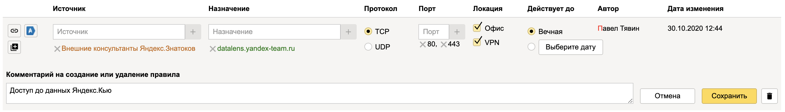

# Управление доступом к DataLens

 

У всех штатных сотрудников есть доступ к {{ datalens-short-name }} по умолчанию. Чтобы предоставить доступ внешним сотрудникам, воспользуйтесь инструкцией ниже.

## Доступ для внешних сотрудников {#access-for-external}

Доступ для внешних сотрудников закрыт на уровне сервиса {{ datalens-short-name }} и на уровне объектов {{ datalens-short-name }} (подключений, датасетов, чартов и дашбордов).

Чтобы у внешних сотрудников появился доступ к DataLens:
1. Запросите доступ к сервисам **datalens.yandex-team.ru** и **upload.datalens.yandex-team.ru** (для возможности загрузки CSV-файлов) в [Puncher](https://puncher.yandex-team.ru/).
2. Запросите доступ к объектам к {{ datalens-short-name }}.



* Права выдаются только для Staff- и ABC-групп. Не согласуются права доступа для отдельных пользователей и Вики-групп. О правилах заказа сетевого доступа через ABC см. в [документации](https://wiki.yandex-team.ru/security/dostup/get_network_access/#abcrol).

* Доступ к сервисам {{ datalens-short-name }} осуществляется только через VPN.



### Пример запроса доступа к дашборду {{ datalens-short-name }} {#access-external-example}

Запрос прав доступа для группы, в которую входят внешние сотрудники.

1. Оформите заявку в [Puncher](https://puncher.yandex-team.ru?create_destinations=datalens.yandex-team.ru&create_destinations=upload.datalens.yandex-team.ru&create_protocol=tcp&create_locations=office&create_locations=vpn&create_ports=443) на доступ к сервисам **datalens.yandex-team.ru**, **upload.datalens.yandex-team.ru** и **stat.yandex-team.ru** (при необходимости работы с отчетами). При оформлении заявки выберите порт **443**.

    

    Заявку в Puncher утверждают последовательно сотрудники сервиса {{ datalens-short-name }} и СИБ.

1. Перейдите в меню дашборда и выберите пункт **Права доступа**.

    

1. Запросите доступ для групп на дашборд и связанные с ним объекты.

    1. Добавьте участников.
    1. Установите права доступа для каждого из объектов.
    1. Активируйте опцию **Cвязанные объекты**.
    1. Нажмите кнопку **Добавить**.

    

Доступы могут утвердить администраторы объектов. Если пользователь, который запрашивает доступ, является администратором — утверждение запроса происходит автоматически.



 

Доступ к сервису {{ datalens-full-name }} регулируется через консоль {{ yandex-cloud }}.
Чтобы предоставить доступ, назначьте пользователю одну из ролей {{ datalens-short-name }}.

Разграничение прав доступа в сервисе реализовано на уровне объектов и папок.
На каждый объект и папку можно назначать пользователю права доступа, которые определяют допустимые операции. По умолчанию объекты наследуют права родительской папки.

Вы можете предоставить пользователю доступ к папке или к любому объекту сервиса:
- Подключение
- Датасет
- Чарт
- Дашборд

Также пользователь может запросить права доступа самостоятельно через форму запроса. Подробнее в разделе [{#T}](../operations/permission/request.md).

## Пользовательские роли {#users-roles}

Позволяют определить права пользователя в экземпляре {{ datalens-short-name }}:

- `{{ roles-datalens-instances-user }}` — пользователь {{ datalens-short-name }} с правами на создание, чтение и изменение объектов согласно [правам доступа на объекты](#permissions).
- `{{ roles-datalens-instances-admin }}` — администратор экземпляра {{ datalens-short-name }}. Роль автоматически присваивается создателю экземпляра. Администратор обладает правами `{{ roles-datalens-instances-user }}`, а также может изменять тарифный план и оплачивать платный контент в {{ marketplace-name }}.

Пользовательские роли назначаются в консоли {{ yandex-cloud }}.

## Добавление пользователя {#add-new-user}

Добавлять можно [пользователей с аккаунтом на Яндексе](#passport-user) и [федеративных пользователей](#federated-user).

### Добавить пользователя с аккаунтом на Яндексе {#passport-user}

Чтобы добавить пользователя и предоставить ему доступ к сервису {{ datalens-short-name }}:

1. 
1. На странице **Пользователи и роли** в правом верхнем углу нажмите **Добавить пользователя**.
1. Введите электронную почту пользователя в Яндексе.
1. Нажмите кнопку **Добавить**. При добавлении нового пользователя в облако ему автоматически назначается роль участника облака — [`resource-manager.clouds.member`](../../iam/concepts/access-control/roles.md#member).

    
    
    Время до появления логина добавленного пользователя в форме выдачи прав доступа может достигать нескольких часов.
    
    

1. 
1. Для добавления роли на облако нажмите значок  в блоке **Роли на облако <имя облака>**.

    Для добавления роли на каталог, выберите каталог и нажмите **Назначить роль** в блоке **Роли в каталогах**.
1. Выберите `{{ roles-datalens-instances-user }}`  или  `{{ roles-datalens-instances-admin }}` из списка.

### Добавить федеративных пользователей {#federated-user}



1. Добавьте федеративных пользователей:

   

1. 
1. Для добавления роли на облако нажмите значок  в блоке **Роли на облако <имя облака>**.

    Для добавления роли на каталог, выберите каталог и нажмите **Назначить роль** в блоке **Роли в каталогах**.
1. Выберите `{{ roles-datalens-instances-user }}` из списка. 

Подробнее о назначении ролей в {{ yandex-cloud }} в разделе [Роли](../../iam/concepts/access-control/roles.md).

## Права доступа на объекты {#permissions}

Вы можете назначить следующие права доступа на объекты и папки в сервисе {{ datalens-short-name }}:

### {{ permission-execute }} {#permission-execute}

Пользователь с правом доступа `{{ permission-execute }}` может выполнять запросы к доступным подключениям и датасетам.
С эти правом пользователь не может просматривать подключения и датасеты.



Вы можете назначить право доступа `{{ permission-execute }}` только на подключение и датасет.



### {{ permission-read }} {#permission-read}

Пользователь с правом доступа `{{ permission-read }}` может просматривать дашборды, виджеты, датасеты и папки.

### {{ permission-write }} {#permission-write}

Пользователь с правом доступа `{{ permission-write }}` может изменять дашборды, виджеты, подключения, датасеты и папки.

Право доступа `{{ permission-write }}` включает в себя все разрешения права доступа `{{ permission-read }}`.

### {{ permission-admin }} {#permission-admin}

Пользователь с правом доступа `{{ permission-admin }}` может изменять доступные объекты и папки, изменять права доступа.

Право доступа `{{ permission-admin }}` включает в себя все разрешения права доступа `{{ permission-write }}`.

## Таблица прав доступа {#permission-table}

Объект доступа Действие | {{ permission-execute }} | {{ permission-read }} | {{ permission-write }} | {{ permission-admin }}
----|----|----|----|----
**Папка** |
Просмотр папки | N/A | ✔ | ✔ | ✔
Редактирование папки | N/A | - | ✔ | ✔
Удаление папки | N/A | - | - | ✔
Изменение прав доступа | N/A | - | - | ✔
**Подключение** |
Выполнение запросов к подключению | ✔ | ✔ | ✔ | ✔
Создание датасета над подключением | - | ✔ | ✔ | ✔
Просмотр параметров подключения | - | ✔ | ✔ | ✔
Редактирование подключения | - | - | ✔ | ✔
Удаление подключения | - | - | - | ✔
Изменение прав доступа | - | - | - | ✔
**Датасет** |
Выполнение запросов к датасету | ✔ | ✔ | ✔ | ✔
Создание чарта над датасетом | ✔ | ✔ | ✔ | ✔
Просмотр датасета | - | ✔ | ✔ | ✔
Редактирование датасета | - | - | ✔ | ✔
Удаление датасета | - | - | - | ✔
Изменение прав доступа | - | - | - | ✔
**Чарт** |
Просмотр чарта | N/A | ✔ | ✔ | ✔
Редактирование чарта | N/A | - | ✔ | ✔
Удаление чарта | N/A | - | - | ✔
Изменение прав доступа | N/A | - | - | ✔
**Дашборд** |
Просмотр дашборда | N/A | ✔ | ✔ | ✔
Редактирование дашборда | N/A | - | ✔ | ✔
Удаление дашборда | N/A | - | - | ✔
Изменение прав доступа | N/A | - | - | ✔

## Аудит доступа к объектам 

Пользователь {{ datalens-short-name }} может получить логи доступа к объектам {{ datalens-short-name }} (просмотр, редактирование, удаление).
Чтобы получить логи, [обратитесь в службу технической поддержки]({{ link-console-support }}).

#### Что дальше {#what-is-next}

- [{#T}](../operations/permission/grant.md)
- [{#T}](../operations/permission/revoke.md)
- [{#T}](../operations/permission/request.md)
- [{#T}](../operations/dataset/manage-row-level-security.md)

