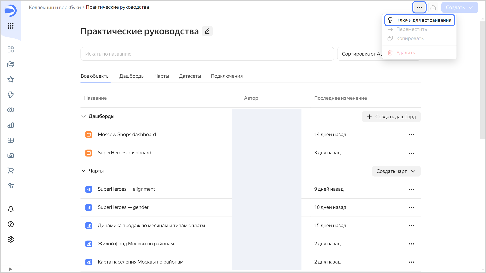
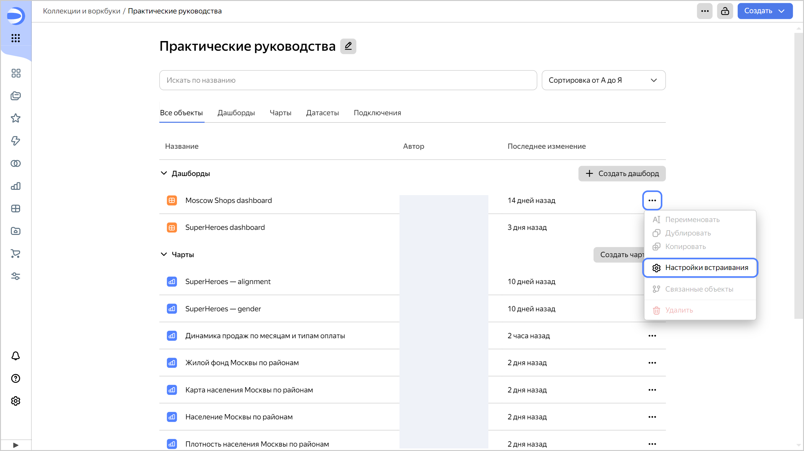

# Встраивание непубличных объектов



Вы можете безопасно встроить непубличные [чарты](../concepts/chart/index.md) и [дашборды](../concepts/dashboard.md) на сайт или в приложение с помощью специальных ссылок с [JWT-токеном](https://ru.wikipedia.org/wiki/JSON_Web_Token).

Встраивание непубличных объектов работает только в новой объектной модели {{ datalens-short-name }} на уровне [воркбуков](../workbooks-collections/index.md) и доступно только [администратору](./roles.md#datalens-workbooks-admin) воркбука.



## Как встроить непубличный объект {#how-to-private-embed}

1. Создайте ключ для встраивания:

   

   Один ключ можно использовать для встраивания нескольких объектов.

   

   1. Перейдите на [главную страницу]({{ link-datalens-main }}) {{ datalens-short-name }}.
   1. На панели слева выберите  **Коллекции и воркбуки**.
   1. Откройте воркбук, в котором расположен объект для встраивания.
   1. В верхней части интерфейса нажмите значок  и выберите  **Ключи для встраивания**.

      

   1. В открывшемся окне:

      1. Нажмите кнопку  **Создать ключ**.
      1. Введите название ключа и нажмите кнопку **Создать**.
      1. Внизу нажмите кнопку **Скачать файл с ключом** или скопируйте значение ключа.

         

         После закрытия окна все данные из него будут потеряны.

         

         Новый ключ для встраивания появится в списке.

1. Настройте встраивание для непубличного объекта:

   

   Для каждого объекта можно настроить несколько встраиваний.

   

   1. В строке с нужным объектом нажмите значок  и выберите **Настройки встраивания**.

      

   1. В открывшемся окне нажмите кнопку  **Новое встраивание**.
   1. В окне настроек укажите:

      

      - Для чарта {#chart}

        * **Название** — введите название встраивания.
        * **Ключ** — выберите созданный ранее ключ для встраивания.
        * Выберите **Режим работы параметров по умолчанию**:

          * **Всё разрешено** (по умолчанию) — все [неподписанные параметры](#unsigned-parameters) разрешены, кроме запрещенных;
          * **Всё запрещено** — все неподписанные параметры запрещены, кроме разрешенных.

          На подписанные параметры из токена эти ограничения не действуют.

        * (опционально) **Запрещённые параметры** — укажите названия неподписанных параметров, которые не будут работать при встраивании чарта. Доступно для режима **Всё разрешено**.
        * (опционально) **Разрешённые параметры** — укажите названия неподписанных параметров, которые можно передавать в ссылке для встраивания. Параметры, которые не указаны в этом списке, будут проигнорированы при попытке передать их в ссылке для встраивания. Доступно для режима **Всё запрещено**.
        * (опционально) **Разрешить экспорт данных** — включите отображение меню, которое позволяет экспортировать данные, представленные на чарте. Для экспорта данных в правом верхнем углу чарта нажмите  →  **Сохранить как** и выберите формат: `XLSX`, `CSV` или `Markdown`.

      - Для дашборда {#dashboard}

        * **Название** — введите название встраивания.
        * **Ключ** — выберите созданный ранее ключ для встраивания.
        * (опционально) **Запрещённые параметры** — укажите названия [неподписанных параметров](#unsigned-parameters), которые не будут работать при встраивании дашборда. На подписанные параметры из токена эти ограничения не действуют. По умолчанию в ссылке для встраивания можно передавать любые параметры, которые [указаны](../operations/dashboard/add-parameters.md) в настройках дашборда.

          

          Если на дашборде есть селекторы с запрещенными параметрами, при встраивании такие селекторы будут недоступны для использования.

          

        * (опционально) **Разрешить экспорт данных** — включите отображение меню, которое позволяет экспортировать данные, представленные на чарте. Для экспорта данных в правом верхнем углу чарта нажмите  →  **Сохранить как** и выберите формат: `XLSX`, `CSV` или `Markdown`.

      

   1. Нажмите кнопку **Создать**. В колонке **ID** скопируйте идентификатор объекта встраивания, а затем нажмите **Закрыть**.

1. Создайте токен:

   1. Подготовьте payload для токена — полезную нагрузку, которая содержит информацию об объекте встраивания. Полезная нагрузка содержит следующие поля:

      * `embedId` — идентификатор объекта встраивания.
      * `iat` — время выписки токена JWT в формате [Unix Timestamp](https://ru.wikipedia.org/wiki/Unix_time).
      * `exp` — время окончания действия токена в формате Unix Timestamp.

        

        Токены, в которых разница между `exp` и `iat` превышает 10 часов, считаются невалидными.

        

      * `dlEmbedService` — строковая константа идентификатора сервиса: `YC_DATALENS_EMBEDDING_SERVICE_MARK`.
      * (опционально) `params` — подписанные параметры чарта, которые передаются в составе токена. Их нельзя изменить без повторной генерации токена.

        

        Генерируемый токен передается в составе заголовка сетевого запроса, поэтому его максимальный размер ограничен — 30 КБ. Учитывайте это при использовании подписанных параметров.

        

        Пример:

        ```json
        {
          "embedId": "ieez7********",
          "iat": 1516239022,
          "exp": 1516240822,
          "dlEmbedService": "YC_DATALENS_EMBEDDING_SERVICE_MARK",
          "params": {
            "param1": "value1",
            "param2": "value2"
          }
        }
        ```

   1. Чтобы создать JWT-токен, подпишите подготовленный payload закрытым ключом, который был получен ранее при создании ключа для встраивания.

      

      Используйте при создании JWT алгоритм `PS256`.

      

      Для создания JWT-токена используйте примеры кода:

      

      - Python {#python}

        Установите модуль `cryptography` для работы с алгоритмом `PS256`:

        ```bash
        pip3 install cryptography
        ```

        Выполните код:

        ```python
        import time
        import jwt
        import json
        ​
        private_key = b"""<закрытый_ключ>"""
        ​
        now = int(time.time())
        payload = {
           'embedId': "<идентификатор_объекта_встраивания>",
           'dlEmbedService': "YC_DATALENS_EMBEDDING_SERVICE_MARK",
           'iat': now,
           'exp': now + 360,
           "params": {  }}
           ​
        # JWT generation.
        encoded_token = jwt.encode(
           payload,
           private_key,
           algorithm='PS256',
           )

        print(encoded_token)
        ```

      - Node.js {#node}

        Установите пакет [jsonwebtoken](https://github.com/auth0/node-jsonwebtoken) с помощью [npm](https://www.npmjs.com/):

        ```bash
        npm install jsonwebtoken
        ```

        Выполните код:

        ```js
        const privateKey = `<закрытый_ключ>`;

        const now = Math.floor(Date.now() / 1000);
        const payload = {
        embedId: '<идентификатор_объекта_встраивания>',
        dlEmbedService: 'YC_DATALENS_EMBEDDING_SERVICE_MARK',
        iat: now,
        exp: now + 360,
        params: {},
        };

        const jwt = require('jsonwebtoken');

        const encodedToken = jwt.sign(payload, privateKey, {
        algorithm: 'PS256',
        });

        console.log(encodedToken);
        ```

      - Go {#go}

        Установите пакет [jwt-go](https://github.com/golang-jwt/jwt):

        ```bash
        go install github.com/golang-jwt/jwt/v5@latest
        ```

        Выполните код:

        ```golang
        
        package main

        import (
          "fmt"
          "time"

          "github.com/golang-jwt/jwt/v5"
        )

        func main() {
          privateKey, err := jwt.ParseRSAPrivateKeyFromPEM([]byte(`<закрытый_ключ>`))

          now := time.Now().Unix()
          payload := jwt.MapClaims{
              "embedId":        "<идентификатор_объекта_встраивания>",
              "dlEmbedService": "YC_DATALENS_EMBEDDING_SERVICE_MARK",
              "iat":            now,
              "exp":            now + 360,
              "params":         map[string]interface{}{},
          }

          token := jwt.NewWithClaims(jwt.SigningMethodPS256, payload)
          signedToken, err := token.SignedString(privateKey)
          if err != nil {
              fmt.Println("Error generating token:", err)
              return
          }

          fmt.Println(signedToken)
        }
        ```

      

   1. Сформируйте ссылку для встраивания:

      

      - Для чарта {#chart}

        ```bash
        {{ link-datalens-main }}/embeds/chart#dl_embed_token=<токен>
        ```

        Где `<токен>` — JWT-токен.

      - Для дашборда {#dashboard}

        ```bash
        {{ link-datalens-main }}/embeds/dash#dl_embed_token=<токен>
        ```

        Где `<токен>` — JWT-токен.

      

1. Добавьте ссылку для встраивания на свой сайт или в приложение. Например:

      

      - Для чарта {#chart}

        ```html
        <iframe src="{{ link-datalens-main }}/embeds/chart#dl_embed_token=<токен>" width="600" height="400" frameborder="0"></iframe>
        ```

        Где:

        * `src` — URL встраивания.
        * `<токен>` — JWT-токен.
        * `width` — ширина чарта.
        * `height` — высота чарта.
        * `frameborder` — наличие рамки для чарта.

      - Для дашборда {#dashboard}

        ```html
        <iframe src="{{ link-datalens-main }}/embeds/dash#dl_embed_token=<токен>" width="600" height="400" frameborder="0"></iframe>
        ```

        Где:

        * `src` — URL встраивания.
        * `<токен>` — JWT-токен.
        * `width` — ширина дашборда.
        * `height` — высота дашборда.
        * `frameborder` — наличие рамки для дашборда.

      

## Обновление токена без потери состояния фильтров {#token-update}

При замене JWT-токена в ссылке для встраивания фильтры на встроенном дашборде сбрасываются к значениям по умолчанию.

Чтобы обновить ссылку для встраивания без потери состояния фильтров, используйте метод [postMessage](https://developer.mozilla.org/en-US/docs/Web/API/Window/postMessage).

Для обновления в ссылке JWT-токена отправьте в `iframe` с помощью метода `postMessage` объект вида:

```js
{
    type: 'SECURE_EMBEDDING_TOKEN_UPDATE',
    token: <обновленный_токен>
}
```

Где `<обновленный_токен>` — обновленный JWT-токен.

После этого запросы с дашборда или чарта будут подписаны новым токеном. Если в обновленном токене изменились подписанные параметры, дашборд или чарт автоматически обновятся.

Пример:

```js
const iframe = document.getElementById('ID_IFRAME');

iframe.contentWindow.postMessage({
    type: 'SECURE_EMBEDDING_TOKEN_UPDATE',
    token: 'NEW_TOKEN'
}, 'https://datalens.yandex.cloud/');
```

Учитывайте время окончания действия токена при его обновлении.

## Неподписанные параметры {#unsigned-parameters}

По умолчанию в ссылке для встраивания объекта можно передавать любые параметры, кроме явно запрещенных. Они указываются в URL перед хешем с токеном. Это позволяет изменять некоторые параметры виджета или дашборда на стороне клиента без повторного создания токена.

Например, если в чарте или дашборде используются параметры `from` и `to` для фильтрации по времени, можно передавать эти параметры в ссылке для встраивания перед хешем с токеном:



- Для чарта {#chart}

  ```html
  <iframe src="{{ link-datalens-main }}/embeds/chart?from=2022-01-01&to=2023-02-05#dl_embed_token=<токен>" width="600" height="400" frameborder="0"></iframe>
  ```

  Где:

  * `src` — URL встраивания.
  * `<токен>` — JWT-токен.
  * `from=2022-01-01&to=2023-02-05` — неподписанные параметры.

- Для дашборда {#dashboard}

  ```html
  <iframe src="{{ link-datalens-main }}/embeds/dash?from=2022-01-01&to=2023-02-05#dl_embed_token=<токен>" width="600" height="400" frameborder="0"></iframe>
  ```

  Где:

  * `src` — URL встраивания.
  * `<токен>` — JWT-токен.
  * `from=2022-01-01&to=2023-02-05` — неподписанные параметры.



Неподписанные параметры будут проигнорированы в ссылке для встраивания, если:



- Для чарта {#chart}

  * название параметра есть в списке запрещенных в режиме **Всё разрешено**;
  * название параметра нет в списке разрешенных в режиме **Всё запрещено**.

- Для дашборда {#dashboard}

  Названия параметра есть в списке запрещенных.



## Рекомендации {#recommendations}

При встраивании непубличных объектов придерживайтесь следующих рекомендаций:

* Значения по умолчанию передавайте через параметры в ссылке.
* Учитывайте, что приоритет значения параметра в ссылке выше, чем значение подписанного параметра с таким же названием.
* Чтобы запретить изменение значения параметра:

  

  - Для чарта {#chart}

    1. Добавьте подписанный параметр с нужным значением в токен.
    1. В настройке встраивания для чарта:

       * в режиме **Всё разрешено** добавьте этот параметр в список запрещенных;
       * в режиме **Всё запрещено** не добавляйте этот параметр в список разрешенных.

  - Для дашборда {#dashboard}

    1. Добавьте подписанный параметр с нужным значением в токен.
    1. В настройке встраивания для дашборда добавьте этот параметр в список запрещенных.

  

## Особенности встраивания дашбордов {#dash-embed-specialties}

При встраивании дашбордов учитывайте следующие особенности:

* Встроенные дашборды открываются только в режиме просмотра. У них скрыта панель навигации и по умолчанию скрыто меню  у чартов. Включите опцию **Разрешить экспорт данных** в настройках встраивания, чтобы у чартов отображалось меню , которое позволяет экспортировать данные, представленные на чарте.
* При открытии встроенного дашборда действуют его [настройки](../dashboard/settings.md).
* На встроенном дашборде работают только те параметры, которые [указаны в настройках дашборда](../operations/dashboard/add-parameters.md).
* Нельзя передать состояние отфильтрованных чартов в параметре `state`.
* В ссылке для встраивания нельзя указать заголовок дашборда.
* В ссылке для встраивания в параметре `tab` можно указать, на какой вкладке открывать дашборд.
