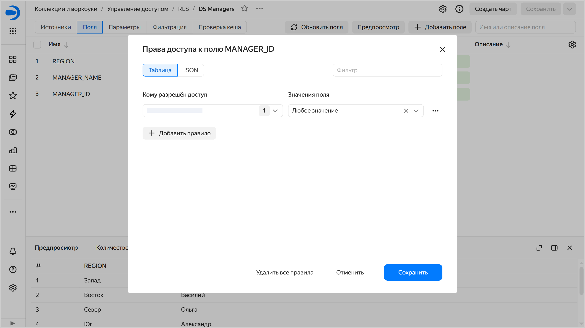
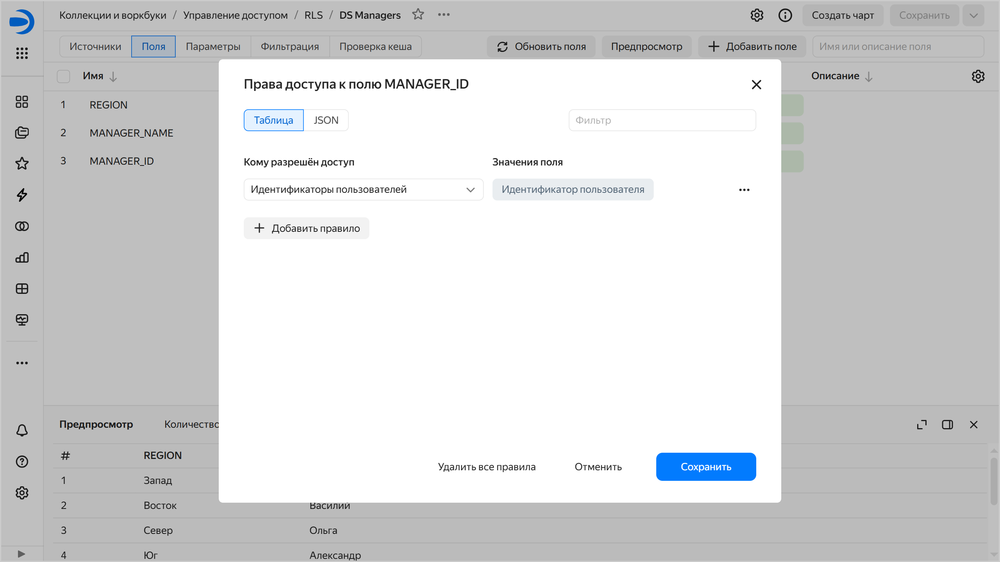

# Управление доступом на уровне строк данных (RLS)

RLS (_Row-level security_ — безопасность на уровне строк) позволяет ограничить доступ к данным для пользователей или [группы пользователей](../../organization/concepts/groups.md) в рамках одного датасета. Например, вы можете разграничить доступ разным клиентам.



Разграничить доступ к данным на уровне строк можно как в [датасете](#dataset-rls), так и в [источнике данных](#datasource-rls).

## Настройка RLS на уровне датасета {#dataset-rls}

Вы можете разграничить доступ к любому измерению датасета. Каждому [пользователю](#user-rls) или [группе пользователей](#group-rls)  могут быть выданы права на неограниченное количество значений измерений.

При использовании RLS запросы к датасету проходят через следующий фильтр:

```sql
where измерение in (значение_1, значение_2 ... значение_N)
```

Вы можете настроить доступ к строкам с помощью интерфейса или задать конфигурацию в формате JSON:



- В интерфейсе {#interface_datalens}

  1. Откройте датасет и перейдите на вкладку **Поля**.
  1. Для поля, которому требуется настроить доступ, нажмите значок  или  → **Права доступа**.
  1. В открывшемся окне на вкладке **Таблица** нажмите кнопку **Добавить правило** и укажите:

     * Кому разрешен доступ:
      
       * `Пользователи и группы` — доступ будет предоставлен указанным пользователям и группам. Можно воспользоваться поиском по имени, логину или почте пользователя.
       * `Все пользователи` — доступ будет предоставлен всем пользователям.
       * `Идентификаторы пользователей` — доступ будет разграничен [на уровне источника данных](#datasource-rls).

     * Значение поля. Доступ будет предоставлен ко всем строкам с указанным значением в поле.

     
     
     

     

  1. Чтобы добавить еще одно правило, повторите предыдущий шаг.
  1. Нажмите кнопку **Сохранить**.  
  1. Сохраните датасет.

- JSON {#json}

  1. Откройте датасет и перейдите на вкладку **Поля**.
  1. Для поля, которому требуется настроить доступ, нажмите значок  или  → **Права доступа**.
  1. В открывшемся окне на вкладке **JSON** задайте конфигурацию RLS в формате JSON:

     ```json
     [
       {
         "allowed_value": "sp-21",
         "pattern_type": "value",
         "subject": {
           "subject_id": "ssxiy********",
           "subject_name": "user:ssxiy********",
           "subject_type": "user"
         }
       }
     ]
     ```

     Где:

     * `allowed_value` — доступ будет предоставлен ко всем строкам с указанным значением в поле. Значение указывается, только если для `pattern_type` указано значение `value`, иначе — `null`;
     * `pattern_type` — как будет предоставлен доступ:
      
       * `value` — для определенного значения поля, указанного в поле `allowed_value`;
       * `all` — для любых значений поля. В этом случае значение `allowed_value` должно быть равно `null`;
       * `userid` — доступ будет разграничен [на уровне источника данных](#datasource-rls);

     * `subject` — описание субъекта доступа:

       * `subject_id` — идентификатор пользователя или группы, которым будет предоставлен доступ. При значении `subject_type` равном `all` указывается `*`, а равном `userid` — пустое значение;
       * `subject_name` — имя пользователя, которому будет предоставлен доступ. При значении `subject_type` равном `all` указывается `*`, а равном `userid` — значение `userid`;
       * `subject_type` — кому будет предоставлен доступ:

         * `user` — пользователю. В этом случае в `subject_id` и `subject_name` указываются идентификатор и имя пользователя соответственно;
         * `group` — группе пользователей. В этом случае в `subject_id` и `subject_name` указываются идентификатор и имя группы соответственно;
         * `all` — всем. В этом случае в `subject_id` и `subject_name` указывается `*`;
         * `userid` — доступ будет разграничен [на уровне источника данных](#datasource-rls).

     Вы можете задать несколько правил, описав каждое в объекте с указанными полями.

  1. Нажмите кнопку **Сохранить**.
  1. Сохраните датасет.



## Настройка RLS на уровне источника данных {#datasource-rls}

Настройка RLS на уровне датасета предполагает его редактирование при каждом изменении настроек RLS.

Чтобы избежать этого, можно перенести логику разграничения прав доступа на уровне строк на сторону источника данных:

1. В исходные данные добавьте новое поле для хранения ID пользователя {{ datalens-short-name }}. По этому полю будет происходить фильтрация всех запросов в источник.

   
   
   Свой ID можно посмотреть [по ссылке]({{ link-my-account }}profile). Если вам нужен ID другого пользователя, попросите его открыть эту ссылку и передать ID вам.


1. Для каждой строки исходных данных укажите ID пользователя {{ datalens-short-name }}, которому должна быть доступна данная строка. Если к одной строке должен быть доступ у нескольких пользователей, то логику разграничения можно вынести в отдельную таблицу и [объединить](../dataset/settings.md#multi-table) ее с основной таблицей на уровне датасета.

1. В датасете настройте доступ к полю с ID пользователей:

   

   - В интерфейсе {#interface_datalens}

     1. В окне настроек RLS на вкладке **Таблица** нажмите кнопку **Добавить правило**.
     1. Для параметра **Кому разрешён доступ** выберите `Идентификаторы пользователей`.
     
        
        
        

        

     1. Нажмите кнопку **Сохранить**.
   
   - JSON {#json}
   
     1. В окне настроек RLS на вкладке **JSON** задайте конфигурацию RLS в формате JSON:

        ```json
        [
          {
            "allowed_value": null,
            "pattern_type": "userid",
            "subject": {
              "subject_id": "",
              "subject_name": "userid",
              "subject_type": "userid"
            },
          }
        ]
        ```

     1. Нажмите кнопку **Сохранить**. Доступ будет предоставлен пользователям с указанными в поле идентификаторами.

   

1. Сохраните датасет.



Перенос логики RLS на сторону источника возможен для источников, в которых доступно изменение структуры данных. В Metrica и AppMetrica структура данных закрыта, поэтому этот способ неприменим.



## Как изменить права доступа к строке в датасете {#how-to-manage-rls}

Чтобы настроить права доступа к строкам данных:


