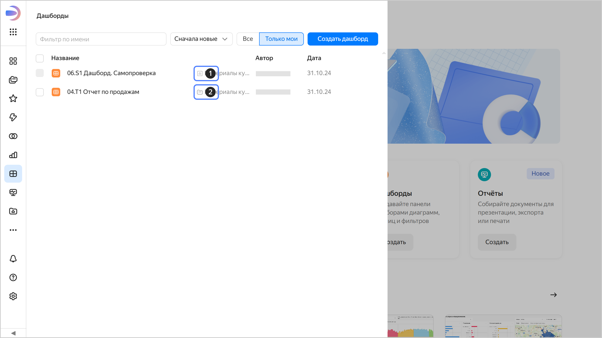

# Права доступа в воркбуках и коллекциях

В этом разделе описано, как устроено управление правами доступа к объектам, которые хранятся внутри воркбуков и коллекций, а также доступы к самим воркбукам и коллекциям. Если объект хранится в папке, доступ к нему настраивается по-другому, подробности читайте в разделе [{#T}](./manage-access.md).



[Воркбуки и коллекции](../workbooks-collections/index.md) — основная модель навигации в {{ datalens-name }}.

* Воркбук содержит подключения, датасеты, чарты и дашборды и является основной единицей разграничения прав доступа.
* Коллекция предназначена для группировки воркбуков и других коллекций.

В некоторых старых экземплярах {{ datalens-name }} еще сохранилась навигация по папкам. Рекомендуем [перейти с нее на воркбуки](../workbooks-collections/index.md#enable-workbooks), чтобы получить больше удобства и возможностей, включая копирование и экспорт/импорт воркбуков, назначение прав доступа на группы, возможность отправки рассылок.





Чтобы узнать расположение объекта (в воркбуке, коллекции или в папке), на панели слева выберите раздел с нужным типом объекта (подключения, датасеты, чарты, дашборды) и найдите объект в списке. При необходимости используйте фильтр по имени.

1.  — объект в воркбуке.
1.  — объект в коллекции.
1.  — объект в папке.



Доступ к подключениям, датасетам, чартам и дашбордам настраивается на уровне воркбуков и коллекций, внутри которых хранятся эти объекты. Предоставляя доступ к воркбуку или коллекции, вы даете аналогичный доступ ко всем объектам внутри этого воркбука или коллекции — это [базовая настройка](./workbooks-access-basic.md) прав доступа.

[Продвинутая настройка](./workbooks-access-advanced.md) позволяет создавать _общие объекты_ — подключения и датасеты, оригиналы которых можно привязывать к нескольким воркбукам, чтобы их могли использовать разные команды. При этом доступы к оригинальным объектам регулируются специальными правами.

