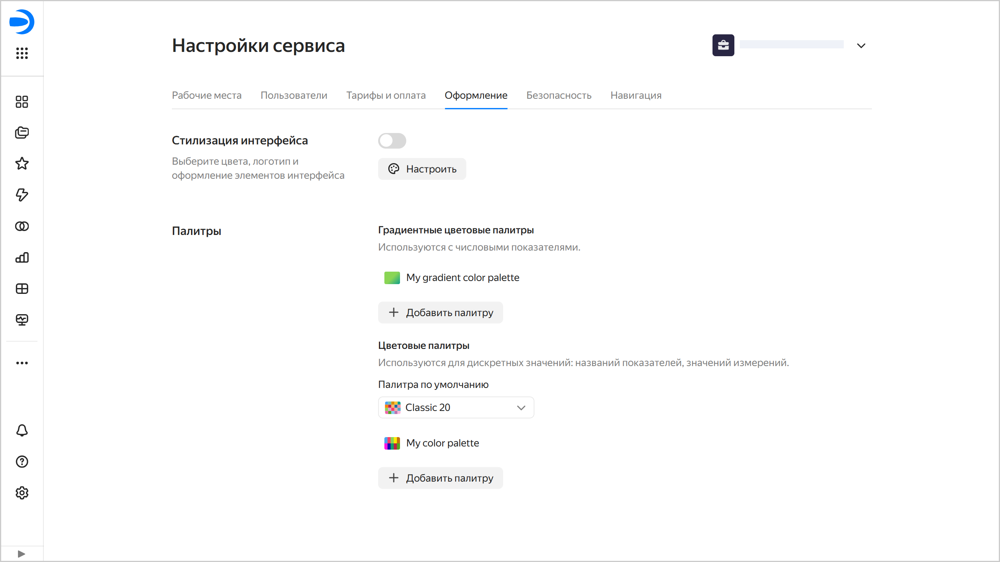
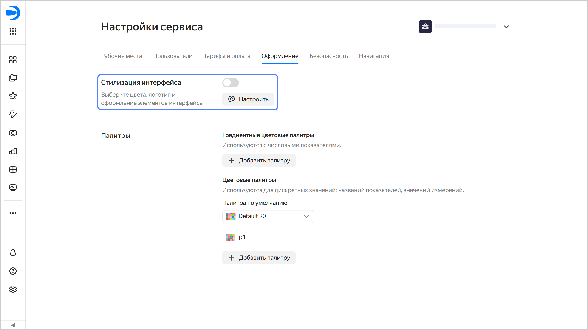

# Настройки оформления в {{ datalens-full-name }}

Настройки оформления позволяют изменить настройки внешнего вида интерфейса для всей организации:

* Настроить [стилизацию интерфейса](#ui-customization).
* Добавить, изменить или удалить [цветовые палитры](#palette-settings) чартов.

Изменить настройки может [администратор](../security/roles.md#datalens-admin) экземпляра {{ datalens-short-name }} (роль `{{ roles-datalens-admin }}`).

Чтобы перейти к настройкам оформления:

1. На панели слева выберите  **Настройки сервиса**. Если на панели не отображается , сначала выберите  **Ещё**, а затем —  **Настройки сервиса**.
1. Выберите вкладку **Оформление**.

   

## Стилизация интерфейса {#ui-customization}

Стилизация интерфейса в {{ datalens-short-name }} позволяет настроить внешний вид интерфейса вашей инсталляции сервиса: цвета, логотип и оформление отдельных элементов.

Изменить настройки стилизации может [администратор](../security/roles.md#datalens-admin) экземпляра {{ datalens-short-name }} (роль `{{ roles-datalens-admin }}`).

Чтобы настроить внешний вид интерфейса:

1. Перейдите на [главную страницу]({{ link-datalens-main }}) {{ datalens-short-name }}.
1. На панели слева выберите  **Настройки сервиса**.
1. Выберите вкладку **Оформление**.
1. В разделе **Стилизация интерфейса** нажмите кнопку  **Настроить**.

   

   

   

1. Настройте оформление:

   * **Тема интерфейса** — выберите тему интерфейса, для которой задается цветовая палитра.
   * **Контрастность** — выберите контрастность, для которой задается цветовая палитра.
   * **Цветовая палитра** — набор цветов для выбранной темы интерфейса и контрастности. Для каждого сочетания темы и контрастности можно настроить уникальную палитру.

     Цвета можно задать вручную или сгенерировать:

     

     - Вручную

       * **Основной цвет** — используется в качестве фона для кнопок и элементов управления: переключателей, чекбоксов и селекторов. Также основной цвет используется в качестве темы для всплывающих подсказок.
       * **Основной цвет при наведении курсора** — при ручной настройке можно выбрать любой цвет. При генерации палитры автоматически задается более темный оттенок основного цвета.
       * **Фон страницы** — цвет фона страницы. Для светлой темы чаще всего используется белый цвет. Для темной темы выбор цветов более широкий: от нейтральных серых оттенков до теплых или холодных цветов.
       * **Дополнительный цвет** — используется в качестве фона для карточек и других элементов, размещенных поверх фона страницы.
       * **Выбранные элементы** — цвет для выбранных элементов, например: нажатой кнопки, выбранной строки или выделенного текста.
       * **Выбранные элементы при наведении курсора** — цвет для выбранных элементов (например, нажатой кнопки, выбранной строки) при наведении на них курсора.
       * **Текст на выбранных элементах** — цвет текста на выбранных элементах. Задайте его контрастным по отношению к цвету выбранных элементов.
       * **Линии и обводки** — цвет активной карточки или таба, а также цвет индикатора загрузки.
       * **Ссылка** — цвет для текста ссылки.
       * **Ссылка при наведении курсора** — цвет для текста ссылки при наведении на него курсора.

     - Сгенерировать

       Нажмите кнопку  **Сгенерировать палитру** и выберите основной цвет. На его основе автоматически сгенерируются остальные цвета. При необходимости отредактируйте цветовые настройки вручную.

     

   * **Контрастный цвет** — выберите цвет для текста на кнопке.
   * **Логотип и фавиконка** — чтобы заменить логотип и фавиконку, [загрузите](https://yandex.cloud/ru/docs/storage/quickstart#upload-files) в хранилище {{ objstorage-full-name }} файл формата SVG в пропорции 1:1. Затем скопируйте ссылку на файл в хранилище и вставьте ее в это поле. Справа от поля нажмите кнопку **Применить**.
   
   * **Скругление** — задает скругление углов элементов интерфейса.

    

    В области предпросмотра отображается внешний вид элементов интерфейса с заданными настройками.

    

1. Вверху справа нажмите кнопку **Сохранить**.
1. Чтобы применить настроенную стилизацию, включите опцию в разделе **Стилизация интерфейса**.

## Управление цветовой палитрой чартов {#palette-settings}

В {{ datalens-full-name }} вы можете [создать](#create-palette), [изменить](#edit-palette), [удалить](#delete-palette) цветовую палитру и [настроить цветовую палитру по умолчанию](#default-palette).

### Создать цветовую палитру {#create-palette}



### Изменить цветовую палитру {#edit-palette}



### Удалить цветовую палитру {#delete-palette}



### Настроить цветовую палитру по умолчанию {#default-palette}


