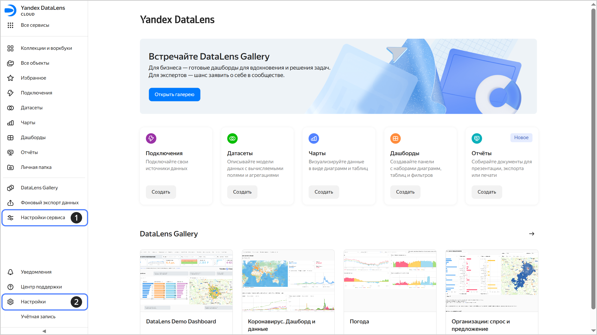
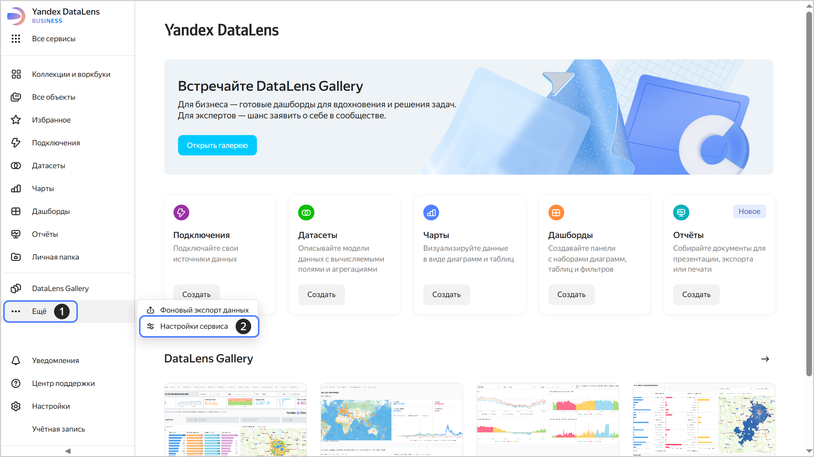

# Настройки сервиса в {{ datalens-full-name }}

В {{ datalens-short-name }} используются настройки двух видов:

1. [Настройки сервиса](#service-settings) предназначены для администратора сервиса {{ datalens-short-name }} и распространяются на всю организацию.
1. [Настройки {{ yandex-cloud }}](#user-settings) доступны каждому пользователю и позволяют настроить интерфейс {{ yandex-cloud }}.

## Настройки сервиса {#service-settings}

Раздел **Настройки сервиса** предназначен для управления конфигурацией экземпляра {{ datalens-short-name }}. С его помощью администратор может настроить функциональность сервиса под нужды команды и организации: управлять доступом пользователей, контролировать использование ресурсов, настраивать внешний вид и безопасность.

Изменить настройки может только [администратор](../security/roles.md#datalens-admin) экземпляра {{ datalens-short-name }} — пользователь с ролью `{{ roles-datalens-admin }}`. Эта роль дает полный доступ ко всем разделам настроек и позволяет управлять всеми аспектами работы сервиса.

Для удобства все настройки сгруппированы по тематическим вкладкам:

* [Рабочие места](./seats.md) — здесь вы можете управлять рабочими местами, которые позволяют пользователям авторизоваться и работать в {{ datalens-short-name }}.
* [Пользователи](../security/add-new-user.md) — в этом разделе вы можете приглашать пользователей и управлять списком пользователей, группами и правами доступа. Также можно настроить интеграцию с корпоративным каталогом через SSO, чтобы упростить управление доступом.
* [Тарифы и оплата](./service-plan.md) — здесь отображается информация о текущем тарифном плане и доступных ресурсах, а также настройки использования.
* [Оформление](./appearance.md) — в этом разделе вы можете стилизовать внешний вид интерфейса {{ datalens-short-name }} и настроить цветовые палитры для визуализации данных.
* [Безопасность](./restrictions.md) — важный раздел для соблюдения политик информационной безопасности вашей компании. Здесь вы можете управлять использованием нейроаналитика и настройками публикации и экспорта.
* [Навигация](./navigation.md) — здесь вы можете отключить навигацию по папкам и перейти на воркбуки и коллекции.

Чтобы перейти к настройкам сервиса:

1. На панели слева выберите  **Настройки сервиса**. Если на панели не отображается , сначала выберите  **Ещё**, а затем —  **Настройки сервиса**.
   
   

   

   

1. Выберите нужную вкладку.

Вверху страницы настроек отображается текущая [организация](../concepts/organizations.md). Нажмите  справа от ее названия, чтобы посмотреть и скопировать ее идентификатор, идентификатор экземпляра {{ datalens-short-name }} или перейти на **Дашборд организации** в сервисе {{ support-center-name }}.

## Настройки {{ yandex-cloud }} {#user-settings}

Чтобы изменить настройки текущего пользователя, на панели слева выберите  **Настройки** и перейдите на вкладку:

* **Уведомления** — укажите адрес электронной почты, номер телефона и аккаунт Telegram и отметьте нужные виды уведомлений.
* **Язык и регион** — выберите язык интерфейса, часовой пояс, формат даты и времени.
* **Оформление** — выберите тему интерфейса и контрастность.
* **Настройки AI** — [настройте пользовательский промпт](../concepts/neuroanalyst.md#user-promt) для AI.

Подробнее см. [{#T}](../../console/operations/update.md).

