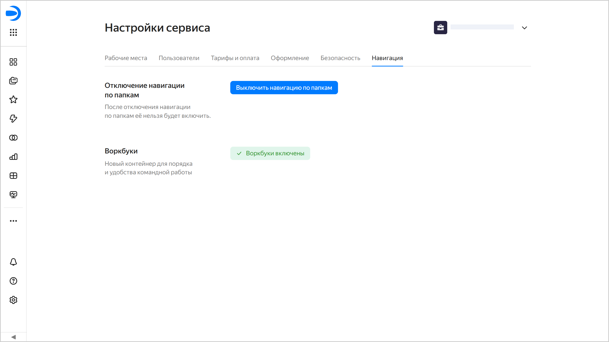

# Настройки навигации в {{ datalens-full-name }}

Настройки навигации позволяют управлять организацией объектов в {{ datalens-full-name }}. Администратор может отключить навигацию по папкам и перейти на воркбуки и коллекции.

* [Отключить навигацию по папкам](#disable-folder-navigation)
* [Включить воркбуки и коллекции](#enable-workbooks)

Чтобы перейти к настройкам навигации:

1. На панели слева выберите  **Настройки сервиса**. Если на панели не отображается , сначала выберите  **Ещё**, а затем —  **Настройки сервиса**.
1. Выберите вкладку **Навигация**.

   

## Отключить навигацию по папкам  {#disable-folder-navigation}



## Включить воркбуки и коллекции {#enable-workbooks}

