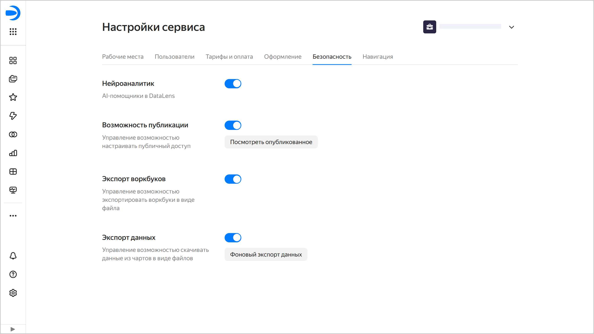

# Настройки безопасности в {{ datalens-full-name }}

Настройки безопасности позволяют накладывать ограничения на использование некоторых возможностей сервиса на уровне экземпляра {{ datalens-name }}:

* [Нейроаналитик](../concepts/neuroanalyst.md#prohibit#prohibit) —  ограничение использования Нейроаналитика.
* [Возможность публикации](../concepts/datalens-public.md#publication-disable) — запрет на публикацию чартов и дашбордов.
* [Экспорт воркбуков](../workbooks-collections/export-and-import.md#workbooks-export-disable) — запрет на экспорт воркбуков в виде файла.
* [Экспорт данных](../concepts/chart/data-export.md#data-export-disable) — ограничение возможности скачивать данные из чартов в виде файлов.

Доступ к настройкам безопасности есть только у [администратора](../security/roles.md#datalens-admin) экземпляра {{ datalens-short-name }} (пользователь с ролью `{{ roles-datalens-admin }}`).

Чтобы перейти к настройкам безопасности:

1. На панели слева выберите  **Настройки сервиса**. Если на панели не отображается , сначала выберите  **Ещё**, а затем —  **Настройки сервиса**.
1. Выберите вкладку **Безопасность**.

   
