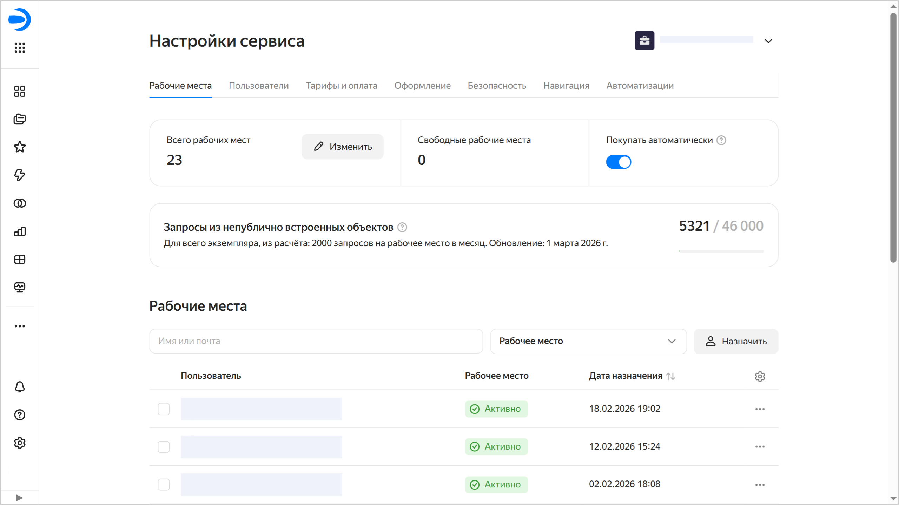

# Настройка рабочих мест в {{ datalens-full-name }}

_Рабочее место_ необходимо каждому пользователю {{ datalens-full-name }}: оно позволяет аутентифицироваться и работать в сервисе. Количество рабочих мест в экземпляре {{ datalens-name }} влияет на [стоимость использования сервиса](../pricing.md).



Администратор (пользователь с ролью `{{ roles-datalens-admin }}`) всегда, даже без рабочего места, сможет зайти в настройки сервиса и управлять списком рабочих мест. Без рабочего места другие возможности сервиса администратору будут недоступны.



Управление рабочими местами производится в настройках сервиса, на вкладке **Рабочие места**. Чтобы открыть ее:

1. Перейдите на [главную страницу]({{ link-datalens-main }}) {{ datalens-short-name }}.
1. На панели слева выберите  **Настройки сервиса**.
1. Выберите вкладку **Рабочие места**. 

На этой вкладке администратору доступны:

* управление опцией [автоматической покупки](#purchase-automatically) рабочих мест;
* [просмотр количества рабочих мест](#number-of-seats) в экземпляре, в том числе свободных;
* [увеличение или сокращение числа рабочих мест](#number-of-seats) в экземпляре;
* [просмотр списка пользователей](#users-and-seats) с рабочими местами;
* [передача рабочего места](#reassign) от одного пользователя другому;
* [ручное назначение рабочих мест](#manual-assignment);
* [отзыв рабочих мест](#revoke) у пользователей, которым они уже не нужны.

## Опция автоматической покупки рабочих мест {#purchase-automatically}

Рабочие места выдаются автоматически всем пользователям при первом входе в {{ datalens-name }}. Сначала новым пользователям назначаются рабочие места из числа свободных — тех, которые никому не назначены.

По умолчанию для рабочих мест включена опция **Покупать автоматически**. Поэтому когда свободных рабочих мест в экземпляре не останется, каждому новому пользователю при его входе в сервис будет автоматически куплено и назначено рабочее место.

Администратор при необходимости может отключить эту опцию. В этом случае покупка и назначение рабочих мест новым пользователям полностью ложится на администратора: с помощью [увеличения числа рабочих мест](#number-of-seats) в экземпляре (для поддержания числа свободных рабочих мест) или [ручного назначения рабочих мест](#manual-assignment) новым пользователям.

## Просмотр и управление количеством рабочих мест {#number-of-seats}

В разделе **Всего рабочих мест** отображается общее количество рабочих мест в экземпляре, в разделе **Свободные рабочие места** — количество рабочих мест, которые куплены, но не назначены пользователям.

Чтобы изменить количество рабочих мест:
1. В разделе **Всего рабочих мест** нажмите кнопку  **Изменить**.
1. Укажите нужное количество рабочих мест.
1. Нажмите **Продолжить** и подтвердите изменение.

Увеличение и уменьшение числа рабочих мест происходит по-разному.

* Увеличение числа рабочих мест.

   Рабочие места будут куплены сразу: они будут учитываться при тарификации текущего месяца.
      
   Купленные рабочие места будут считаться свободными до тех пор, пока в экземпляр не зайдут новые пользователи, которым эти места будут назначены.

* Уменьшение числа рабочих мест.

   Сокращение числа рабочих мест происходит в первый день следующего месяца, а до этого продолжается тарификация исходного количества рабочих мест (до сокращения). В настройках рабочих мест появится баннер с напоминанием о запланированном сокращении рабочих мест. На баннере будет кнопка отмены сокращения на случай, если вы передумаете.
      
   Сокращаемые рабочие места будут выбраны из числа свободных, а оставшиеся — случайным образом из числа назначенных пользователям. В списке пользователей у таких рабочих мест будет статус `До <дата_сокращения_числа_рабочих_мест>`, и у пользователей рабочих мест появится предупреждение в интерфейсе. При наступлении даты сокращения числа рабочих мест статус изменится на `Неактивно`, и пользователи не смогут попасть в интерфейс {{ datalens-short-name }}. Администратор сможет активировать такие рабочие места (пользователь получит рабочее место из числа свободных или для него будет куплено новое рабочее место) или передать рабочие места от других пользователей.

## Просмотр списка пользователей с рабочими местами {#users-and-seats}

В списке **Рабочие места** отображаются пользователи экземпляра {{ datalens-short-name }} с рабочими местами. Вверху списка расположены фильтры для быстрого поиска.

У рабочих мест могут быть статусы:
* `Активно` — рабочее место назначено пользователю.
* `Неактивно` — для рабочих мест, которые сократили при уменьшении числа рабочих мест в экземпляре, или если при завершении пробного периода не привязали платежный аккаунт.
* `До <дата>` — администратор запланировал сокращение рабочих мест, и место с таким статусом будет удалено из экземпляра в указанную дату.
* `Нет` — пользователи из организации, у которых нет рабочих мест. Они не отображаются в списке.

Для каждого рабочего места с помощью кнопки  можно открыть настройки. Доступны следующие действия:

*  **Активировать рабочее место** — только для рабочих мест со статусом `Неактивно`.
*  **Передать рабочее место** — подробнее в [инструкции](#reassign).
*  **Скопировать идентификатор** пользователя.
*  **Диагностика доступа** — для диагностики доступа пользователя в {{ support-center-name }}.
*  **Отозвать рабочее место** — подробнее в [инструкции](#revoke).

## Передача рабочего места между пользователями {#reassign}

Передать рабочее место можно от пользователя с рабочим местом тому, у кого рабочего места нет. Для этого:

1. Найдите пользователя в списке **Рабочие места** и в строке с его именем нажмите  → **Передать рабочее место**. Откроется список пользователей организации, у которых нет рабочего места в {{ datalens-short-name }}.
1. Выберите пользователя, которому требуется передать рабочее место. Для удобства используйте поиск по имени или почте.
1. Нажмите кнопку **Подтвердить**.

Рабочее место сразу перейдет от одного пользователя другому. Первый пользователь пропадет из списка пользователей с рабочими местами: его заменит второй пользователь.

## Ручное назначение рабочих мест {#manual-assignment}

Вы можете вручную назначить рабочее место пользователю из вашей организации. Если есть свободные рабочие места, то новый пользователь получит рабочее место из их числа, а если нет — потребуется подтвердить покупку нового рабочего места.

Чтобы вручную назначить пользователю рабочее место:
1. Нажмите кнопку  **Назначить**. Откроется список пользователей организации, у которых нет рабочего места в {{ datalens-short-name }}.
1. Выберите одного или нескольких пользователей, которым требуются рабочие места. Для удобства используйте поиск по имени или почте.
1. Нажмите кнопку **Назначить**.

Пользователи появятся в списке, статус их рабочих мест будет `Активно`.

## Отзыв рабочего места {#revoke}

Чтобы отозвать у пользователя рабочее место:

1. Найдите пользователя в списке **Рабочие места** и в строке с его именем нажмите  → **Отозвать рабочее место**.
1. Подтвердите отзыв рабочего места. Пользователь потеряет доступ к интерфейсу {{ datalens-name }}.

Отозванное рабочее место станет свободным: его можно назначить другому пользователю вручную, или оно автоматически назначится новому пользователю при входе в сервис.
