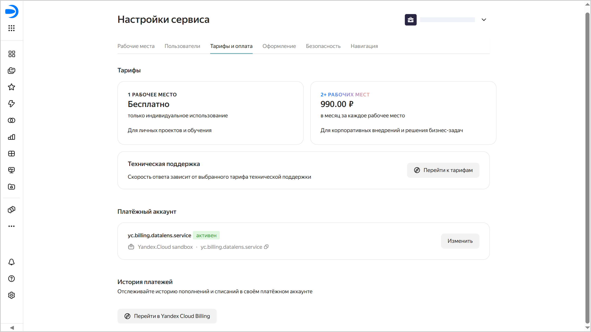

# Настройки тарифов и оплаты в {{ datalens-full-name }}



1 декабря 2025 года в {{ datalens-name }} изменились правила тарификации. Подробности изменений описаны в [статье](../pricing-changes.md), актуальные правила тарификации доступны по [ссылке](../pricing.md).



Чтобы перейти к настройкам тарифов и оплаты:

1. На панели слева выберите  **Настройки сервиса**. Если на панели не отображается , сначала выберите  **Ещё**, а затем —  **Настройки сервиса**.
1. Выберите вкладку **Тарифы и оплата**.

На этой вкладке доступна информация о стоимости рабочих мест, ссылка на тарифы технической поддержки, а также можно управлять платежным аккаунтом.

## Тарифы {#service-plans}

В {{ datalens-short-name }} действует единый [тарифный план](../pricing.md), который включает в себя все возможности сервиса. Стоимость тарифа зависит от количества [рабочих мест](./seats.md) в экземпляре, используйте их для управления потреблением.

В технической поддержке {{ yandex-cloud }} действуют свои [тарифные планы](../../support/pricing.md#change-service-plan), и в блоке **Техническая поддержка** вы найдете ссылку для перехода в [{{ support-center-name }}]({{ link-console-support }}). По этой ссылке вы увидите свой тарифный план и, при необходимости, сможете его изменить.

## Платежный аккаунт {#billing-account}

Платежный аккаунт необходим для оплаты услуг. При регистрации нового экземпляра {{ datalens-full-name }} платежный аккаунт не требуется, так как действует [пробный период](../pricing.md#trial). По истечении пробного периода необходимо сократить потребление до 1 рабочего места или добавить платежный аккаунт для оплаты рабочих мест. Если не добавить платежный аккаунт, то все рабочие места в экземпляре, кроме одного, станут неактивными.

### Добавить или изменить платежный аккаунт {#add-billing-account}



Создание нового платежного аккаунта доступно только пользователям с учетной записью Яндекс ID или Яндекс 360. Федеративные учетные записи для этого не подходят.

Для привязки платежного аккаунта у пользователя должны быть [роли](../security/roles.md#service-roles):

* на платежный аккаунт — `billing.accounts.editor` или выше;
* на организацию с {{ datalens-short-name }} — `{{ roles-datalens-admin }}` или роли, включающие ее полномочия, например `{{ roles-organization-owner }}`.



Чтобы добавить платежный аккаунт:

1. Перейдите на [главную страницу]({{ link-datalens-main }}) {{ datalens-short-name }}.
1. На панели слева выберите  **Настройки сервиса**.
1. Выберите вкладку **Тарифы и оплата**.
1. Если у вас в {{ datalens-short-name }} еще не добавлен платежный аккаунт, в разделе **Платёжный аккаунт** нажмите кнопку **Добавить аккаунт**. Если есть — нажмите кнопку **Изменить аккаунт**.
1. Если у вас есть привязанные к [организации](../concepts/organizations.md) платежные аккаунты, вы сможете выбрать нужный из списка. Если необходимо создать новый аккаунт, нажмите **Создать аккаунт**. Если у вас нет привязанных к организации платежных аккаунтов, сразу откроется форма создания нового аккаунта:
   1. Введите общую информацию:

      * **Имя аккаунта** — будет отображаться в списке ваших платежных аккаунтов и поможет выбрать нужный.
      * **Страна** — выберите страну, резидентом которой является [плательщик](../../billing/concepts/glossary.md#payer).
      * **Плательщик** — выберите из списка доступных плательщиков.
      * **Тип аккаунта** — выберите физическое или юридическое лицо. Для юридического лица выберите способ оплаты: `Банковская карта` или `Банковский перевод`.

      Нажмите кнопку **Вперед**.

   1. Введите данные плательщика, в зависимости от типа аккаунта:

      * Физическое лицо: фамилия, имя, отчество, почтовый адрес.
      * Юридическое лицо: краткое название организации, полное название организации, почтовый индекс, фактический адрес, юридический адрес, ИНН, КПП.

      Нажмите кнопку **Вперед**.

   1. (если плательщик — юридическое лицо и способ оплаты — `Банковский перевод`, пропустите этот шаг) Привяжите к аккаунту банковскую карту:

      * Нажмите кнопку **Добавить карту**.
      * Укажите данные карты: 16-значный номер, срок действия, код CVV (с обратной стороны карты).
      * Нажмите кнопку **Привязать**.
      * Выберите карту.

      Если плательщик — юридическое лицо, поставьте отметку: **Я подтверждаю, что могу распоряжаться указанной корпоративной картой**.

      Нажмите кнопку **Вперед**.

   1. Укажите контактную информацию:

      * Введите адрес электронной почты и нажмите кнопку **Получить код**. Подтвердите адрес электронной почты.
      * Введите номер телефона и нажмите кнопку **Получить код**. Подтвердите номер телефона.

   1. Нажмите кнопку **Создать**.

1. Нажмите кнопку **Привязать**.

## Посмотреть историю платежей {#history}

Чтобы [посмотреть историю платежей](../../billing/operations/check-bill-history.md), нажмите кнопку  **Перейти в Yandex Cloud Billing**.

#### См. также {#see-also}

* [Правила тарификации](../pricing.md)
* [Вопросы про тарификацию](../qa/pricing.md)
