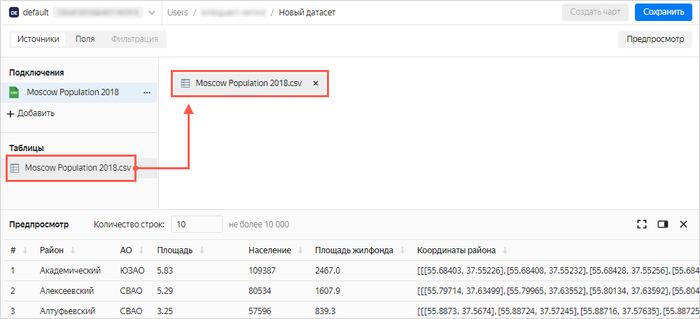
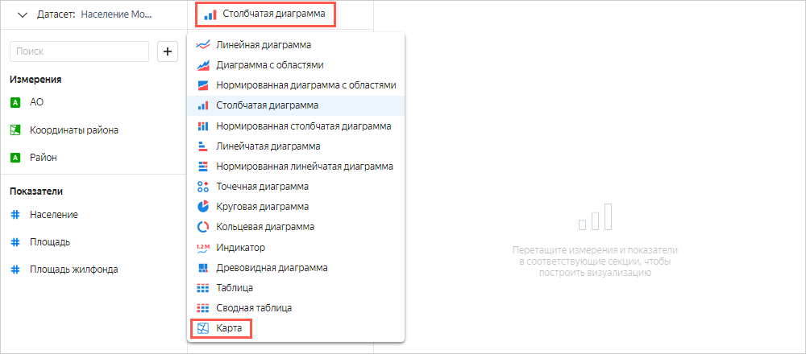
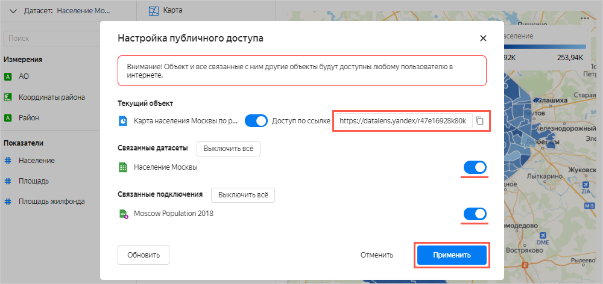

# Публикация в DataLens Public диаграммы с картой на основе CSV-файла

С помощью {{datalens-short-name }} вы можете предоставлять публичный доступ к созданным чартам и дашбордам 



Перед публикацией собственных данных убедитесь, что данные на чартах и дашбордах не являются персональными данными или коммерческой тайной. Доступ к опубликованным данным не ограничен.



В этом сценарии с помощью {{ datalens-short-name }} будут визуализированы показатель населения на карте районов Москвы и опубликован в DataLens Public.

В качестве исходных данных будет использоваться файл [Moscow Population 2018.csv](https://yadi.sk/d/H4dQKVDpU4Rd8g) с информацией о населении и площади Москвы на 2018 год. Источник — [Список районов и поселений Москвы](https://ru.wikipedia.org/wiki/%D0%A1%D0%BF%D0%B8%D1%81%D0%BE%D0%BA_%D1%80%D0%B0%D0%B9%D0%BE%D0%BD%D0%BE%D0%B2_%D0%B8_%D0%BF%D0%BE%D1%81%D0%B5%D0%BB%D0%B5%D0%BD%D0%B8%D0%B9_%D0%9C%D0%BE%D1%81%D0%BA%D0%B2%D1%8B).

Чтобы визуализировать и опубликовать данные, необходимо пройти следущие шаги:

- [Шаг 1. Создайте подключение](data-from-csv-visualization.md#step1)
- [Шаг 2. Создайте датасет](data-from-csv-visualization.md#step2)
- [Шаг 3. Создайте чарт с картой районов Москвы](data-from-csv-visualization.md#step3)
- [Шаг 4. Опубликуйте чарт в DataLens Public](data-from-csv-visualization.md#step4)

## Шаг 1. Создайте подключение и датасет {#step1}

Создайте датасет на основе [подключения](../concepts/connection.md) к CSV-файлу.

1. Перейдите в интерфейс [{{ datalens-short-name }}](https://datalens.yandex.ru).
1. Нажмите кнопку **Создать подключение**.

    

1. Выберите **CSV**.

    

1. Нажмите кнопку **Выбрать CSV-файл**.

    

1. Выберите необходимый файл. В данном примере **Moscow Population 2018.csv** ([ссылка на скачивание](https://yadi.sk/d/H4dQKVDpU4Rd8g)).
1. Дождитесь, когда на экране появится содержимое таблицы.
1. Нажмите кнопку **Сохранить**.

    

1. После сохранения нажмите кнопку **Создать датасет**.

    

## Шаг 2. Создайте датасет {#step2}

1. Перетащите таблицу **Moscow Population 2018.csv** из панели выбора на рабочую область.

    

1. Перейдите на вкладку **Датасет**.

    

1. Для полей **Площадь**, **Население** и **Площадь жилфонда** укажите тип агрегации **Сумма**.

    
    
    Поля с опеределнными функциями агрегации становятся показателями и меняют свой цвет на голубой.

    
    
1. Для поля **Коодинаты района** измените тип данных на **Геополигон**.

    

1. Нажмите кнопку **Сохранить** в верхнем правом углу и сохраните датасет.

    
    
1. Введите имя датасета **Население Москвы**, нажмите **Создать**.
    
1. После сохранения датасета нажмите **Создать чарт** 

    

## Шаг 3. Создайте чарт с картой районов Москвы {#step3}

1. Выберите тип визуализации **Фоновая карта**.

    

1. Добавьте на карту полигоны районов. Для из раздела **Измерения** перетащите поле **Координаты** в секцию **Геополигоны**.

    

1. Измените цвета районов относительно показателя населения. Для из раздела **Показатели** перетащите поле **Население** в секцию **Цвета**.

    

1. Нажмите кнопку **Сохранить** в верхнем правом углу. 
   В открывшемся окне введите название чарта **Карта населения Москвы по районам** и нажмите кнопку **Сохранить**.

## Шаг 4. Опубликуйте чарт в DataLens Public {#step4}

1. Нажмите значок **Настроить публичный доступ**.

    

1. В открывшемся окне настройки публичного доступа включите **Доступ по ссылке**.

    
    
1. Потвердите публикацию чарта и связанным с ним данных.

1. Скопируте уникальный URL чарта. Нажмите **Применить**.

    

1. Откройте новую вкладу в браузере и перейдите по скопированной ссылке.

    

Этой ссылкой можно поделиться с коллегам, партнерами или друзьями. DataLens Public не требует авторизации и аутентификации при переходе по ссылке чарта. 

**Попробуйте еще:**
- Построить столбчатую карту с районами с плотностью населения.
- Создать дашборд с картой, столбчатой диаграммой и селекторами.
- Опубликовать дашборд.
