# Визуализация данных из CSV-файла 

В качестве исходных данных будет использоваться файл [SuperHeroes.csv](https://storage.yandexcloud.net/datalens/SuperHeroes.csv) с информацией о супергероях — имя, пол, раса, издатель комиксов и т.д.

[!KEYREF datalens-short-name] можно использовать для исследования зависимостей, например:
- Веса супергероя от его пола.
- Веса супергероя от его принадлежности к лагерю хороших или плохих.

Чтобы визуализировать зависимости для исследования, нужно создать подключение к CSV-файлу, на его основе создать датасет и настроить дашборд, добавив на него соответствующие виджеты с графиками.

- [Шаг 1. Создайте подключение и датасет](data-from-csv-visualization.md#step1)
- [Шаг 2. Создайте первый чарт](data-from-csv-visualization.md#step2)
- [Шаг 3. Создайте второй чарт](data-from-csv-visualization.md#step3)
- [Шаг 4. Создайте дашборд](data-from-csv-visualization.md#step4)
- [Шаг 5. Добавьте чарты на дашборд](data-from-csv-visualization.md#step5)
- [Шаг 6. Добавьте селекторы на дашборд](data-from-csv-visualization.md#step6)
- [Шаг 7. Настройте отображение виджетов и приступите к исследованию зависимостей](data-from-csv-visualization.md#step7)
- [Шаг 8. Продолжите исследования данных о супергероях](data-from-csv-visualization.md#step8)

## Шаг 1. Создайте подключение и датасет {#step1}

Создайте датасет на основе [подключения](../concepts/connection.md) к CSV-файлу с информацией о супергероях или выберите существуюещее подключение из списка подключений.

1. Перейдите в [[!KEYREF datalens-short-name]](https://datalens.yandex.ru).
1. Нажмите кнопку **Создать датасет**.

    
    
1. Нажмите кнопку **Создать подключение**.

    
    
1. Выберите **CSV**.

    
    
1. Нажмите кнопку **Выбрать CSV-файл**.

    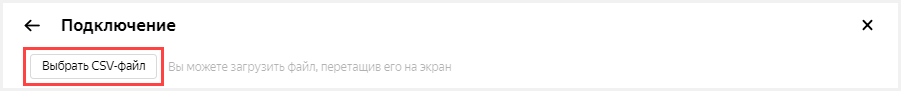
    
1. Выберите необходимый файл. В данном примере **SuperHeroes.csv**.
1. Подождите, пока на экране появится содержимое таблицы.
1. Нажмите кнопку **Сохранить**.

    
    
1. Введите имя датасета **SuperHeroes**.
1. Нажмите кнопку **Создать**.

    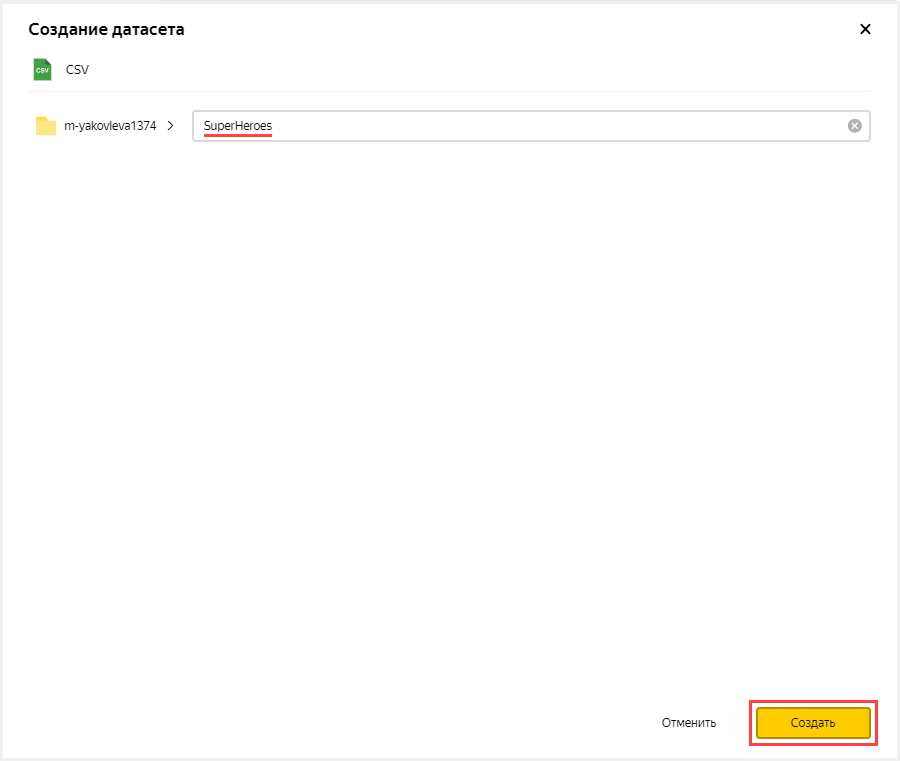
    
1. Создайте поле, в котором будут хранится показатели среднего веса супергероя.
    1. Продублируйте поле **Weight**.
    1. Нажмите значок  в строке **Weight**.
    1. Выберите **Продублировать**.
    
        
        
    1. Переименуйте дубликат поля **Weight (1)** в **Weight avg**: нажмите на имя строки, удалите текущее имя и введите новое.
    1. В столбце **Агрегация** для поля **Weight avg** выберите **Среднее**.
    
        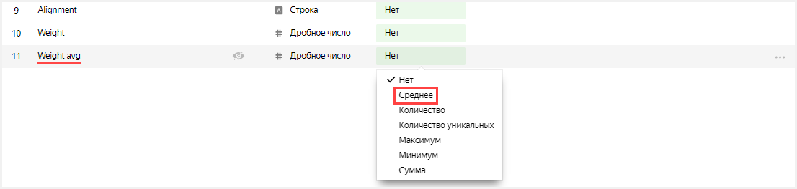
        
1. Нажмите кнопку **Сохранить** в верхнем правом углу и сохраните датасет.

    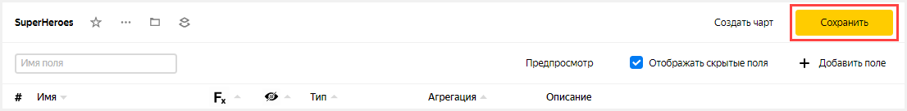

## Шаг 2. Создайте первый чарт {#step2}

Для визуализации разделения по половому признаку создайте [чарт](../concepts/chart.md) — столбчатую диаграмму. 

1. Нажмите кнопку **Создать чарт** в верхнем правом углу.

    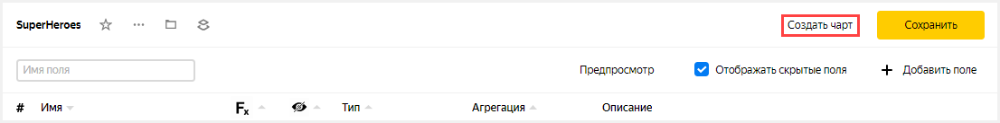

1. В открывшемся окне во втором столбце нажмите на **Линейная диаграмма** и выберите другой тип чарта: **Столбчатая диаграмма**.

    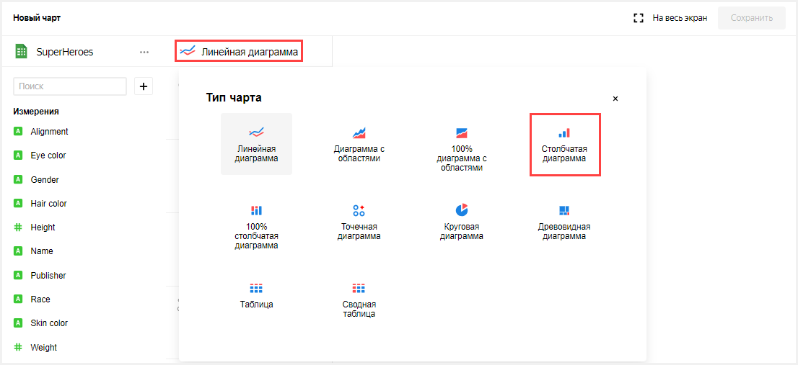

1. Добавьте на график имена супергероев. Для этого из первой колонки из раздела **Измерения** перетащите поле **Name** на ось **X** во второй колонке. 
1. Дополните график весами супергероев. для этого из первой колонки из раздела **Показатели** перетащите поле **Weight avg** на ось **Y** во второй колонке. 
1. Отсортируйте график по весам, например, по убыванию.
    1. Из первой колонки из раздела **Показатели** перетащите поле **Weight avg** в секцию **Сортировка**. 
1. Оставьте на графике только тех супергероев, чей вес больше нуля. 
    1. Из первой колонки из раздела **Показатели** перетащите поле **Weight avg** в секцию **Фильтры**.
    1. В открывшемся окне укажите **Больше** и **0**. 
    1. Нажмите кнопку **Применить**.
    
        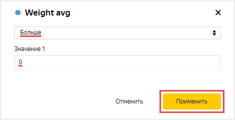
    
1. Добавьте на график цветовое разделение супергероев по половому призаку. Для этого из первой колонки из раздела **Измерения** перетащите поле **Gender** в секцию **Цвет**.

    

1. Сохраните чарт.
    1. Нажмите кнопку **Сохранить** в верхнем правом углу и сохраните чарт.
    
        
    
    1. В открывшемся окне введите название чарта **SuperHeroes — gender**.
    1. Нажмите кнопку **Сохранить**.
    
        
    
## Шаг 3. Создайте второй чарт {#step3}

Для визуализации по принадлежности к лагерю хороших или плохих создайте чарт — столбчатую диаграмму. 

1. Скопируйте чарт, получившийся на предыдущем шаге.
    1. Нажмите значок  в верхнем левом углу рядом с названием чарта.
    1. Выберите **Копировать**.
    
        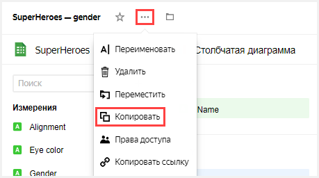
    
    1. В открывшемся окне введите название нового чарта **SuperHeroes — alignment**.
    1. Нажмите кнопку **Готово**.
    
        
    
1. Добавьте на график цветовое разделение супергероев по принадлжености к лагерю хороших или плохих. Для этого из первой колонки из раздела **Измерения** перетащите поле **Alignment** в секцию **Цвет**. 

    Предыдущее значение секции (поле **Gender**) будет заменено на **Alignment**.
    
    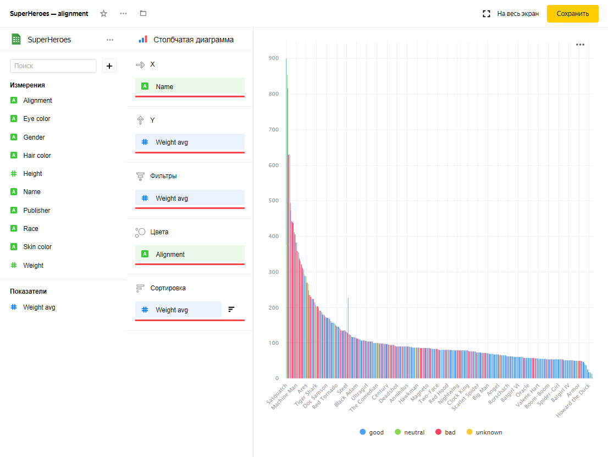
1. Нажмите кнопку **Сохранить** в верхнем правом углу и сохраните чарт.

     

## Шаг 4. Создайте дашборд {#step4}

Создайте [дашборд](../concepts/dashboard.md), на который будут добавлены диаграммы.

1. Перейдите на главную страницу DataLens. Для этого нажмите на надпись **Yandex DataLens** в левом верхнем углу.
1. Нажмите кнопку **Создать дашборд**.

    
1. Введите название дашборда **SuperHeroes dashboard**.
1. Нажмите кнопку **Создать**.

    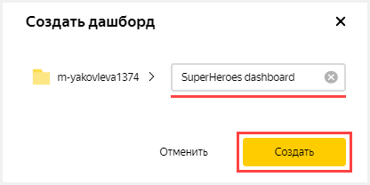
   
## Шаг 5. Добавьте чарты на дашборд {#step5}

Подготовьте дашборд для исследования, добавив на него оба чарта.

1. В открывшемся дашборде нажмите кнопку **Редактировать** в правом верхнем углу.

    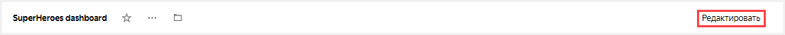

1. Нажмите кнопку **Добавить**.
1. Выберите **Чарт**.

    

1. В открывшемся окне нажмите кнопку **Выбрать**.
1. Выберите чарт **SuperHeroes — gender**. После этого автоматически заполнится поле **Заголовок** по названию выбранного чарта.
1. Нажмите кнопку **Добавить**.

    

1. Добавьте еще один чарт. Пройдите все шаги сначала и укажите на 4 пункте чарт **SuperHeroes — alignment**.

    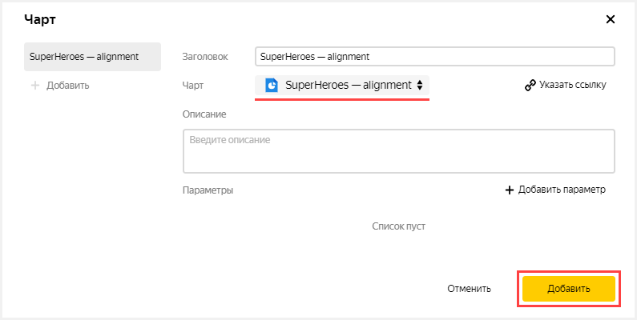
    
## Шаг 6. Добавьте селекторы на дашборд {#step6}

Добавьте [селекторы](../concepts/dashboard.md#selector), чтобы иметь возможность фильтровать супергероев по расам (поле **Race**) и издательствам (поле **Publisher**).

1. Нажмите кнопку **Добавить**.
1. Выберите **Селектор**.

    

1. Под надписью **Датасет** нажмите кнопку **Выбрать**.
1. Выберите датасет **SuperHeroes**.
1. Под надписью **Поле** нажмите кнопку **Выбрать**.
1. Выберите поле **Race**. После этого автоматически заполнится поле **Заголовок** по названию выбранного поля.
1. Включите опцию **Множественный выбор**.
1. Нажмите кнопку **Добавить**.

    

1. Добавьте еще один селектор. Пройдите все шаги сначала и укажите в пункте 6 поле **Publisher**. 

    

## Шаг 7. Настройте отображение виджетов и приступите к исследованию зависимостей {#step7}

1. Перетащите селекторы наверх страницы рядом друг с другом.
1. Растяните чарты по ширине дашборда.
1. Нажмите кнопку **Сохранить** в верхнем правом углу и сохраните дашборд.

    

1. Примените различные фильтры и исследуйте зависимости веса от пола и лагеря супергероя.
    
    В датасете, который был исследован, прослеживаются следующие зависимости: 
    - Мужчины в основном тяжелее женщин.
    - Плохие супергерои в основном тяжелее хороших.

## Шаг 8. Продолжите исследование данных о супергероях {#step8}

Вы можете создать новые показатели в датасете, например, средний рост (среднее от поля **Height**) и количество супергероев (количество уникальных от поля **Name**) и ответить на вопросы: 
- Представителей какой расы больше всего?
- Есть ли зависимость роста от принадлежности к лагерю хороших или плохих?
- Какая студия создала больше всего супергероев?
