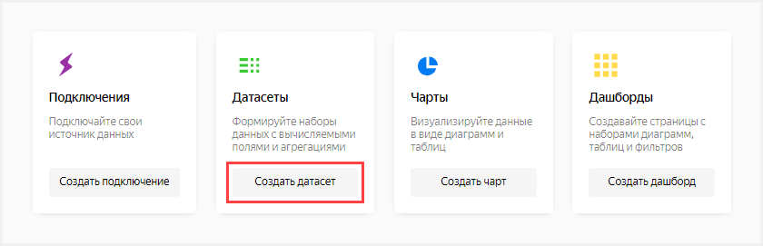
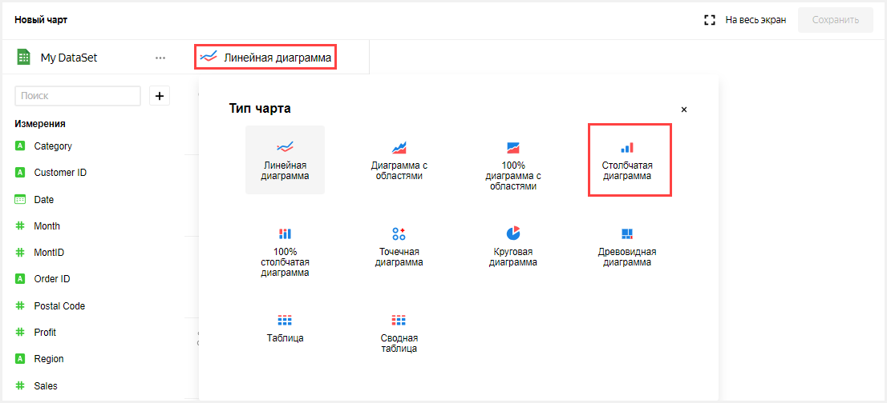
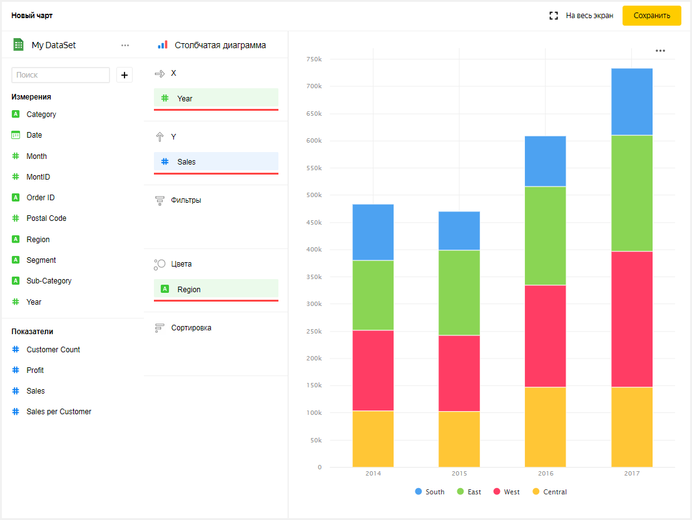
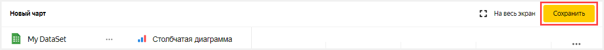
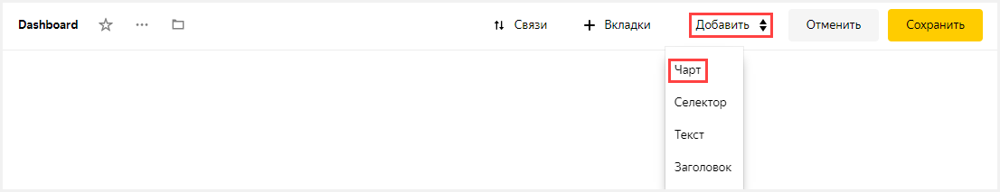

# Визуализация данных из базы данных ClickHouse

В качестве источника данных будет использована таблица из базы данных ClickHouse с информацией о продажах — сумма, регион, сегмент, год и т.д.

[!KEYREF datalens-short-name] можно использовать, чтобы визуализировать продажи, например:
* По годам и регионам.
* По регионам, сегментам и годам.

Чтобы визуализировать зависимости, нужно подключиться к базе данных ClickHouse, на основе подключения создать датасет и настроить дашборд, добавив на него соответсвующие чарты.

В виде шагов это будет выглядеть следующим образом: 

- [Шаг 1. Создайте датасет](data-from-db-vizualization.md#step1)
- [Шаг 2. Создайте чарт — столбчатая диаграмма](data-from-db-vizualization.md#step2)
- [Шаг 3. Создайте чарт — сводная таблица](data-from-db-vizualization.md#step3)
- [Шаг 4. Создайте дашборд](data-from-db-vizualization.md#step4)
- [Шаг 5. Добавьте чарты на дашборд](data-from-db-vizualization.md#step5)
- [Шаг 6. Добавьте селекторы на дашборд](data-from-db-vizualization.md#step6)

Создайте [подключение](../concepts/connection.md) к базе данных ClickHouse, в которой хранится таблица.

## Шаг 1. Создайте датасет {#step1}

Создайте [датасет](../concepts/dataset.md) на основе [подключения](../concepts/connection.md) к базе данных ClickHouse, в которой хранится таблица.

1. Перейдите в [[!KEYREF datalens-short-name]](https://datalens.yandex.ru).
1. Нажмите кнопку **Создать датасет**.
    
    
    
1. Выберите подключение **Sample ClickHouse**.

    
    
1. Введите имя подключения **My DataSet**.
1. Под надписью **Таблица** выберите таблицу **SampleLight**.
1. Нажмите кнопку **Создать**.

    

1. В столбце Агрегация для поля **Profit** выберите **Сумма**.

    
    
1. В столбце Агрегация для поля **Sales** выберите **Сумма**.

    

1. Переименуйте поле **Customer ID** в **Customer Count**: нажмите на имя поля, удалите текущее имя и введите новое.
1. В столбце **Агрегация** для поля **Customer Count** выберите **Количество уникальных**.

    

1. Создайте вычисляемое поле для рассчета продаж на одного клиента.
    1. В правом верхнем углу нажмите кнопку **Добавить поле**.
        
        
        
    1. В поле **Имя** укажите **Sales per Customer**.
    1. Слева в колонке нажмите на поле **Sales**.
    1. Введите символ `/`.
    1. Слева в колонке нажмите на поле **Customer Count**.
    1. Нажмите кнопку **Создать**.
    
        
        
1. Нажмите кнопку **Сохранить** в верхнем правом углу и сохраните датасет.  

    
      

## Шаг 2. Создайте чарт — столбчатая диаграмма {#step2}

Для визуализации продаж по годам и регионам создайте [чарт](../concepts/chart.md) — столбчатую диаграмму. 

1. Нажмите кнопку **Создать чарт** в верхнем правом углу.
    
   
   
1. В открывшемся окне во втором столбце нажмите на **Линейная диаграмма** и выберите другой тип [чарта](../concepts/chart.md): **Столбчатая диаграмма**.
    
    
    
1. Добавьте на диаграмму года. Для этого из первой колонки из раздела **Измерения** перетащите поле **Year** на ось **X** во второй колонке. 
1. Дополните диаграмму информацией о продажах. Для этого из первой колонки из раздела **Показатели** перетащите поле **Sales** на ось **Y** во второй колонке. 
1. Добавьте на график цветовое разделение по регионам. Для этого из первой колонки из раздела **Измерения** перетащите поле **Region** в секцию **Цвет**.

    
    
1. Сохраните чарт.
    1. Нажмите кнопку **Сохранить** в верхнем правом углу и сохраните чарт.
    
        
    
    1. В открывшемся окне нажмите кнопку **Сохранить**.
    
        

## Шаг 3. Создайте чарт — сводная таблица {#step3}

Для визуализации продаж по регионам, сегментам и годам создайте чарт — сводную таблицу. 
    
1. Скопируйте чарт, получившийся на предыдущем шаге.
    1. Нажмите значок  в верхнем левом углу рядом с названием чарта.
    1. Выберите **Копировать**.
    
          
    
    1. В открывшемся окне введите название нового чарта **My DataSet — Сводная таблица**.
    1. Нажмите кнопку **Готово**.
    
                
        
1. В открывшемся окне во втором столбце нажмите на **Столбчатая диаграмма** и выберите другой тип чарта: **Сводная таблица**.      
    

1. Дополните таблицу информацией о регионах. Для этого из первой колонки из раздела **Измерения** перетащите поле **Region** в секцию **Строки**.    
1. Дополните таблицу информацией о сегментах. Для этого из первой колонки из раздела **Измерения** перетащите поле **Segment** в секцию **Строки**.  
1. Добавьте на график цветовое разделение по продажам на одного клиента. Из первой колонки из раздела **Измерения** перетащите поле **Sales per Customer** в секцию **Цвет**.
1. Нажмите кнопку **Сохранить** в верхнем правом углу и сохраните чарт. 

           

## Шаг 4. Создайте дашборд {#step4}

Создайте [дашборд](../concepts/dashboard.md), на который будут добавлены диаграмма и таблица.

1. Перейдите на главную страницу **DataLens**. Для этого нажмите на надпись **Yandex DataLens** в левом верхнем углу.
1. Нажмите кнопку **Создать дашборд**.

      

1. Введите название дашборда **Dashboard**.
1. Нажмите кнопку **Создать**.

      

## Шаг 5. Добавьте чарты на дашборд {#step5}

Добавьте диаграмму и таблицу на дашбоард.

1. В открывшемся дашборде нажмите кнопку **Редактировать** в правом верхнем углу.

      

1. Нажмите кнопку **Добавить**.
1. Выберите **Чарт**.

      

1. В открывшемся окне нажмите кнопку **Выбрать** .
1. Выберите чарт **My DataSet — Сводная таблица**. После этого автоматически заполнится поле **Заголовок** по названию выбранного чарта.
1. Нажмите кнопку **Добавить**.

    
    
1. Добавьте еще один чарт. Пройдите все шаги сначала и укажите в пункте 5 чарт **My DataSet — Столбчатая диаграмма**.

        
     
1. Удобно расположите чарты на дашборде, например, растяните их и перетащите диаграмму правее таблицы.

    

## Шаг 6. Добавьте селекторы на дашборд {#step6}

Добавьте [селекторы](../concepts/dashboard.md#selector), чтобы иметь возможность фильтровать продажи по годам (поле **Year**) и категориям (поле **Category**).

1. Нажмите кнопку **Добавить**.
1. Выберите **Селектор**.

    

1. Под надписью **Датасет** нажмите кнопку **Выбрать**.
1. Выберите датасет **My DataSet**.
1. Под надписью **Поле** нажмите кнопку **Выбрать**.
1. Выберите поле **Year**. После этого автоматически заполнится поле **Заголовок** по названию выбранного поля.
1. Под надписью **Значение по умолчанию** укажите значения **2014** и **2015**.
1. Включите опцию **Множественный выбор**.
1. Нажмите кнопку **Добавить**.

    
    
1. Добавьте еще один селектор. 
    1. Пройдите все шаги сначала и укажите в пункте 6 поле **Category**. 
    1. **Не указывайте** в пункте 7 значение по умолчанию.
        
        
        
1. Нажмите кнопку **Сохранить** в верхнем правом углу и сохраните дашборд. 
1. Удобно расположите селекторы на дашборде, например, перетащите их наверх дашборда над сводной таблицей. 

    
