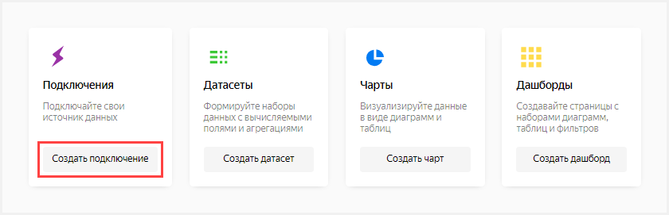
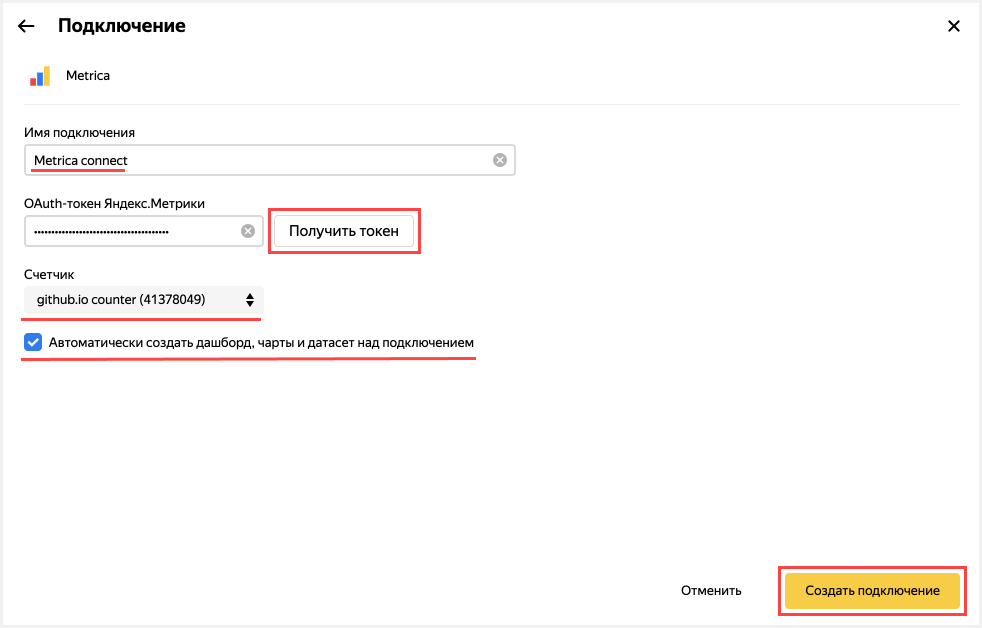
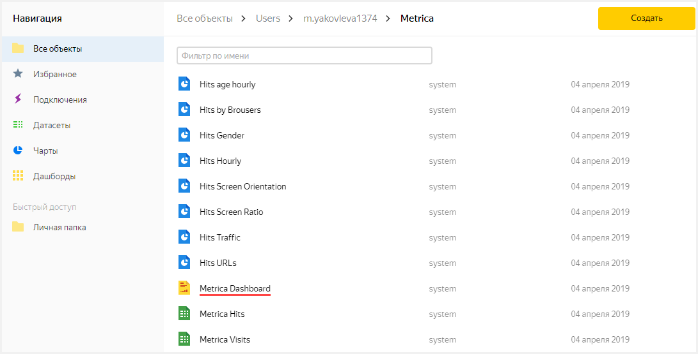
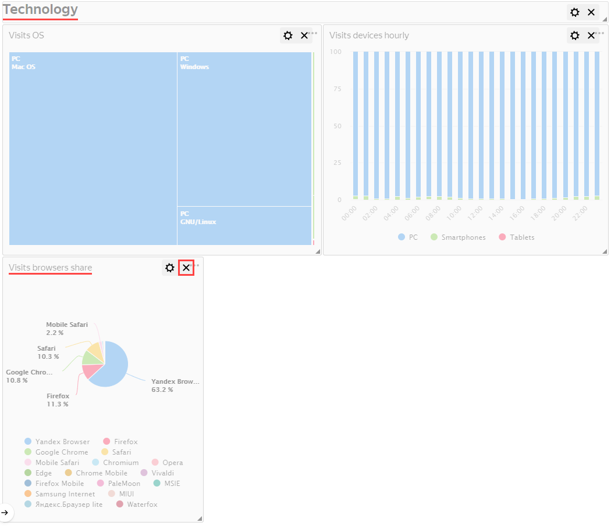

# Визуализация данных из Metriсa

В качестве исходных данных будет использована статистика из Яндекс.Метрики. DataLens автоматически создаст дашборд на основе счетчика Метрики с подборкой графиков, а вы сможете отредактировать его по своему усмотрению.

В виде шагов это будет выглядеть следующим образом:

- [Шаг 1. Создайте подключение и стандартный дашборд](data-from-metrica-visualization#step1)
- [Шаг 2. Измените стандартный дашборд](data-from-metrica-visualization#step2)
- [Шаг 3. Измените чарт](data-from-metrica-visualization#step3)

## Шаг 1. Создайте подключение и стандартный дашборд {#step1}



Данный шаг доступен для пользователей, у которых есть права на какой-либо счетчик Метрики. Если у вас нет прав на счетчик, то откройте готовый дашборд **Metriсa** и перейдите к шагу 2.



1. Перейдите в [DataLens](https://datalens.yandex.ru).
1. Нажмите кнопку **Создать подключение**.

    

1. Выберите **Metriсa**.

    

1. Введите имя подключения **Metriсa connect**.
1. Нажмите кнопку **Получить токен**.
1. В открывшемся окне предоставьте сервису необходимые разрешения.
1. Из выпадающего списка под надписью **Счетчик** выберите необходимый счетчик.
1. Включите опцию **Автоматически создать дашборд на данном подключении**.
1. Нажмите кнопку **Создать подключение**.

    

## Шаг 2. Измените стандартный дашборд {#step2}



Если у вас нет счетчика Метрики и вы пропустили шаг 1, используйте дашборд **Metriсa Live Demo Dashboard**.



Вы можете изменять [дашборд](../concepts/dashboard.md), так как вам удобно, например, удалив ненужный график.

1. Выберите из списка стандартный дашборд с названием **Metrica Dashboard**.

    

1. В открывшемся дашборде нажмите кнопку **Редактировать** в правом верхнем углу.

    

1. Удалите график.
    1. Пролистайте вниз страницы до раздела **Technology**.
    1. Удалите график **Visits browsers share**. Для этого нажмите значок   в верхнем правом углу графика.

        

1. Нажмите кнопку **Сохранить** в верхнем правом углу и сохраните дашборд.

     

## Шаг 3. Измените чарт {step3}

Вы можете отредактировать любой чарт на дашборде. Например, поменяйте тип визуализации для диаграммы **Visits OS** из раздела **Technology**.

1. Нажмите значок  в верхнем правом углу графика **Visits OS**.
1. Выберите **Редактировать**.

    

1. В открывшемся окне во втором столбце нажмите на **Древовидная диаграмма** и выберите другой тип чарта: **Круговая диаграмма**.

    

1. Нажмите кнопку **Сохранить** в верхнем правом углу и сохраните чарт.

    

1. Закройте вкладку с редактированием чарта.
1. Вернитесь в окно с дашбордом.
1. Обновите дашборд.

    
