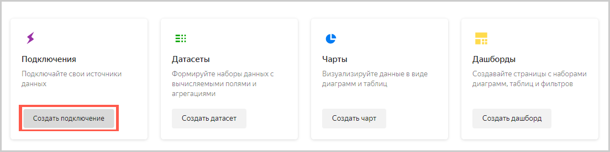
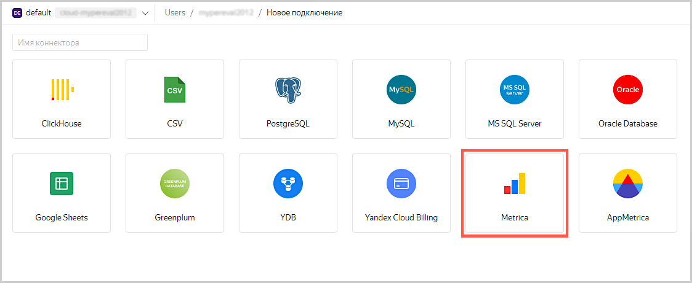
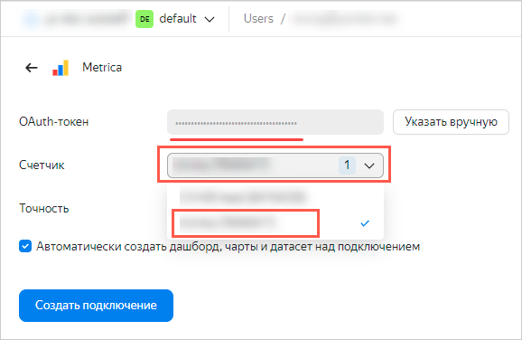
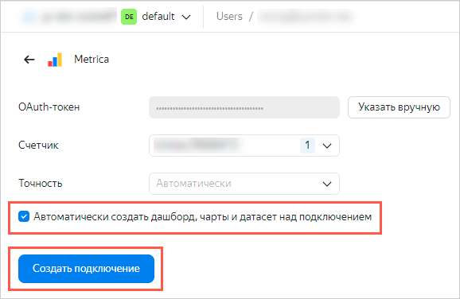
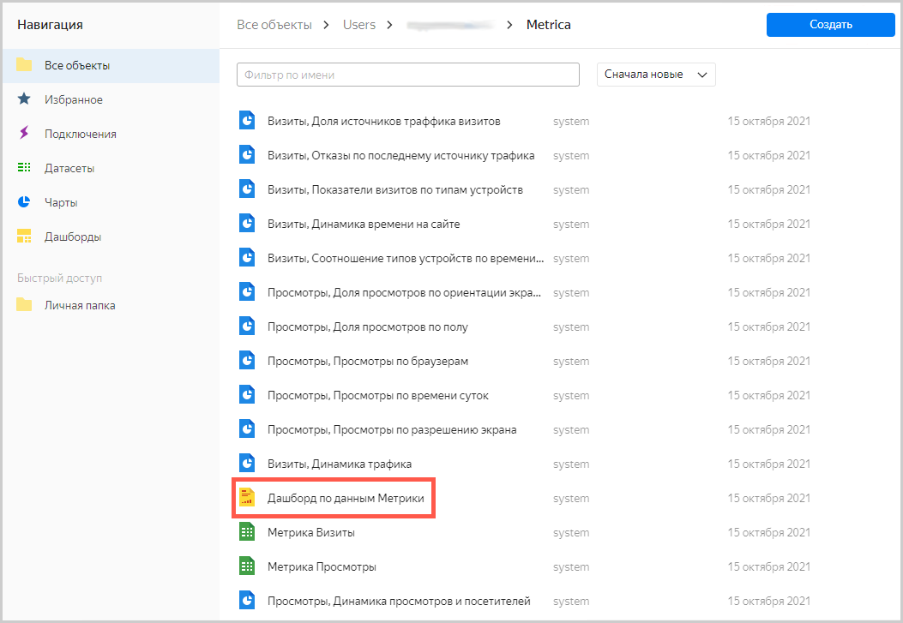
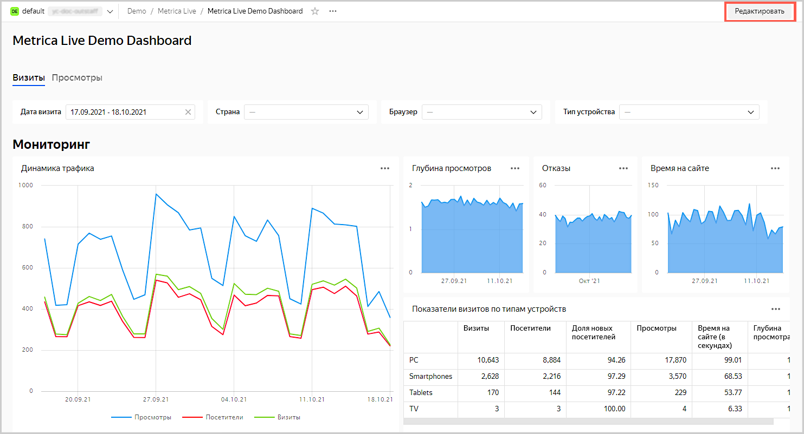
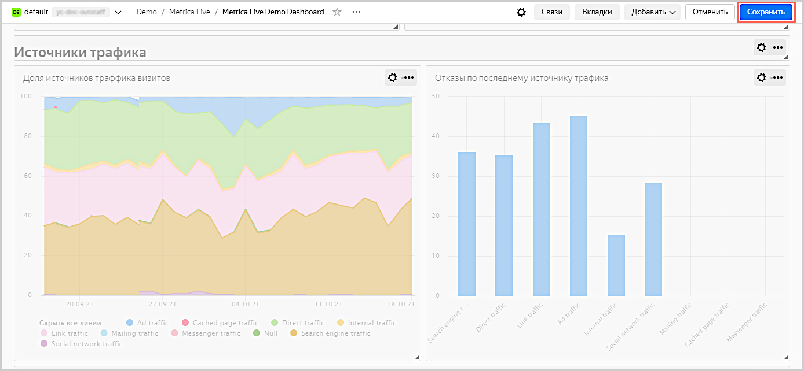

# Визуализация данных из Metriсa

В качестве источника данных будет использован один из счетчиков Яндекс.Метрики, к которому у вас есть доступ. Просмотреть список доступных вам счетчиков можно по ссылке [https://metrika.yandex.ru/list](https://metrika.yandex.ru/list).
    

Если в вашем списке не оказалось доступных счетчиков, то перед началом выполнения данного сценария вам будет необходимо получить доступ к счетчику или работать с демонстрационным дашбордом над данными Яндекс.Метрики. Он создается автоматически при создании экземпляра {{ datalens-short-name }}.

Чтобы визуализировать данные, необходимо пройти следущие шаги:

- [Шаг 1. Создайте подключение и стандартный дашборд](data-from-metrica-visualization#step1)
- [Шаг 2. Измените стандартный дашборд](data-from-metrica-visualization#step2)
- [Шаг 3. Измените чарт](data-from-metrica-visualization#step3)

## Шаг 1. Создайте подключение и стандартный дашборд {#step1}



Данный шаг доступен для пользователей, у которых есть права на какой-либо счетчик Яндекс.Метрики. Если у вас нет прав на счетчик, то откройте готовый дашборд [**Metriсa Live Demo Dashboard**](https://datalens.yandex.ru/navigation?path=Demo/Metrica/Metrica%20Live%20Demo%20Dashboard) и перейдите к шагу 2.



1. Перейдите в [{{ datalens-short-name }}](https://datalens.yandex.ru).
1. Нажмите кнопку **Создать подключение**.

    

1. Выберите **Metriсa**.

    

1. Введите имя подключения **My Metriсa** и нажмите кнопку **Получить токен**.

    

1. Если вы первый раз создаете подключение к счетчику Яндекс.Метрики, то предоставьте сервису необходимые разрешения.
1. Выберите необходимый счетчик из выпадающего списка. 

    

1. Выберите тип подключения **Прямой доступ**.
1. Включите опцию **Автоматически создать дашборд на данном подключении**.
1. Нажмите кнопку **Создать подключение**.

    

    После создания подключения откроется папка с набором датасетов, чартов и дашборда созданных над новым подключением.
    
1. Перейдите на **Дашборд по данным Метрики**.

    

## Шаг 2. Измените стандартный дашборд {#step2}



Если у вас нет счетчика Яндекс.Метрики и вы пропустили шаг 1, используйте дашборд [**Metriсa Live Demo Dashboard**](https://datalens.yandex.ru/navigation?path=Demo/Metrica/Metrica%20Live%20Demo%20Dashboard).



Вы можете изменять стандартный [дашборд](../concepts/dashboard.md), так как вам удобно. Например, вы можете удалить ненужный график.

1. В дашборде нажмите кнопку **Редактировать** в правом верхнем углу.

    

1. Удалите чарт **Глубина просмотров**. Для этого нажмите значок   в верхнем правом углу графика.

    
    
1. Разместите чарты **Отказы** и **Время на сайте** таким образом, чтобы они заполнили пустое пространство после удаления чарта на предыдущем шаге. Ператаскивать чарты можно кликнув на сам чарт, растягивать и ужимать через треугольник в нижнем правом углу чарта. 

    
 
1. Удалите чарты **Доля визитов по браузерам** и **Визиты, просмотры и посетители по браузерам**.

    

1. Нажмите кнопку **Сохранить** в верхнем правом углу и сохраните дашборд.

     

## Шаг 3. Измените чарт {step3}

Вы можете отредактировать любой чарт на дашборде. Например, поменяйте тип визуализации для диаграммы **Визиты по типам устройств и ОС** из раздела **Технологии**.

1. Нажмите значок  в верхнем правом углу графика **Визиты по типам устройств и ОС**.
1. Выберите **Редактировать**.

    

1. В открывшемся окне во втором столбце нажмите на **Древовидная диаграмма** и выберите другой тип чарта: **Круговая диаграмма**.

    

1. Нажмите кнопку **Сохранить** в верхнем правом углу и сохраните чарт.

    

1. Закройте вкладку с редактированием чарта и вернитесь в окно с дашбордом.

1. Обновите дашборд, и убедитесь, что в разделе **Технологии** чарт изменился.

    
