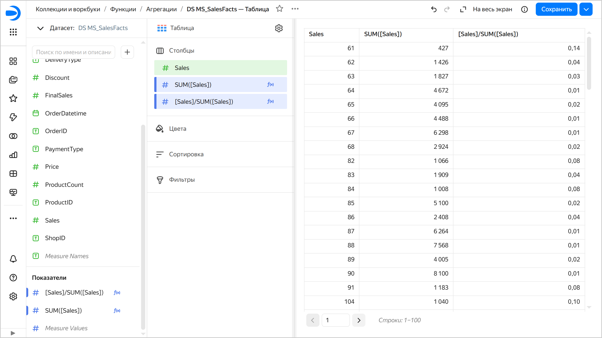
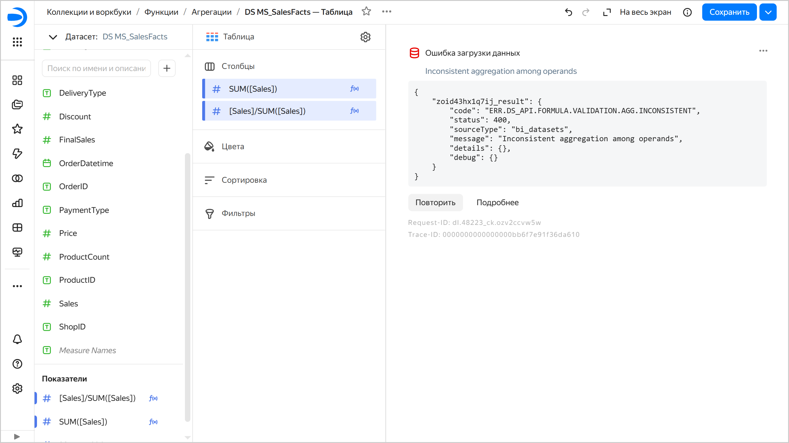
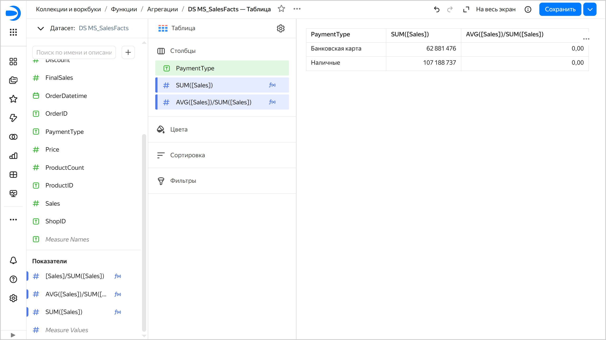

# [{{ datalens-full-name }}] Inconsistent aggregation among operands

`ERR.DS_API.FORMULA.VALIDATION.AGG.INCONSISTENT`

Происходит, когда аргументами одной и той же функции (или операндами одного оператора) являются одновременно агрегированное и неагрегированное выражения.

При вычислении агрегированного значения происходит преобразование большого набора строк в единственное значение. Для этого применяются специальные [агрегатные функции](../../../datalens/function-ref/aggregation-functions.md). Наиболее часто применяются функции `SUM`, `MIN`, `MAX`, `AVG` и `COUNT`. Агрегатные функции рассчитывают и возвращают одно результирующее значение для всех строк запроса. Если используется группировка, то рассчитываются и возвращаются значения отдельно для каждой группы, на которые разбивается результат запроса.

В {{ datalens-short-name }} вы не можете использовать в одном выражении агрегированные и неагрегированные значения. Нельзя использовать в одном выражении [показатели](../../dataset/data-model.md#field) (отображаются в датасете и в визарде синим цветом) и [измерения](../../dataset/data-model.md#field) (отображаются в датасете и в визарде зеленым цветом).

Еще ошибка может появиться, когда у оконной функции в разделе `WITHIN` есть поля, не являющиеся ни агрегацией, ни измерением в чарте.

## Как исправить ошибку {#fix-error}

Чтобы исправить ошибку:

* Примените агрегацию ко всем полям в выражении.
* Разделите выражение на отдельные показатели.
* Используйте [LOD-выражения](../../../datalens/function-ref/aggregation-functions.md#syntax-lod), чтобы создать вложенные агрегации и агрегации над всеми данными или группами, отличающимися от группировки, заданной на уровне чарта.

## Примеры {#examples}

**Пример 1. Деление поля на агрегированную сумму**

* Некорректная формула: `[Sales] / SUM([Sales])`.
* Проблема: Поле `Sales` неагрегированное, а `SUM([Sales])` — агрегированное. Поле `Sales` не является ни агрегацией, ни измерением в рамках группы. Оно не имеет фиксированного значения — в каждой строке оно может быть разным. Поэтому невозможно определить, какое конкретно значение поля `Sales` должно быть выбрано при вычислении выражения `[Sales] / SUM([Sales])`. Это выражение вычислить невозможно.
* Решение: Используйте агрегацию для поля `Sales`. Тогда это поле станет показателем.
* Корректная формула: `AVG([Sales]) / SUM([Sales])`.



Для большей наглядности выполните следующий сценарий:

1. Создайте [подключение](../../quickstart.md#create-connection) к демонстрационной БД и датасет на основе таблицы `MS_SalesFacts`.
1. На основе датасета создайте чарт [Таблица](../../visualization-ref/table-chart.md).
1. Из раздела `Измерения` перетащите поле `Sales` в секцию **Столбцы**. К полю не применяется функция агрегации — это измерение. В интерфейсе измерения отображаются зеленым цветом. Они задают группировку в чартах.
1. [Создайте поле](../../concepts/calculations/index.md#how-to-create-calculated-field) `SUM([Sales])` с формулой `SUM([Sales])` и перетащите его из раздела `Показатели` в секцию **Столбцы**. В формуле поля к числовому значению применяется функция агрегации — это показатель. В интерфейсе показатели отображаются синим цветом. Агрегатная функция рассчитывает и возвращает одно результирующее значение для каждой группы, на которые разбивается результат запроса — для каждой группы `Sales` рассчитывается одно значение `SUM([Sales])`.
1. Создайте поле `[Sales]/SUM([Sales])` с формулой `[Sales]/SUM([Sales])` и перетащите его из раздела `Показатели` в секцию **Столбцы**. Это тоже показатель. Измерение `Sales` используется при построении чарта и задает группировку для вычисления показателей. Поэтому для вычисления каждого значения `[Sales]/SUM([Sales])` используется одно конкретное значение `Sales`, и ошибка не возникает.

   

   

   

1. Удалите из секции **Столбцы** измерение `Sales`. Теперь нет измерения, определяющего группировку в чарте, и агрегатные функции рассчитывают и возвращают одно результирующее значение для всех строк запроса. Но в формуле `[Sales]/SUM([Sales])` присутствует поле `Sales` без агрегации, которое не используется при построении чарта и не имеет фиксированного значения. Поэтому непонятно, какое значение поля `Sales` использовать для вычисления значения выражения. Возникает ошибка.

   

   

   

1. Из раздела `Измерения` перетащите поле `PaymentType` в секцию **Столбцы**. Теперь группировку в чарте определяет измерение `PaymentType`, и агрегатная функция рассчитывает и возвращает одно результирующее значение для каждой группы. Но в каждой группе `PaymentType` содержится много записей с разными значениями `Sales`, поэтому непонятно, какое значение поля `Sales` использовать для вычисления значения выражения `[Sales] / SUM([Sales])`. Также возникает ошибка.
1. Создайте поле `AVG([Sales])/SUM([Sales])` с формулой `AVG([Sales])/SUM([Sales])` и замените на него показатель `[Sales]/SUM([Sales])` в секции **Столбцы**. Теперь для каждой группы `PaymentType` вычисляются результирующие значения `AVG([Sales])` и `SUM([Sales])`, которые используются для вычисления значения выражения `AVG([Sales])/SUM([Sales])`. Ошибка не возникает.

   

   

   



**Пример 2. Вычитание неагрегированного поля из агрегированного**

* Некорректная формула: `[Total Sales] - [Profit]`.
* Проблема: Поле `Total Sales` агрегированное, а `Profit` — неагрегированное. `[Total Sales]` — результат комбинирования всех записей группы, а выражение `[Profit]` имеет разное значение для каждой записи, и для группы не понятно, какое значение нужно брать. Такое выражение лишено смысла, его невозможно вычислить.
* Решение: Применить агрегацию к полю `Profit`.
* Корректная формула: `[Total Sales] - SUM([Profit])`.
