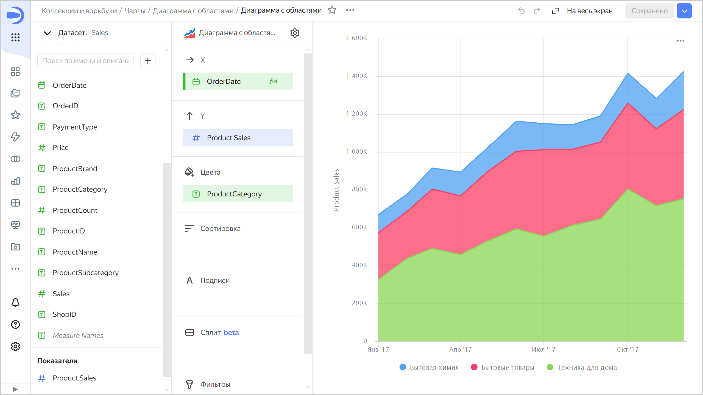

# Накопительная диаграмма с областями 

Диаграмма показывает изменение показателя во времени. Область между осью и линией заполняется цветами, чтобы указать объем. При показе нескольких категорий данных, они накладываются друг на друга. Самая верхняя линия представляет собой сумму всех данных.

Диаграмму используют, когда важно посмотреть на суммарный итог по категориям. Например, общую сумму продаж в разбивке по категориям товаров.



Год |	Техника для дома |	Бытовые товары  | Бытовая химия
----- | ---------| ---------- | ---------- 
Январь 2019|	128К |	55К | 26К
Февраль 2019|	97К |	79К | 18К
Март 2019|	187К |	105К | 41К
Апрель 2019|	188К | 137К | 34К
Май 2019|	230К |	121К | 43К
Июнь 2019|	256К |	162К | 59К
Июль 2019|	284К |	206К | 67К	
Август 2019|	409К |	204К | 72К
Сентябрь 2019|	314К |	209К | 86К
Октябрь 2019|	324К |	262К | 79К
Ноябрь 2019|	385К |	238К | 101К
Декабрь 2019|	451К |	307К | 111К



Внимательно выбирайте показатели для построения диаграммы. Например, некорректно складывать количество клиентов и сумму продаж, или сумму продаж и сумму закупок.

## Секции в визарде {#wizard-sections}

Секция  в визарде| Описание
----- | ----
X | Измерение. Может быть указано только одно поле. Обычно это измерение бывает датой. В этом случае проверьте, что в датасете для этого поля указан тип данных `Дата`. Это необходимо для корректной сортировки, отображения подписей. Для более наглядной визуализации дату можно группировать в недели, месяцы, годы (подробнее в разделе [{#T}](../concepts/chart/settings.md#field-settings)).
Y | Показатель. Может быть указано несколько показателей. При добавлении в секцию более одного показателя в секции **Цвета** появится измерение `Measure Names`.
Цвета | Измерение или поле `Measure Names`. Влияет на цвет линий. `Measure Names` удаляется путем удаления показателей с оси Y.
Сортировка | Измерение или показатель. Может использоваться измерение из секций **Х** и **Цвета** или показатель с оси Y. Влияет на сортировку оси X или областей по оси Y.
Подписи | Показатель. Отображает значения показателя на диаграмме. Если в секцию **Y** добавлено несколько показателей, перетащите в эту секцию показатель `Measure Values`.
Фильтры | Измерение или показатель. Используется в качестве фильтра.

## Создание диаграммы с областями {#create-diagram}

Чтобы создать диаграмму с областями:

1. На [главной странице]({{ link-datalens-main }}) сервиса {{ datalens-full-name }} нажмите **Создать чарт**.
1. В разделе **Датасет** выберите датасет для визуализации.
1. Выберите тип чарта **Накопительная диаграмма с областями**.
1. Перетащите измерение из датасета в секцию **X**. Значения отобразятся в нижней части графика по оси X.
1. Перетащите один или несколько показателей из датасета в секцию **Y**. Значения отобразятся в виде областей по оси Y.

### Настройка отображения пустых (`null`) значений {#null-settings}



## Рекомендации {#recomendations}

* 
* Не показывайте на диаграмме больше 3-5 областей.
* Чтобы отслеживать динамику было проще, расположите самые крупные или самые важные категории ближе к основанию диаграммы. Для этого перетащите нужный показатель в секцию **Сортировка**, или настройте их порядок в секции **Y**. Например, для отслеживания динамики продаж по категории `Бытовая химия`.
  
  
  
  

  
