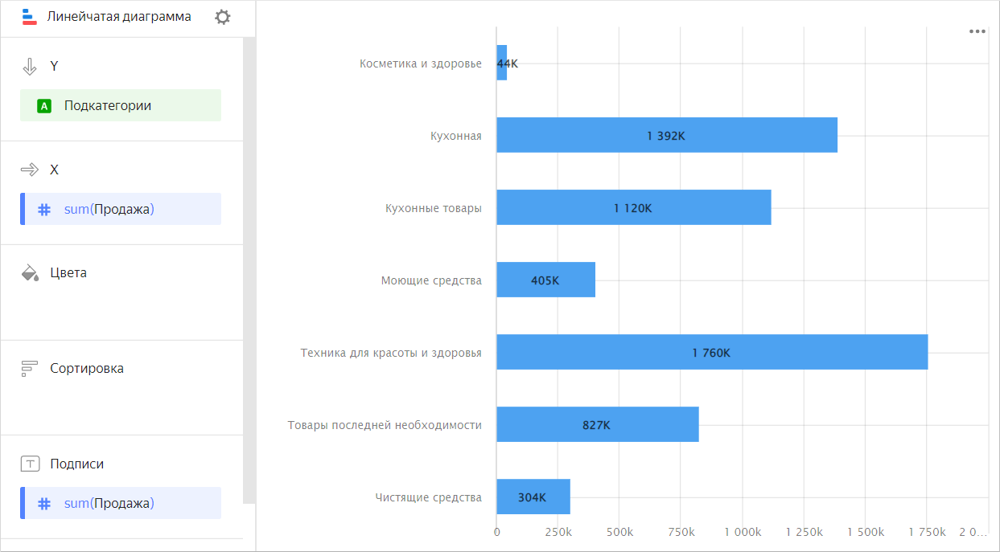
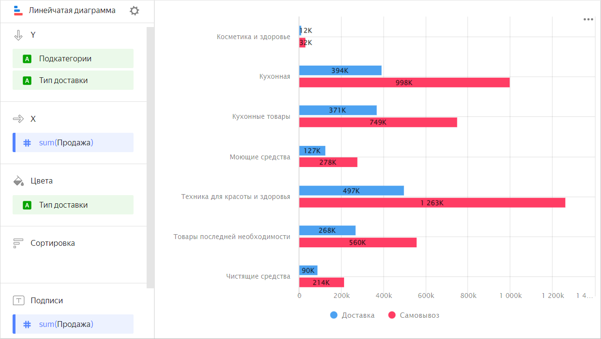
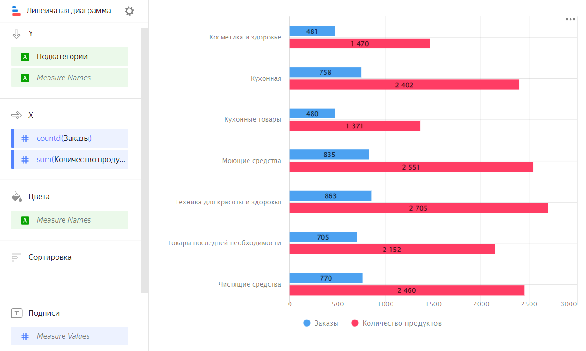
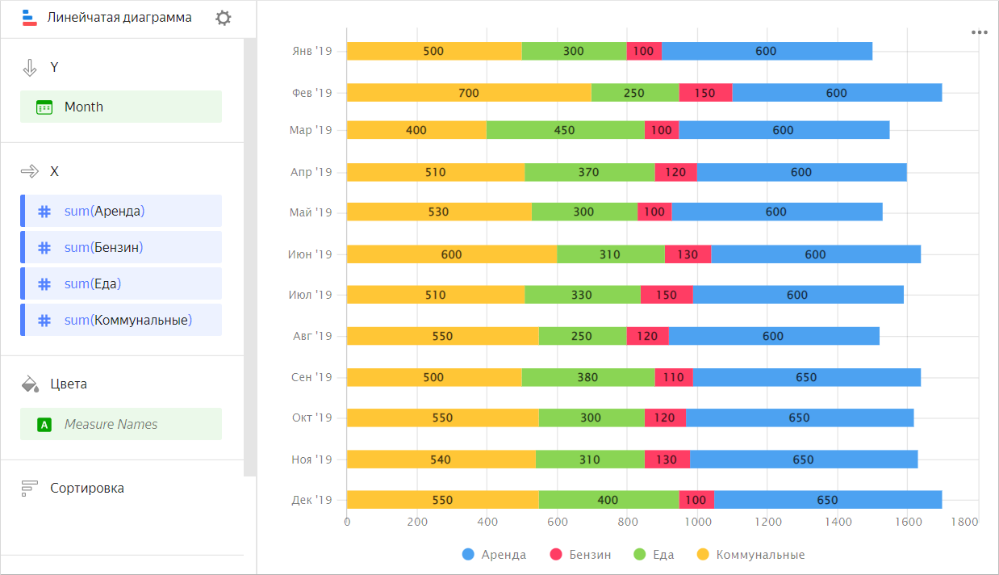
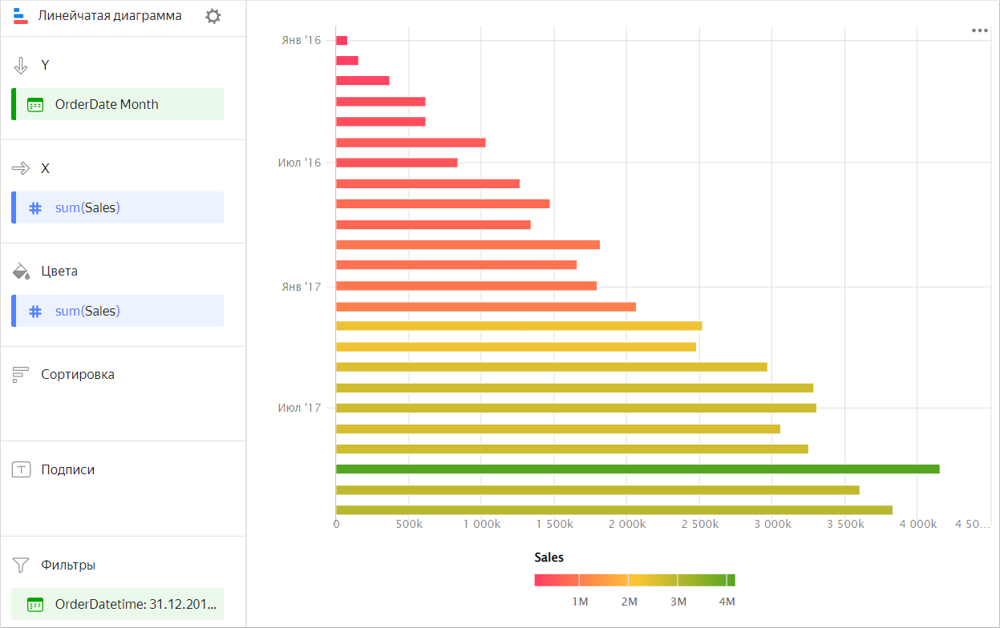

# Линейчатая диаграмма 

Диаграмма отображает значения одного или нескольких показателей по каждой категории с помощью горизонтальных столбиков. Длина столбика определяет значение показателя: чем длиннее столбец, тем больше его значение. Например, можно сравнить продажи товаров по их подкатегориям.



Подкатегория |	Продажа
-------------|--------- 
Косметика и здоровье |	44К
Кухонная |	1392К
Кухонные товары |	1120К
Моющие средства |	405К
Техника для красоты и здоровья |	1760К
Товары последней необходимости |	827К
Чистящие средства |	304К



## Типы линейчатых диаграмм {#types}

* [с группировкой](#groupped)
* [с накоплением](#stacked)

### С группировкой {#groupped}

Диаграмма с группировкой по измерению позволяет сравнивать две или несколько категорий по одному показателю. Например, группировка по типу доставки позволяет сравнить стоимость товаров, доставленных курьером и самовывоз. Категории выделяются разным цветом, а длина столбцов выражает величину показателя.



Подкатегория |	Доставка |	Самовывоз
-------------|---------| ----------|
Косметика и здоровье |	12К |	32К
Кухонная |	394К |	998К
Кухонные товары |	371К |	749К
Моющие средства |	127К |	278К
Техника для красоты и здоровья |	497К |	1263К
Товары последней необходимости |	268К |	560К



Диаграмма с группировкой позволяет сравнивать два или несколько показателей между собой, например количество заказов и продуктов. Длина столбца выражает величину показателя.



Подкатегория |	Заказы |	Количество продуктов
-------------|---------| ----------|
Косметика и здоровье |	481 |	1470
Кухонная |	758 |	2402
Кухонные товары |	480 |	1371
Моющие средства |	835 |	2551
Техника для красоты и здоровья |	863 |	2705
Товары последней необходимости |	705 |	2152
Чистящие средства |	770 |	2460



### С накоплением {#stacked}

Диаграмма с накоплением показывает соотношение внутренних сегментов в итоговой величине. При этом сегменты располагаются друг за другом — началом для каждого следующего сегмента будет крайняя граница предыдущего.
Диаграмму используют, когда нужно посмотреть вклад каждого показателя в суммарный итог по периодам времени или по категориям. Например, для просмотра доли статей расхода в общей сумме бюджета.



Месяц |	Бензин | Аренда  | Еда | Коммунальные
----- | ---------| ---------- | ---------- | ---------- 
Январь 2019	| 100	| 600	| 300	| 500
Февраль 2019	| 150	| 600	| 250	| 700
Март 2019	| 100	| 600	| 450	| 400
Апрель 2019	| 120	| 600	| 370	| 510
Май 2019	| 100	| 600	| 300	| 530
Июнь 2019	| 130	| 600	| 310	| 600
Июль 2019	| 150	| 600	| 330	| 510
Август 2019	| 120	| 600	| 250	| 550
Сентябрь 2019	| 110	| 650	| 380	| 500
Октябрь 2019	| 120	| 650	| 300	| 550
Ноябрь 2019	| 130	| 650	| 310	| 540
Декабрь 2019	| 100	| 650	| 400	| 550



## Секции в визарде {#wizard-sections}

Секция  в визарде| Описание
----- | ----
Y | Измерения. Может быть указано одно или два измерения.
X | Показатель. Может быть указано несколько показателей. При добавлении в секцию более одного показателя в секции **Цвета** появится измерение [Measure Names](../concepts/chart/measure-values.md). [Measure Names](../concepts/chart/measure-values.md) можно перенести на ось Y.
Цвета | Измерение или поле [Measure Names](../concepts/chart/measure-values.md). Влияет на цвет столбцов. [Measure Names](../concepts/chart/measure-values.md) удаляется нажатием на кнопку крестика или путем удаления показателей с оси X.
Сортировка | Измерение или показатель. Влияет на сортировку столбцов. Направление сортировки отмечено значком рядом с полем: по возрастанию  или по убыванию . Чтобы изменить направление сортировки, нажмите значок.
Подписи | Показатель. Отображает значения показателя на диаграмме. Если в секцию **Y** добавлено несколько показателей, перетащите в эту секцию показатель [Measure Values](../concepts/chart/measure-values.md).
Фильтры | Измерение или показатель. Используется в качестве фильтра.

## Создание линейчатой диаграммы {#create-diagram}

Чтобы создать линейчатую диаграмму:

1. На [главной странице]({{ link-datalens-main }}) сервиса {{ datalens-full-name }} нажмите **Создать чарт**.
1. В разделе **Датасет** выберите датасет для визуализации.
1. Выберите тип чарта **Линейчатая диаграмма**.
1. Перетащите одно или несколько измерений из датасета в секцию **Y**. Значения отобразятся по оси Y.
1. Перетащите один или несколько показателей из датасета в секцию **X**.
1. Перетащите измерение из датасета или поле [Measure Names](../concepts/chart/measure-values.md) в секцию **Цвета**. 

По умолчанию отображается диаграмма с накоплением.

### Создание линейчатой диаграммы с группировкой {#grouped-bar-chart}

Чтобы отобразить диаграмму с группировкой по оси Y:

1. Перейдите к уже созданной линейчатой диаграмме.
1. В зависимости от количества показателей в секции **X** выполните следующие действия:
    
   
    
   - Один показатель {#one}
       
     1. Проверьте наличие измерения в секции **Цвета**.
     1. Продублируйте это измерение в секцию **Y**. Порядок измерений будет влиять на порядок группировки.
    
   - Два и больше показателей {#more}
    
     1. Перетащите измерение [Measure Names](../concepts/chart/measure-values.md) в секцию **Цвета**.
     1. Перетащите измерение [Measure Names](../concepts/chart/measure-values.md) в секцию **Y**. Порядок измерений будет влиять на порядок группировки.

   

### Добавление цвета столбцов по показателю {#column-colors}

Чтобы окрасить столбцы на диаграмме в зависимости от значений показателя:

1. Перейдите к уже созданной столбчатой диаграмме.
1. В зависимости от количества показателей в секции **X** выполните:

   

    - Один показатель {#one}

      Продублируйте показатель из секции **X** в секцию **Цвета**.

      Столбцы на диаграмме окрасятся в зависимости от значений показателя.

      

    - Два и больше показателей {#more}

      Перетащите показатель [Measure Values](../concepts/chart/measure-values.md) в секцию **Цвета**.

      Столбцы на диаграмме окрасятся в зависимости от значений всех показателей, указанных в секции **X**.

      

   

1. Дополнительно настройте градиент цвета для показателя. Для этого в правом верхнем углу секции **Цвета** нажмите значок  (значок появляется при наведении указателя на секцию).
1. В настройках цвета укажите:

   * **Тип градиента** — выберите двухцветный или трехцветный.
   * Цвет градиента — выберите цветовую гамму градиента из списка.
   * Направление градиента — измените направление градиента с помощью значка .
   * **Задать пороговые значения** — установите пороговые числовые значения, которые будут соответствовать каждому цвету. Работает, если в секции **X** один показатель.

### Настройка отображения пустых (`null`) значений {#null-settings}



## Рекомендации {#recomendations}

* 
* Расположите сегменты внутри столбцов так, чтобы самые крупные или самые важные категории находились слева, ближе к оси Y диаграммы. Так вам будет легче сравнивать величины.
* При визуализации нескольких показателей внимательно подбирайте цвета. Они должны быть различимыми и контрастными. Рекомендуем не использовать больше 3-5 цветов на одном чарте. Если вам интересен один показатель среди всех – выделите его одним ярким цветом.
