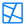
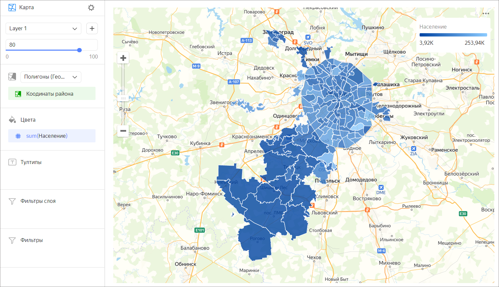

# Фоновая карта 

Фоновая карта отображает целые области и регионы разными цветами или оттенками цвета. Области на карте задаются с помощью геополигонов. Геополигон — это элемент, который состоит из области, ограниченной замкнутой линией, и самой этой линии. Значение показателя выражается через насыщенность цвета или через сам оттенок.

Чтобы показать полигоны на карте, добавьте в датасет поле с типом данных [Геополигон](../concepts/data-types.md#geopolygon):

* Создайте текстовое поле, в котором лежат данные вида `[[[55.60807, 37.5698], [55.60847, 37.56992], [55.60851, 37.57095]]]` — координаты точек полигона в квадратных скобках. Вы можете предварительно подготовить данные в БД и определить тип данных [Геополигон](../concepts/data-types.md#geopolygon) в интерфейсе описания датасета.
* Используйте [функцию](../function-ref/GEOPOLYGON.md) `GEOPOLYGON(polygon_string)`, чтобы создать вычисляемое поле с типом данных [Геополигон](../concepts/data-types.md#geopolygon).
* Если у вас в данных есть поле с названием городов, регионов или стран, используйте [функцию](../function-ref/TOPONYM_TO_GEOPOLYGON.md) `TOPONYM_TO_GEOPOLYGON([city])`.

По [ссылке](https://storage.yandexcloud.net/doc-files/Regions.csv) можно скачать пример CSV-файла с полигонами регионов РФ.

​Фоновая карта используется, когда нужно оценить значение показателя в рамках территориальной единицы. Например, с помощью фоновой карты можно показать плотность населения отдельных районов.

## Секции в визарде {#wizard-sections}

Секция  в визарде| Описание
----- | ----
Полигоны (Геополигоны) | Измерение с типом [Геополигон](../concepts/data-types.md#geopolygon).
Цвета | Измерение или показатель. Влияет на цвет или интенсивность закрашивания областей.
Тултипы | Измерение или показатель. Подсказка, которая отобразится при наведении на область.
Фильтры слоя | Измерение или показатель. Используется в качестве фильтра текущего слоя.
Фильтры | Измерение или показатель. Используется в качестве фильтра всего чарта.

## Создание фоновой карты {#create-diagram}

1. На [главной странице]({{ link-datalens-main }}) сервиса {{ datalens-full-name }} нажмите **Создать чарт**.
1. В разделе **Датасет** выберите датасет для визуализации. Если у вас нет датасета, [создайте его](../operations/dataset/create.md).
1. Выберите тип чарта **Карта**.
1. Выберите тип слоя **Полигоны (Геополигоны)**.
1. Перетащите измерение c типом [Геополигон](../concepts/data-types.md#geopolygon) из датасета в секцию с выбором типа слоя.
1. Закрасьте полигоны на карте. Перенесите показатель или измерение в секцию **Цвета**.
1. Добавьте тултипы из значений измерения и показателя, которые отображаются при наведении на полигон.

Дополнительно вы можете:

* добавить, переименовать, удалить слой;
* применить фильтр ко всему чарту или к одному слою.

## Рекомендации {#recomendations}

* Не используйте фоновую карту, если хотите провести точное сравнение значений между собой.
* Для повышения точности нужно наносить подписи данных или добавлять к карте всплывающие подсказки с информацией.
