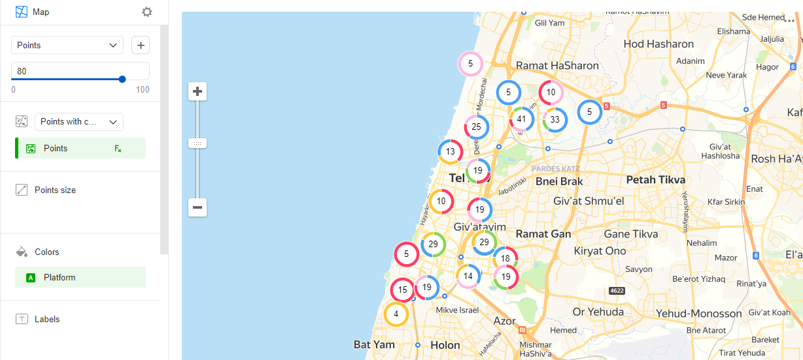

# Точечная карта с кластеризацией 

Точечная диаграмма с кластеризацией отличается от [обычной точечной](point-map-chart.md) тем, что находящиеся рядом друг с другом точки объединяются в кластер. На карте кластер отображается в виде кольцевой диаграммы с числом точек в центре.

Поведение точек отличается в зависимости от масштаба карты:

* При уменьшении масштаба точки будут объединены в кластеры.
* При увеличении масштаба, если точки удаляются друг от друга, кластер автоматически разбивается на кластеры поменьше и/или на отдельные точки.

Если на карте в выбранном масштабе на месте есть только одна точка, то в кластер точка объединена не будет. В этом случае вместо кольцевой диаграммы будет отображена точка как в обычной точечной диаграмме.

Кластеризация на карте позволяет сделать визуализацию с большим количеством точек более наглядной. Например, если вы хотите показать на карте расположение всех магазинов в городе с помощью кластеризации, то точки на карте не перекроют друг друга.





## Секции в визарде {#wizard-sections}

Ограничения:

* Секции **Размер точек**, **Тултипы** и **Подписи** применимы только для отдельно взятых точек.
* В секцию **Цвета** можно добавить только измерение.

Секция  в визарде| Описание
----- | ----
Точки с кластеризацией (Геоточки) | Измерение с типом [Геоточка](../concepts/data-types#geopoint).
Размер точек | Показатель. Задает размер точки в зависимости от значения показателя.
Цвета | Измерение. Влияет на интенсивность закрашивания точек.
Подписи | Показатель. Отображается в виде подписи на точке. При использовании подписи блокируется управление размером точки.
Тултипы | Измерение или показатель. Подсказка, которая отобразится при наведении на точку.
Фильтры слоя | Измерение или показатель. Используется в качестве фильтра текущего слоя.
Фильтры | Измерение или показатель. Используется в качестве фильтра всего чарта.

## Создание точечной карты с кластеризацией {#create-diagram}

1. На [главной странице]({{ link-datalens-main }}) сервиса {{ datalens-full-name }} нажмите **Создать чарт**.
1. В разделе **Датасет** выберите датасет для визуализации. Если у вас нет датасета, [создайте его](../operations/dataset/create.md).
1. Выберите тип чарта **Карта**.
1. Выберите тип слоя **Точки с кластеризацией (Геоточки)**.
1. Перетащите измерение с типом [Геоточка](../concepts/data-types#geopoint) из датасета в секцию с выбором типа слоя.
1. Задайте размер отображаемых точек для точечной карты. Перенесите показатель в секцию **Размер точек** или нажмите значок  в строке с названием секции.
1. Закрасьте точки на карте. Перенесите измерение в секцию **Цвета**.
1. Добавьте тултипы из значений измерения и показателя, которые отображаются при наведении на точку.

Дополнительно вы можете:

* добавить, переименовать, удалить слой;
* поменять слои местами в рамках их типа;
* применить фильтр ко всему чарту или к одному слою.

## Рекомендации {#recomendations}

* Используйте цветовые палитры, соответствующие целям и задачам визуализации.
