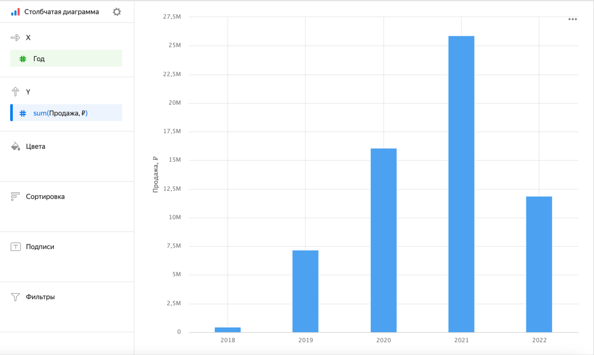
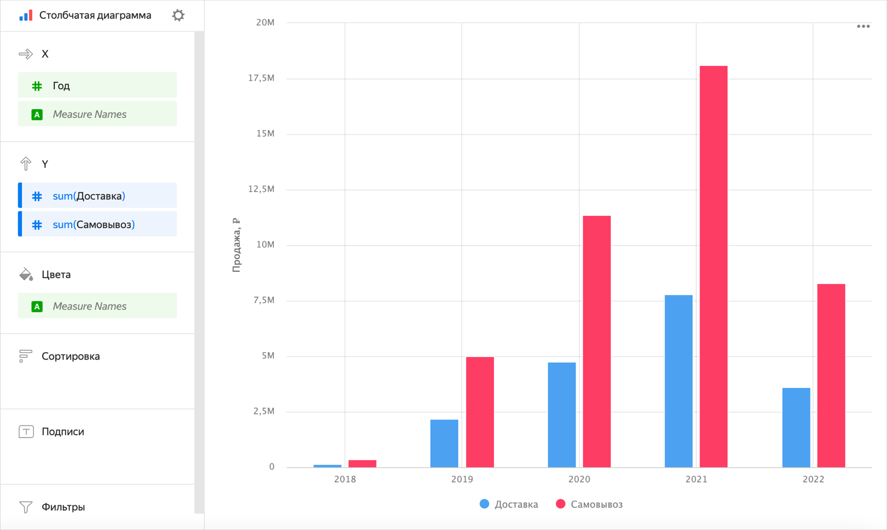
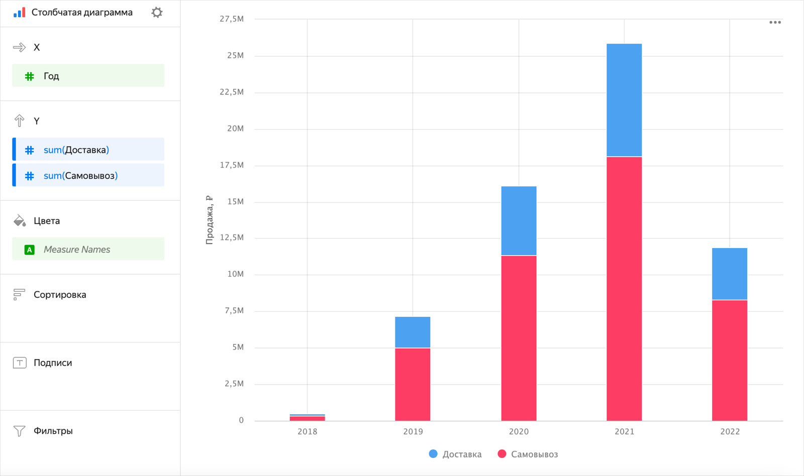
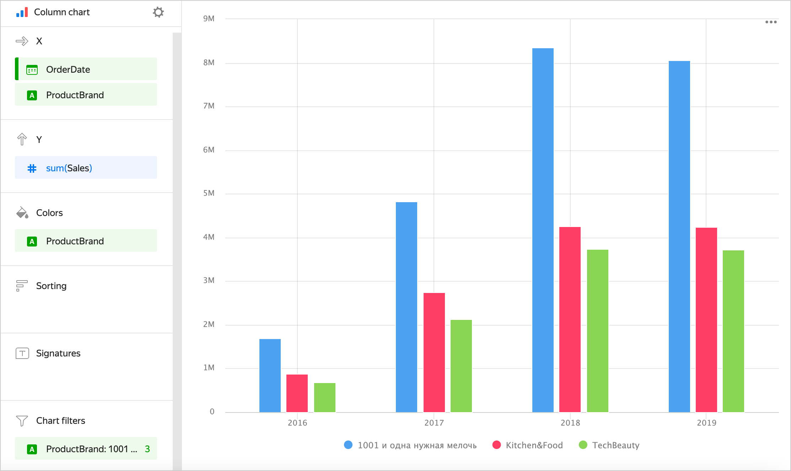
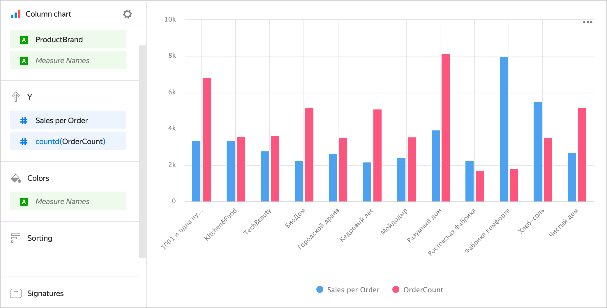
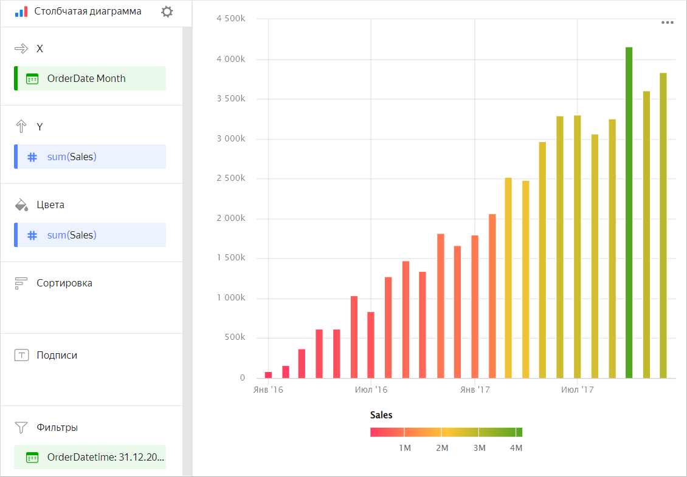
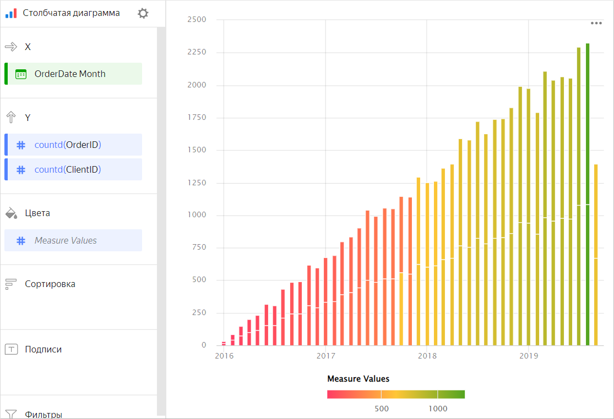
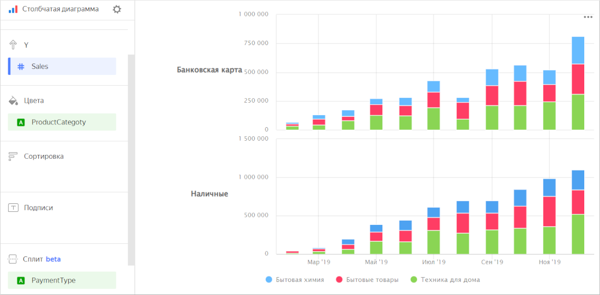

# Столбчатая диаграмма 

Диаграмма отображает значения одного показателя или нескольких показателей по периодам времени или по категориям. Высота столбика определяет значение показателя: чем выше столбец, тем больше его значение.
В отличие от линейного графика, эта диаграмма предполагает прямое сравнение между отдельными периодами, делая акцент на индивидуальных значениях, а не на общем тренде показателя.



Год |	Продажа|	
-----|---------| 
2022|	6М|	
2021|	28М|	
2020|	18М|	
2019|	9М| 
2018|	1М|



## Типы столбчатых диаграмм {#types}

* [c группировкой](#groupped)
* [c накоплением](#stacked)

### C группировкой {#groupped}

Диаграмма с группировкой позволяет сравнивать два или несколько показателей, например количество доставленных товаров курьером или самовывоз. Высота столбца выражает величину показателя.



Год |	Доставка|	Самовывоз
-----|---------| ----------|
2022|	2М|	4М
2021|	8М|	19М
2020|	5М|	13М
2019|	3М| 6М
2018|	331К|	918К



### C накоплением {#stacked}

Диаграмма показывает соотношение внутренних сегментов по периодам времени. При этом сегменты располагаются друг над другом – основанием для каждого следующего сегмента будет крайняя граница предыдущего.
Поскольку сумма всех сегментов будет выражаться общей длиной столбца, то такую диаграмму используют когда важна итоговая сумма столбца.



Год |	Доставка|	Самовывоз
-----|---------| ----------|
2022|	2М|	4М
2021|	8М|	19М
2020|	5М|	13М
2019|	3М| 6М
2018|	331К|	918К



## Секции в визарде {#wizard-sections}

Секция  в визарде| Описание
----- | ----
X | Измерения. Может быть указано одно или два измерения. Влияет на группировку значений по оси X. Порядок указанных измерений влияет на порядок группировок по оси X. Для типов `Дата` и `Дата и время`можно задать группировку по времени: минуты, часы, недели и др.
Y | Показатель. Может быть указано несколько показателей. При добавлении в секцию более одного показателя в секции **Цвета** появится измерение [Measure Names](../concepts/chart/measure-values.md). 
Цвета | Измерение или поле [Measure Names](../concepts/chart/measure-values.md). Влияет на цвет столбцов. [Measure Names](../concepts/chart/measure-values.md) удаляется нажатием на кнопку крестика или путем удаления показателей с оси Y.
Сортировка | Измерение или показатель. Влияет на сортировку столбцов. В сортировку выносится только то измерение, которое участвует в построении чарта.
Подписи | Показатель. Отображает значения показателя на диаграмме. При использовании нескольких показателей для подписи добавляйте [Measure Values](../concepts/chart/measure-values.md).
Сплит | Измерение. Разбивает чарт по горизонтали по значениям выбранного измерения. Максимальное количество сплитов в одном чарте — 25.
Фильтры | Измерение или показатель. Используется в качестве фильтра. Фильтр может быть переопределен селектором дашборда, если селектор будет построен на том же поле.

## Создание столбчатой диаграммы {#create-diagram}

Чтобы создать столбчатую диаграмму:

1. На главной странице сервиса {{ datalens-full-name }} нажмите **Создать чарт**.
1. В разделе **Датасет** выберите датасет для визуализации. 
1. Выберите тип чарта **Столбчатая диаграмма**.
1. Перетащите измерение из датасета в секцию **X**. Значения отобразятся в нижней части графика по оси X.
1. Перетащите один или несколько показателей из датасета в секцию **Y**. Значения отобразятся по оси Y в виде столбцов.

По умолчанию отображается диаграмма с накоплением, если у вас больше одного показателя.

### Создание столбчатой диаграммы c группировкой {#grouped-column-chart}

Чтобы отобразить диаграмму с группировкой по оси X:

1. Перейдите к уже созданной столбчатой диаграмме.
1. В зависимости от количества показателей в секции **Y** выполните следующие действия:

   

    - Один показатель

      1. Проверьте наличие измерения в секции **Цвета**.
      1. Продублируйте это измерение в секцию **Х**. Порядок измерений будет влиять на порядок группировки.

      

    - Два и больше показателей

      1. Перетащите измерение [Measure Names](../concepts/chart/measure-values.md) в секцию **Цвета**.
      1. Перетащите измерение [Measure Names](../concepts/chart/measure-values.md) в секцию **X**. Порядок измерений будет влиять на порядок группировки.

      

   

### Добавление цвета столбцов по показателю {#column-colors}

Чтобы окрасить столбцы на диаграмме в зависимости от значений показателя:

1. Перейдите к уже созданной столбчатой диаграмме.
1. В зависимости от количества показателей в секции **Y** выполните:

   

   - Один показатель

     Продублируйте показатель из секции **Y** в секцию **Цвета**.

     Столбцы на диаграмме окрасятся в зависимости от значений показателя.

     

   - Два и больше показателей

     Перетащите показатель [Measure Values](../concepts/chart/measure-values.md) в секцию **Цвета**.

     Столбцы на диаграмме окрасятся в зависимости от значений всех показателей, указанных в секции **Y**.

     

   

1. Дополнительно настройте градиент цвета для показателя. Для этого в правом верхнем углу секции **Цвета** нажмите значок  (значок появляется при наведении указателя на секцию).
1. В настройках цвета укажите:

   * **Тип градиента** — выберите двухцветный или трехцветный.
   * Цвет градиента — выберите цветовую гамму градиента из списка.
   * Направление градиента — измените направление градиента с помощью значка .
   * **Задать пороговые значения** — установите пороговые числовые значения, которые будут соответствовать каждому цвету. Работает, если в секции **Y** один показатель.

### Настройка отображения пустых (`null`) значений {#null-settings}



## Рекомендации {#recomentations}

* Если значения категорий содержат большое количество текста, постарайтесь сокращать текст — подписи на диаграмме будут выглядеть аккуратнее. Можно использовать строковые функции в вычисляемых полях или условные операторы `CASE`.
* Если каждый столбец является категорией, а не временем, рассмотрите возможность сортировки столбцов по убыванию или возрастанию показателя. Это сделает график визуально более аккуратным и информативным. Сортировка может быть полезна и внутри подкатегорий каждого столбца.
* Столбчатая диаграмма рекомендуется для отображения изменения показателя(ей) во времени. В этом случае сортировку по оси Х используйте с осторожностью, так как обычно пользователь ожидает увидеть изменение во времени по оси X.
* При визуализации нескольких показателей внимательно подбирайте цвета. Они должны быть различимыми и контрастными. Рекомендуем не использовать больше 3-5 цветов на одном чарте. Если вам интересен один показатель среди всех – выделите его одним ярким цветом.
* Диаграмму можно разбить по измерению на несколько небольших диаграмм, которые удобно сравнивать между собой. Для этого перетащите измерение из датасета в секцию **Сплит**.

  

  

  
