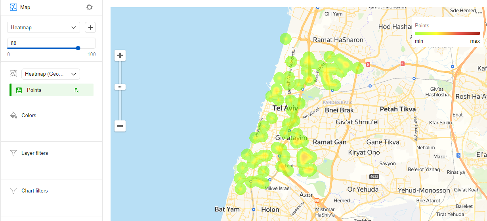

# Тепловая карта 

Тепловая карта показывает плотность распределения точек. Области на карте окрашиваются градиентом от зеленого цвета к красному: чем больше точек сгруппированы в области, тем ближе к красному будет ее цвет. Тепловые карты используются для отображения скоплений большого количества точек.

Тепловая карта наиболее эффективна при работе с набором данных, содержащим много точек, расположенных в небольшой географической области. Если точек на карте немного, интенсивность их закрашивания может быть выражена значением показателя: чем выше значение показателя, тем ближе к красному будет цвет точки. 

Тепловая карта помогает найти зависимости, которые могли быть скрыты из-за перекрывающихся точек на карте (в случае с [точечной](point-map-chart.md) картой). Например, с помощью тепловой карты можно определить районы, в которые наиболее часто заказывают доставку.





## Секции в визарде {#wizard-sections}

Секция  в визарде| Описание
----- | ----
Теплокарта (Геоточки) | Измерение с типом [Геоточка](../concepts/data-types#geopoint).
Цвета  | Измерение или показатель. Влияет на интенсивность закрашивания точек.
Фильтры слоя | Измерение или показатель. Используется в качестве фильтра текущего слоя.
Фильтры | Измерение или показатель. Используется в качестве фильтра всего чарта.

## Создание тепловой карты {#create-diagram}

1. На [главной странице]({{ link-datalens-main }}) сервиса {{ datalens-full-name }} нажмите **Создать чарт**.
1. В разделе **Датасет** выберите датасет для визуализации. Если у вас нет датасета, [создайте его](../operations/dataset/create.md).
1. Выберите тип чарта **Карта**.
1. Выберите тип слоя **Теплокарта (Геоточки)**.
1. Перетащите измерение с типом [Геоточка](../concepts/data-types.md#geopoint) из датасета в секцию с выбором типа слоя. 
1. Измените вес точек на тепловой карте. Для этого перенесите показатель в секцию **Цвета**.

Дополнительно вы можете:

* добавить, переименовать, удалить слой;
* применить фильтр ко всему чарту или к одному слою.

## Рекомендации {#recomendations}

* Используйте тепловую карту, если ваш набор данных содержит большое число точек. Если точек мало, это может исказить выявленные зависимости.
* Интенсивность закрашивания точек и областей на тепловой карте меняется в зависимости от масштаба. Обращайте на это внимание.
