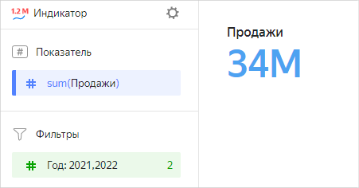
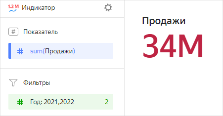
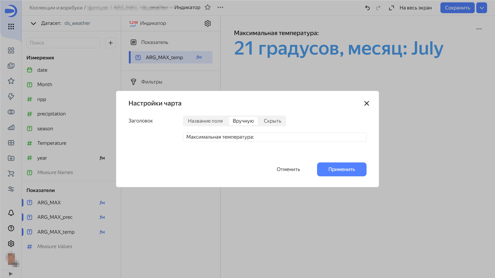
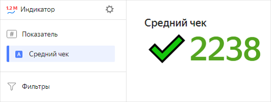
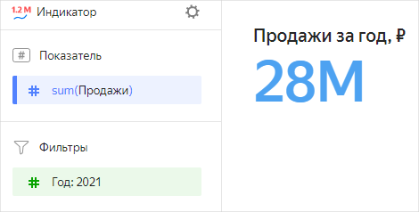

# Индикатор 

Индикатор отражает значение одного ключевого показателя. Используется, когда на дашборде есть значения, за которыми нужно регулярно следить для понимания общей ситуации. Это может быть количество инцидентов за прошлый день, процент выполнения плана или прирост продаж год к году. Чаще всего индикаторы располагаются сверху или в правой части дашборда. Чтобы индикаторы не теряли акцент и не путали пользователя, их должно быть не больше 6 на одном экране. С помощью индикаторов разного размера можно выстроить иерархию важности разных метрик.

Размер и цвет индикатора можно настраивать.



Год |	Продажа|	
-----|---------| 
2022|	6М |	
2021|	28М |	
2020|	18М |	
2019|	9М | 
2018|	1М |



## Секции в визарде {#wizard-sections}

Секция  в визарде| Описание
----- | ----
Показатель  | Показатель. Один показатель, который определяет значение индикатора.
Фильтры | Измерение или показатель. Используется в качестве фильтра.

## Создание индикатора {#create-diagram}

Чтобы создать индикатор:



1. Перейдите на [главную страницу]({{ link-datalens-main }}) {{ datalens-short-name }}.
1. На панели слева выберите  **Чарты**.
1. Нажмите кнопку **Создать чарт** → **Чарт**.
1. Слева вверху нажмите  **Выберите датасет** и укажите датасет для визуализации.
1. Выберите тип чарта **Индикатор**.
1. Перетащите измерение или показатель из датасета в секцию **Показатель**. Значение отобразится в виде числа.

## Дополнительные настройки {#additional-settings}

### Изменение размера и цвета индикатора {#size-color-setting}

Чтобы изменить размер и цвет индикатора:

1. В секции **Показатель** нажмите значок .
1. В окне **Настройки индикатора** выберите размер, цвет и нажмите **Применить**.

### Настройка отображения заголовка {#indicator-title}

Чтобы настроить отображение заголовка:

1. В верхней части экрана, напротив типа чарта, нажмите значок .
1. Выберите отображение заголовка:

   * `Название поля` — отображать название поля в заголовке;
   * `Вручную` — переименовать заголовок;
   * `Скрыть` — не отображать заголовок.

1. Нажмите кнопку **Применить**.





## Рекомендации {#recommendations}

* Используйте Emoji при вычислении значений индикатора, чтобы добавить информативности.

  

  В данном чарте-индикаторе используется вычисляемое поле с формулой `IF([Средний чек]>2200, CONCAT("✔️",STR(ROUND([Средний чек]))),CONCAT("🔻",STR(round([Средний чек]))))`.

* Описывайте контекст для понимания, что означает индикатор.

  

#### См. также {#see-also}

* [{#T}](../operations/dashboard/create.md)
* [{#T}](../operations/dashboard/add-chart.md)
* [{#T}](../operations/dashboard/add-selector.md)