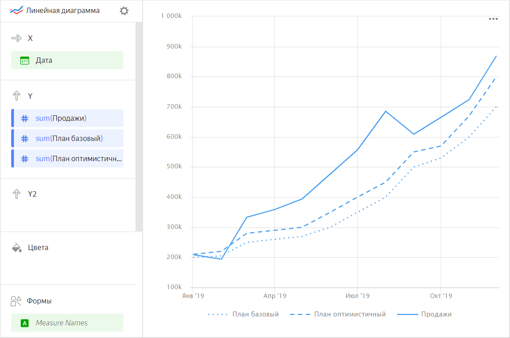
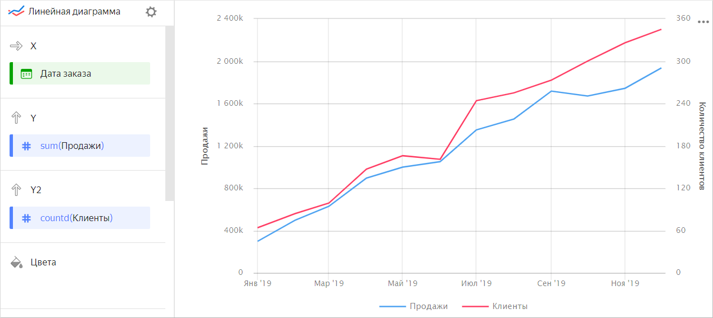
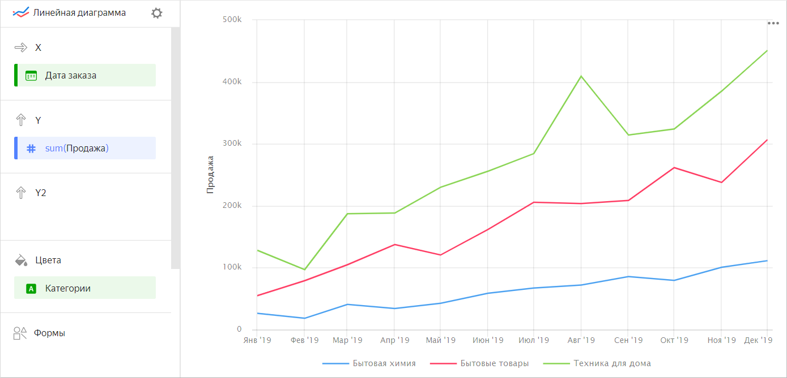
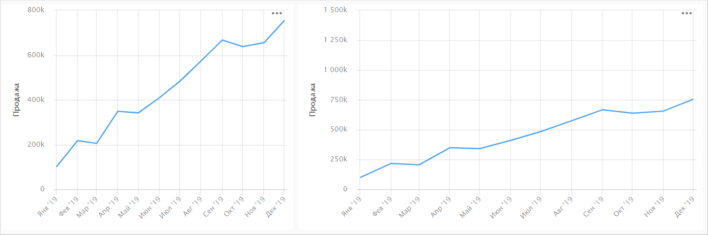
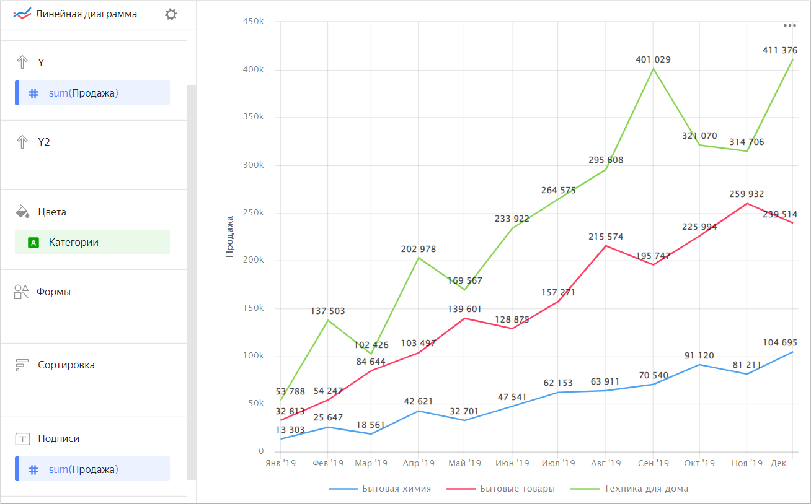
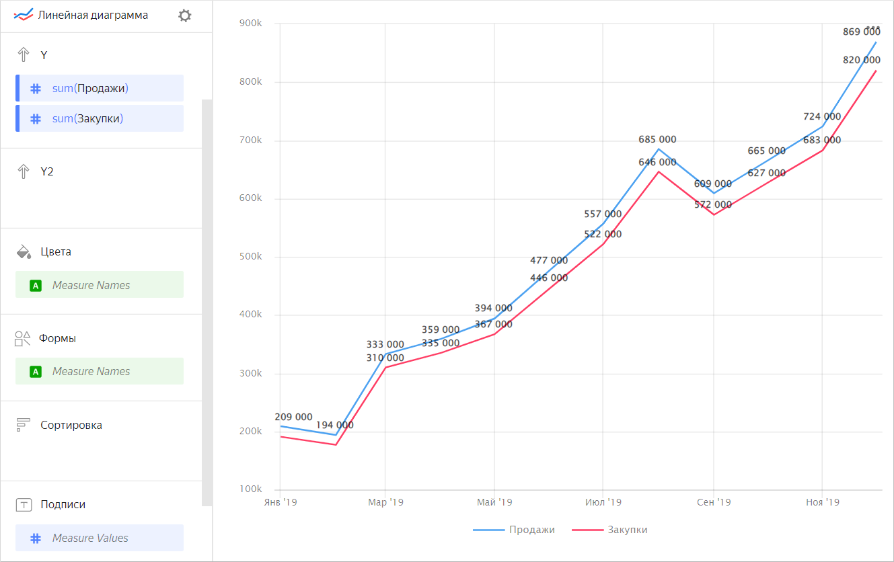
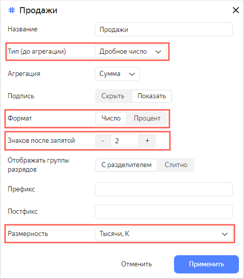

# Линейная диаграмма 

Диаграмма отображает изменение одного или нескольких показателей на отрезке времени. Она показывает тренды, сезонность, динамику, соотношение нескольких показателей в общей точке во времени. Строится по точкам с координатами (X, Y), которые затем соединяются одной линией. 

Диаграмма может показывать несколько показателей разными линиями. Например, базовый план продаж, оптимистичный план продаж и фактические продажи можно показать пунктирной, штриховой и сплошной линиями соответственно.



Год |	Продажа |	План базовый |	План оптимистичный
----- | --------- | --------- | --------- 
Январь 2019|	209К |	200К |	210К
Февраль 2019|	194К |	205К |	220К
Март 2019|	333К |	250К |	280К
Апрель 2019|	359К | 260К |	290К
Май 2019|	394К |	270К |	300К
Июнь 2019|	477К |	300К |	350К
Июль 2019|	557К |	350К |	400К
Август 2019|	685К |	400К |	450К
Сентябрь 2019|	609К |	500К |	550К
Октябрь 2019|	665К |	530К |	570К
Ноябрь 2019|	724К |	600К |	670К
Декабрь 2019|	869К |	700К |	800К



Если значения показателей сильно различаются, их можно расположить на разных осях Y. Тогда значения каждого показателя будут откладываться по своей оси. Например, диаграмма продаж и количества клиентов.

  

  

| Год | Продажи | Количество клиентов |
| ----- | ----- | ----- |
| Январь 2019 | 298450 | 64 |
| Февраль 2019 |498052 | 84 |
| Март 2019 | 629201 | 99 |
| Апрель 2019 | 895075 | 147 |
| Май 2019 | 998557 | 166 |
| Июнь 2019 | 1050330 | 161 |
| Июль 2019 | 1350246 | 244 |
| Август 2019 | 1452550 | 255 |
| Сентябрь 2019 | 1716182 | 273 |
| Октябрь 2019 | 1670980 | 300 |
| Ноябрь 2019 | 1743450 | 326 |
| Декабрь 2019 | 1935377 | 345 |

  

Диаграмма позволяет сравнивать несколько категорий по одному показателю. Линия каждой категории имеет свой цвет или форму. Например, сумма продаж для разных категорий товаров.



Год |	Техника для дома |	Бытовые товары  | Бытовая химия
----- | ---------| ---------- | ---------- 
Январь 2019|	128К |	55К | 26К
Февраль 2019|	97К |	79К | 18К
Март 2019|	187К |	105К | 41К
Апрель 2019|	188К | 137К | 34К
Май 2019|	230К |	121К | 43К
Июнь 2019|	256К |	162К | 59К
Июль 2019|	284К |	206К | 67К	
Август 2019|	409К |	204К | 72К
Сентябрь 2019|	314К |	209К | 86К
Октябрь 2019|	324К |	262К | 79К
Ноябрь 2019|	385К |	238К | 101К
Декабрь 2019|	451К |	307К | 111К



## Секции в визарде {#wizard-sections}

Секция  в визарде| Описание
----- | ----
X | Измерение. Может быть указано только одно поле. Обычно это измерение бывает датой. В этом случае проверьте, что в датасете для этого поля указан тип данных `Дата`. Это необходимо для корректной сортировки, отображения подписей. Для более наглядной визуализации дату можно группировать в недели, месяцы, годы (подробнее в разделе [{#T}](../concepts/chart/settings.md#field-settings)).
Y | Показатель. Может быть указано несколько показателей. При добавлении в секцию более одного показателя в секции **Цвета** появится измерение `Measure Names`.
Y2 | Показатель. Позволяет добавить вторую ось Y на диаграмму. Может быть указано несколько показателей. При добавлении в секцию более одного показателя в секции **Цвета** появится измерение `Measure Names`.
Цвета | Измерение или поле `Measure Names`. Влияет на цвет линий. `Measure Names` удаляется нажатием на кнопку крестика или путем удаления показателей с оси Y.
Формы | Измерение или поле `Measure Names`. Влияет на форму линий.
Сортировка | Измерение. Может использоваться только одно измерение с оси Х. Влияет на сортировку оси X.
Подписи | Показатель. Отображает значения показателя на диаграмме. Если в секцию **Y** или **Y2** добавлено несколько показателей, перетащите в эту секцию показатель `Measure Values`.
Фильтры | Измерение или показатель. Используется в качестве фильтра.

## Создание линейной диаграммы {#create-diagram}

Чтобы создать линейную диаграмму:

1. На [главной странице]({{ link-datalens-main }}) сервиса {{ datalens-full-name }} нажмите **Создать чарт**.
1. В разделе **Датасет** выберите датасет для визуализации.
1. Выберите тип чарта **Линейная диаграмма**.
1. Перетащите измерение из датасета в секцию **X**. Значения отобразятся в нижней части графика по оси X.
1. Перетащите один или несколько показателей из датасета в секцию **Y**. Значения отобразятся в виде графика по оси Y.
1. Перетащите один или несколько показателей из датасета в секцию **Y2**. Значения отобразятся в виде графика по второй оси Y.
1. Перетащите измерение в секцию **Цвета**. Значение показателя разделится по цветам в зависимости от выбранного измерения.
1. Перетащите измерение или показатель из датасета в секцию **Фильтры**. Поле может быть пустым, тогда фильтрация не будет применена.

### Настройка отображения пустых (`null`) значений {#null-settings}



## Рекомендации {#recomendations}

* Восприятие данных на линейной диаграмме зависит от ее пропорций. Восходящий или нисходящий тренд может усиливаться, если график сжат, и быть менее явным, если график растянут. 
  
  
  
  

  
  
* 
* При визуализации нескольких показателей внимательно подбирайте цвета. Они должны быть различимыми и контрастными. Рекомендуем использовать не более 3-5 цветов на одном чарте. Если вам интересен один показатель среди всех – выделите его одним ярким цветом.
* Отключите опцию **Сумма в тултипе** в [настройках чарта](../concepts/chart/settings.md#common-settings), если линии на графике отображают разные сущности. Например, сумма продаж и число клиентов.
* Используйте подписи значений показателя на диаграмме. Для этого перетащите показатель из датасета в секцию **Подписи**. Его значения отобразятся на графике.

  

  

  

  Если в секцию **Y** или **Y2** добавлено несколько показателей, перетащите в эту секцию показатель `Measure Values`.

  

  

  

  Также можно подписать только последнее значение на графике, добавив вычисляемое поле с функцией `MAX`. Подробнее см. [Демодашборд](https://datalens.yandex/9fms9uae7ip02?tab=Are).
  
* Применяйте форматирование в окне настройки [измерений](../concepts/chart/settings.md#measure-settings) и [показателей](../concepts/chart/settings.md#indicator-settings) для улучшения визуализации. Проверяйте тип данных для правильной сортировки, сравнения величин. Указывайте дополнительные параметры. Например, формат, размерность для численных данных, число знаков после запятой для дробных чисел.
  
  
  
  

  

