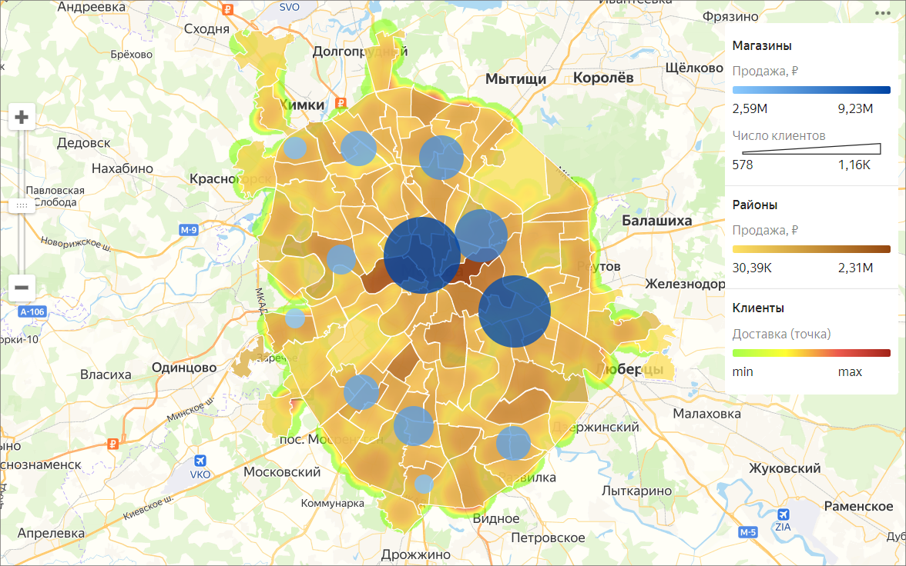

# Карта 

Карты используются для геоаналитики — отображения и исследования бизнес-показателей на карте. К таким показателям можно отнести, например, численность и плотность населения, количество коммерческих объектов, их прибыль и другие параметры, которые могут влиять на эффективность бизнеса.

На карте можно отображать слои разных типов:

* Области. Слой отображает целые области и регионы. Значение показателя выражается через цвета, либо оттенки цвета. Хорошей практикой будет добавление к карте всплывающих подсказок с информацией, в которых можно отобразить наименование области и показатель.
* Точки. С помощью точек можно отобразить отдельные объекты – города, магазины, пункты выдачи заказов или адреса клиентов. Значение показателя можно передать двумя способами – через цвет точки и через ее размер.
* Линии. Используются для отображения связей между объектами на местности. Например, рейсов авиалиний или маршрутов перевозки грузов.
* Теплокарта. Отображает плотность точек на карте. Полезна для отображения большого количества точек и мест их скопления.

Чтобы у вас была возможность создавать карты, в источнике данных обязательно должны находиться либо координаты с типом [Геоточка](../dataset/data-types.md#geopoint), либо области с типом [Геополигон](../dataset/data-types.md#geopolygon).

На одной карте располагаются не более 5 слоев с любыми типами визуализации. Слои в чарте типа **Карта** называются геослоями.

_Геослои_ — визуализация показателей по точкам или полигонам на карте.

С геослоями можно выполнять следующие операции:

* изменять название;
* устанавливать уровень прозрачности с помощью ползунка;
* менять порядок внутри типа визуализации, при этом порядок типов визуализации остается неизменным (сверху вниз: точечная карта, полилинейная карта, фоновая карта, тепловая карта).

Вы можете приобрести предрассчитанные геослои от партнеров в {{ marketplace-name }}.



Создание карт не поддерживается в [QL-чартах](../concepts/chart/index.md#sql-charts).


