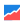
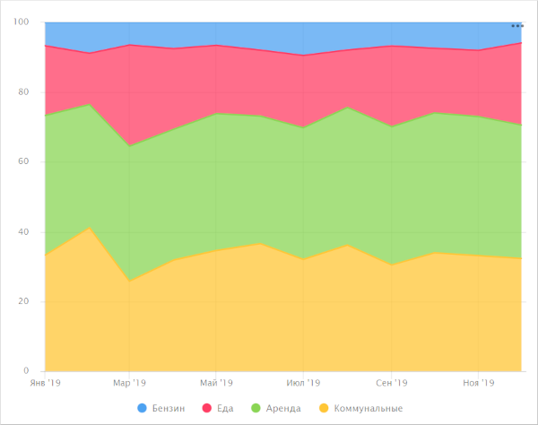

# Нормированная диаграмма с областями  в {{ datalens-full-name }}

Нормированная диаграмма с областями показывает изменения вклада каждой категории в значение показателя на отрезке времени. 

* Области выделяются разными цветами и располагаются друг над другом. Показывается процентное соотношение между областями, а не абсолютная величина областей. 

* Ширина области соответствует ее доле от общей суммы, приведенной к 100%. Например, доля статей расхода в общей сумме бюджета.

  

  

  - Представление

    

  - Исходная таблица

    Месяц |	Бензин | Аренда  | Еда | Коммунальные
    ----- | ---------| ---------- | ---------- | ---------- 
    Январь 2019	| 100	| 600	| 300	| 500
    Февраль 2019	| 150	| 600	| 250	| 700
    Март 2019	| 100	| 600	| 450	| 400
    Апрель 2019	| 120	| 600	| 370	| 510
    Май 2019	| 100	| 600	| 300	| 530
    Июнь 2019	| 130	| 600	| 310	| 600
    Июль 2019	| 150	| 600	| 330	| 510
    Август 2019	| 120	| 600	| 250	| 550
    Сентябрь 2019	| 110	| 650	| 380	| 500
    Октябрь 2019	| 120	| 650	| 300	| 550
    Ноябрь 2019	| 130	| 650	| 310	| 540
    Декабрь 2019	| 100	| 650	| 400	| 550

  

  

* Диаграмму используют, когда нужно показать изменение удельного веса категорий, но их общая сумма при этом не важна. Например, изменение процентной доли категорий товаров в общей сумме продаж.

  

  

  - Представление

    

  - Исходная таблица

    Месяц |	Техника для дома |	Бытовые товары  | Бытовая химия
    ----- | ---------| ---------- | ---------- 
    Январь 2019|	128К |	55К | 26К
    Февраль 2019|	97К |	79К | 18К
    Март 2019|	187К |	105К | 41К
    Апрель 2019|	188К | 137К | 34К
    Май 2019|	230К |	121К | 43К
    Июнь 2019|	256К |	162К | 59К
    Июль 2019|	284К |	206К | 67К	
    Август 2019|	409К |	204К | 72К
    Сентябрь 2019|	314К |	209К | 86К
    Октябрь 2019|	324К |	262К | 79К
    Ноябрь 2019|	385К |	238К | 101К
    Декабрь 2019|	451К |	307К | 111К

  

  

## Секции в визарде {#wizard-sections}

Секция  в визарде| Описание
----- | ----
X | Измерение. Может быть указано только одно поле. Обычно это измерение бывает датой. В этом случае проверьте, что в датасете для этого поля указан тип данных `Дата`. Это необходимо для корректной сортировки, отображения подписей. Для более наглядной визуализации дату можно группировать в недели, месяцы, годы (подробнее в разделе [{#T}](../concepts/chart/settings.md#field-settings)).
Y | Показатель. Может быть указано несколько показателей. При добавлении в секцию более одного показателя в секции **Цвета** появится измерение [Measure Names](../concepts/chart/measure-values.md).
Цвета | Измерение или поле [Measure Names](../concepts/chart/measure-values.md). Влияет на цвет линий. [Measure Names](../concepts/chart/measure-values.md) удаляется путем удаления показателей с оси Y.
Сортировка | Измерение или показатель. Может использоваться измерение из секций **Х** и **Цвета** или показатель с оси Y. Влияет на сортировку оси X или областей по оси Y. Направление сортировки отмечено значком рядом с полем: по возрастанию  или по убыванию . Чтобы изменить направление сортировки, нажмите значок.
Подписи | Показатель. Отображает значения показателя на диаграмме. Если в секцию **Y** добавлено несколько показателей, перетащите в эту секцию показатель [Measure Values](../concepts/chart/measure-values.md). Поддерживается использование [функций разметки](../function-ref/markup-functions.md). Для полей с типом `Строка` можно настроить использование базового синтаксиса [{#T}](../dashboard/markdown.md): нажмите на значок перед названием поля и включите опцию **Markdown**.
Сплит | Измерение. Разбивает чарт по горизонтали по значениям выбранного измерения. Максимальное количество сплитов в одном чарте — 25.
Фильтры | Измерение или показатель. Используется в качестве фильтра.

## Создание нормированной диаграммы с областями {#create-diagram}

Чтобы создать нормированную диаграмму с областями:



1. 
1. 
1. 
1. 
1. Выберите тип чарта **Нормированная диаграмма с областями**.
1. Перетащите измерение из датасета в секцию **X**. Значения отобразятся в нижней части графика по оси X.
1. Перетащите один или несколько показателей из датасета в секцию **Y**. Значения отобразятся в виде областей по оси Y.
1. Перетащите измерение из датасета в секцию **Цвета**. Цветные области отобразят удельный вес отдельной категории в суммарном значении показателя.

## Рекомендации {#recomendations}

* 
* Не показывайте на диаграмме больше 3-5 областей.
* Чтобы отслеживать динамику было проще, расположите самые крупные или самые важные категории ближе к основанию диаграммы. Для этого перетащите нужный показатель в секцию **Сортировка**, или настройте их порядок в секции **Y**. 

  Например, при сравнении статей бюджета.

  

  

  
  
  Для отслеживания динамики бюджета по категории `Бензин`, расположите ее ближе к основанию диаграммы.

  

  

  

  При наличии второй важной категории – поместите ее у верхней границы диаграммы. Тогда области будут иметь ровные границы для визуального сравнения их величин. Например, чтобы сравнить `Коммунальные` и `Аренда`.

  
  
  

  

* 

  

  

  

* Если вам нужно показать абсолютные значения переменных, используйте [диаграмму с областями](area-chart.md).

