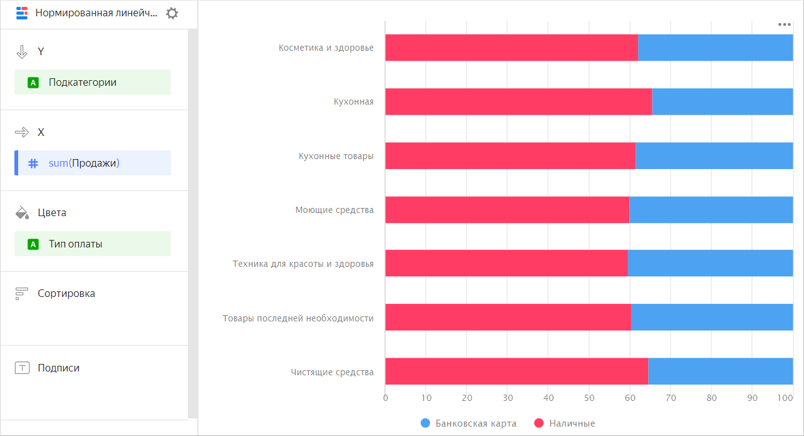
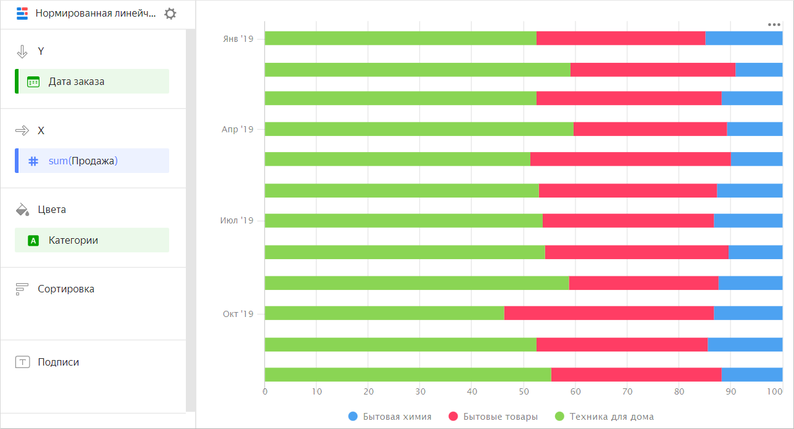

# Нормированная линейчатая диаграмма 

Нормированная линейчатая диаграмма показывает процентный вклад нескольких показателей в общую сумму по периодам времени или по категориям. В отличие от [линейчатой диаграммы с накоплением](bar-chart.md##stacked) для этой диаграммы важна не суммарная длина столбца, а соотношение долей сегментов между собой. Сегменты выделяются разными цветами и располагаются друг за другом. Длина сегмента соответствует его доле от общей суммы, приведенной к 100%. Например, доля статей расхода в бюджете за год. 



Месяц |	Бензин | Аренда  | Еда | Коммунальные
----- | ---------| ---------- | ---------- | ---------- 
Январь 2019	| 100	| 600	| 300	| 500
Февраль 2019	| 150	| 600	| 250	| 700
Март 2019	| 100	| 600	| 450	| 400
Апрель 2019	| 120	| 600	| 370	| 510
Май 2019	| 100	| 600	| 300	| 530
Июнь 2019	| 130	| 600	| 310	| 600
Июль 2019	| 150	| 600	| 330	| 510
Август 2019	| 120	| 600	| 250	| 550
Сентябрь 2019	| 110	| 650	| 380	| 500
Октябрь 2019	| 120	| 650	| 300	| 550
Ноябрь 2019	| 130	| 650	| 310	| 540
Декабрь 2019	| 100	| 650	| 400	| 550



Или процентное распределение типов оплаты в подкатегориях товаров.



Подкатегория |	Доставка |	Самовывоз
-------------|---------| ----------|
Косметика и здоровье |	615К |	373К
Кухонная |	1929К |	1005К
Кухонные товары |	1217К |	759К
Моющие средства |	1210К |	803К
Техника для красоты и здоровья |	2046К |	1380К
Товары последней необходимости |	1368К |	894К
Чистящие средства |	1237К |	673К



Нормированная линейчатая диаграмма показывает процентный вклад каждой категории в итоговое значение показателя на отрезке времени. Например, процент продаж для разных категорий товаров.



Месяц |	Техника для дома |	Бытовые товары  | Бытовая химия
----- | ---------| ---------- | ---------- 
Январь 2019|	128К |	55К | 26К
Февраль 2019|	97К |	79К | 18К
Март 2019|	187К |	105К | 41К
Апрель 2019|	188К | 137К | 34К
Май 2019|	230К |	121К | 43К
Июнь 2019|	256К |	162К | 59К
Июль 2019|	284К |	206К | 67К	
Август 2019|	409К |	204К | 72К
Сентябрь 2019|	314К |	209К | 86К
Октябрь 2019|	324К |	262К | 79К
Ноябрь 2019|	385К |	238К | 101К
Декабрь 2019|	451К |	307К | 111К



## Секции в визарде {#wizard-sections}

Секция  в визарде| Описание
----- | ----
Y | Измерения. Может быть указано одно или два измерения. Для типов `Дата` и `Дата и время` можно задать группировку по времени: минуты, часы, недели и др.
X | Показатель. Может быть указано несколько показателей. При добавлении в секцию более одного показателя в секции **Цвета** появится измерение [Measure Names](../concepts/chart/measure-values.md). [Measure Names](../concepts/chart/measure-values.md) можно перенести на ось Y.
Цвета | Измерение или поле [Measure Names](../concepts/chart/measure-values.md). Влияет на цвет линий. [Measure Names](../concepts/chart/measure-values.md) удаляется путем удаления показателей с оси X.
Сортировка | Измерение или показатель. Влияет на сортировку столбцов. Направление сортировки отмечено значком рядом с полем: по возрастанию  или по убыванию . Чтобы изменить направление сортировки, нажмите значок.
Подписи | Показатель. Отображает значения показателя на диаграмме. Если в секцию **Y** добавлено несколько показателей, перетащите в эту секцию показатель [Measure Values](../concepts/chart/measure-values.md). Поддерживается использование [функций разметки](../function-ref/markup-functions.md). Для полей с типом `Строка` можно настроить использование базового синтаксиса [{#T}](../dashboard/markdown.md): нажмите на значок перед названием поля и включите опцию **Markdown**.
Фильтры | Измерение или показатель. Используется в качестве фильтра.

## Создание нормированной линейчатой диаграммы {#create-diagram}

Чтобы создать нормированную линейчатую диаграмму:



1. Перейдите на [главную страницу]({{ link-datalens-main }}) {{ datalens-short-name }}.
1. На панели слева выберите  **Чарты**.
1. Нажмите кнопку **Создать чарт** → **Чарт**.
1. Слева вверху нажмите  **Выберите датасет** и укажите датасет для визуализации.
1. Выберите тип чарта **Нормированная линейчатая диаграмма**.
1. Перетащите одно или несколько измерений из датасета в секцию **Y**. Значения отобразятся по оси Y.
1. Перетащите один или несколько показателей из датасета в секцию **X**.
1. Перетащите измерение из датасета или поле [Measure Names](../concepts/chart/measure-values.md) в секцию **Цвета**. 

## Рекомендации {#recomendations}

* 
* Не показывайте на диаграмме больше 3-5 сегментов.
* При визуализации нескольких показателей внимательно подбирайте цвета. Они должны быть различимыми и контрастными. Рекомендуем не использовать больше 3-5 цветов на одном чарте. Если вам интересен один показатель среди всех – выделите его одним ярким цветом.

#### См. также {#see-also}

* [{#T}](../operations/dashboard/create.md)
* [{#T}](../operations/dashboard/add-chart.md)
* [{#T}](../operations/dashboard/add-selector.md)