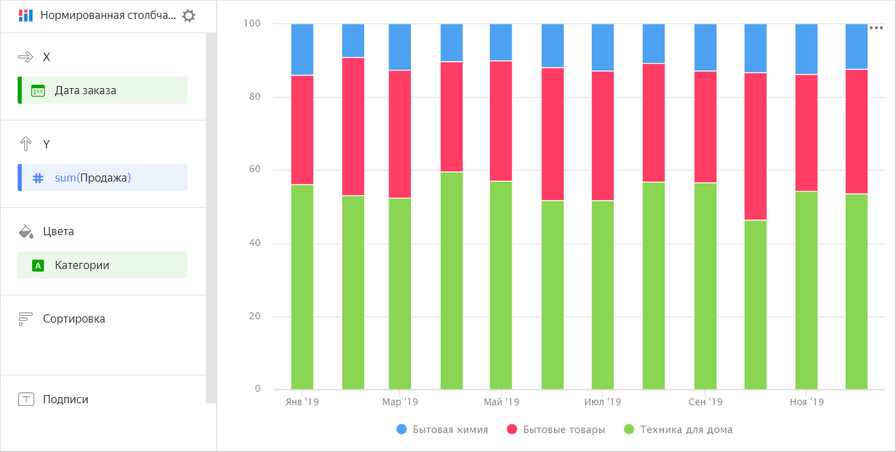
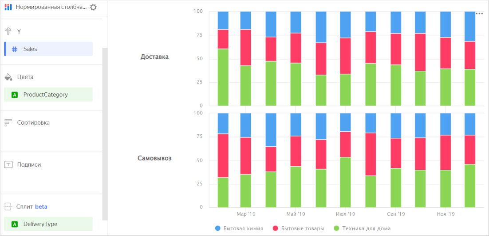

# Нормированная столбчатая диаграмма

Нормированная столбчатая диаграмма показывает вклад каждого показателя или категории в общую сумму. В отличие от [столбчатой диаграммы с накоплением](column-chart.md#stacked), для этой диаграммы важна не суммарная длина столбца, а соотношение долей сегментов между собой. Сегменты выделяются разными цветами и располагаются друг над другом. Высота сегмента соответствует его доле от общей суммы, приведенной к 100%. Например, доля продаж для разных категорий товаров.



Месяц |	Техника для дома |	Бытовые товары  | Бытовая химия
----- | ---------| ---------- | ---------- 
Январь 2019|	128К |	55К | 26К
Февраль 2019|	97К |	79К | 18К
Март 2019|	187К |	105К | 41К
Апрель 2019|	188К | 137К | 34К
Май 2019|	230К |	121К | 43К
Июнь 2019|	256К |	162К | 59К
Июль 2019|	284К |	206К | 67К	
Август 2019|	409К |	204К | 72К
Сентябрь 2019|	314К |	209К | 86К
Октябрь 2019|	324К |	262К | 79К
Ноябрь 2019|	385К |	238К | 101К
Декабрь 2019|	451К |	307К | 111К



Диаграмму используют, когда нужно посмотреть вклад каждого показателя в суммарный итог по периодам времени или по категориям. Например, для просмотра доли статей расхода в общей сумме бюджета.



Месяц |	Бензин | Аренда  | Еда | Коммунальные
----- | ---------| ---------- | ---------- | ---------- 
Январь 2019	| 100	| 600	| 300	| 500
Февраль 2019	| 150	| 600	| 250	| 700
Март 2019	| 100	| 600	| 450	| 400
Апрель 2019	| 120	| 600	| 370	| 510
Май 2019	| 100	| 600	| 300	| 530
Июнь 2019	| 130	| 600	| 310	| 600
Июль 2019	| 150	| 600	| 330	| 510
Август 2019	| 120	| 600	| 250	| 550
Сентябрь 2019	| 110	| 650	| 380	| 500
Октябрь 2019	| 120	| 650	| 300	| 550
Ноябрь 2019	| 130	| 650	| 310	| 540
Декабрь 2019	| 100	| 650	| 400	| 550



## Секции в визарде {#wizard-sections}

Секция  в визарде| Описание
----- | ----
X | Измерения. Может быть указано одно или два измерения.
Y | Показатель. Может быть указано несколько показателей. При добавлении в секцию более одного показателя в секции **Цвета** появится измерение [Measure Names](../concepts/chart/measure-values.md). [Measure Names](../concepts/chart/measure-values.md) можно перенести на ось Х.
Цвета | Измерение или поле [Measure Names](../concepts/chart/measure-values.md). Влияет на цвет линий. [Measure Names](../concepts/chart/measure-values.md) удаляется путем удаления показателей с оси Y.
Сортировка | Измерение или показатель. Влияет на сортировку столбцов. Направление сортировки отмечено значком рядом с полем: по возрастанию  или по убыванию . Чтобы изменить направление сортировки, нажмите значок.
Подписи | Показатель. Отображает значения показателя на диаграмме. Если в секцию **Y** добавлено несколько показателей, перетащите в эту секцию показатель [Measure Values](../concepts/chart/measure-values.md).
Сплит | Измерение. Разбивает чарт по горизонтали по значениям выбранного измерения. Максимальное количество сплитов в одном чарте — 25.
Фильтры | Измерение или показатель. Используется в качестве фильтра.

## Создание нормированной столбчатой диаграммы {#create-diagram}

Чтобы создать нормированную столбчатую диаграмму:

1. На [главной странице]({{ link-datalens-main }}) сервиса {{ datalens-full-name }} нажмите **Создать чарт**.
1. В разделе **Датасет** выберите датасет для визуализации.
1. Выберите тип чарта **Нормированная столбчатая диаграмма**.
1. Перетащите измерение из датасета в секцию **X**. Значения отобразятся в нижней части графика по оси X.
1. Перетащите один или несколько показателей из датасета в секцию **Y**. Значения отобразятся по оси Y в виде столбцов.
1. Перетащите измерение из датасета в секцию **Цвета**. Столбцы разобьются на сегменты.

## Рекомендации {#recomendations}

* 
* Не показывайте на диаграмме больше 3-5 сегментов.
* Расположите сегменты так, чтобы самые крупные или самые важные категории находились ближе к основанию диаграммы. Так вам будет легче сравнивать величины.
* Диаграмму можно разбить по измерению на несколько небольших диаграмм, которые удобно сравнивать между собой. Для этого перетащите измерение из датасета в секцию **Сплит**.

  

  

  

* Если вам нужно показать абсолютные значения переменных, используйте [столбчатую диаграмму](column-chart.md).
