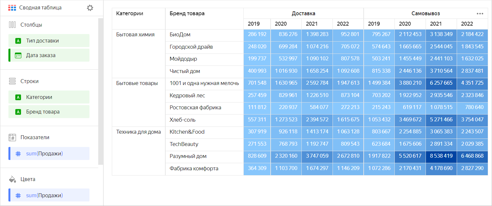
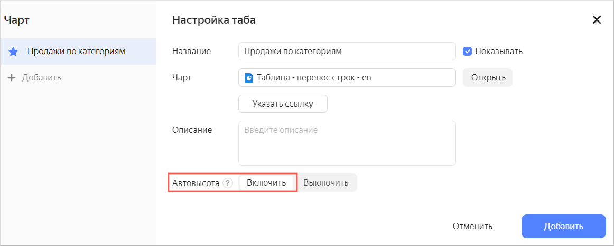
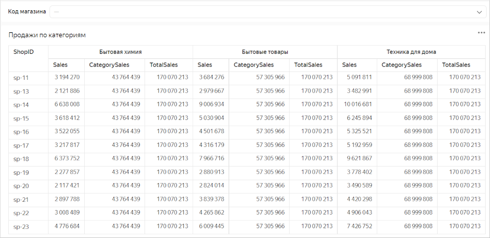
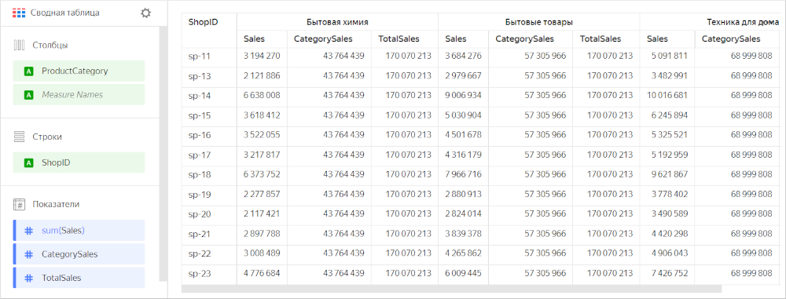
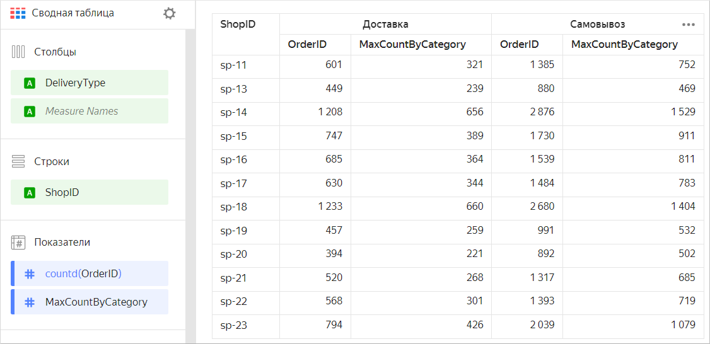

# Сводная таблица 

Таблица — это стандартный вид представления данных с наибольшей детализацией. Чаще всего подходят для детальной аналитики (глубокого погружения в цифры), а также для поиска проблем. Таблицы лучше всего располагать в самом конце дашборда. Графические представления более просты для считывания информации, а таблицы заставляют больше погружаться в данные и требуют большего времени для считывания информации.

В отличие от плоской [таблицы](table-chart.md), в сводной категории могут располагаться как в столбцах, так и в строках. В строках и столбцах может находиться несколько категорий, а в ячейках на их пересечении — значения показателей.

Сводные таблицы упрощают работу с большим объемом данных и позволяют анализировать взаимосвязь между различными показателями. Например, с помощью такой таблицы вы сможете проанализировать продажи товаров в зависимости от типа доставки в разрезе брендов и категорий товаров за конкретный год.



Категории |	Бренд товара |	Тип доставки |	2019 |	2020 |	2021 |	2022
---------|---------|---------|---------|---------|---------|---------
Бытовая химия |	БиоДом |	Доставка |	286 192 |	836 276 |	1 398 283 |	952 801
Бытовая химия |	Городской драйв |	Доставка |	248 020 |	699 284 |	1 074 216 |	705 072
Бытовая химия |	Мойдодыр |	Доставка |	199 737 |	532 997 |	1 090 102 |	807 578
Бытовая химия |	Чистый дом |	Доставка |	400 993 |	1 016 930 |	1 658 254 |	1 092 608
Бытовая химия |	БиоДом |	Самовывоз |	795 267 |	2 112 453 |	3 138 349 |	2 184 422
Бытовая химия |	Городской драйв |	Самовывоз |	574 643 |	1 665 665 |	2 544 045 |	1 843 545
Бытовая химия |	Мойдодыр |	Самовывоз |	503 241 |	1 455 449 |	2 441 103 |	1 632 025
Бытовая химия |	Чистый дом |	Самовывоз |	815 338 |	2 446 136 |	3 710 564 |	2 837 481
Бытовые товары |	1001 и одна нужная мелочь |	Доставка |	701 548 |	1 630 965 |	2 592 784 |	1 947 613
Бытовые товары |	Кедровый лес |	Доставка |	257 459 |	829 961 |	1 226 510 |	873 104
Бытовые товары |	Ростовская фабрика |	Доставка |	111 812 |	220 937 |	584 077 |	272 213
Бытовые товары |	Хлеб-соль |	Доставка |	557 311 |	1 273 523 |	2 394 572 |	1 615 675
Бытовые товары |	1001 и одна нужная мелочь |	Самовывоз |	1 499 384 |	3 880 210 |	6 257 665 |	4 351 725
Бытовые товары |	Кедровый лес |	Самовывоз |	703 202 |	1 922 952 |	2 935 546 |	2 323 846
Бытовые товары |	Ростовская фабрика |	Самовывоз |	215 243 |	619 117 |	1 078 515 |	780 640
Бытовые товары |	Хлеб-соль |	Самовывоз |	1 053 432 |	3 469 672 |	5 271 466 |	3 754 047
Техника для дома |	Kitchen&Food |	Доставка |	307 919 |	926 118 |	1 413 174 |	1 063 128
Техника для дома |	TechBeauty |	Доставка |	271 553 |	768 793 |	1 192 747 |	809 543
Техника для дома |	Разумный дом |	Доставка |	828 609 |	2 320 160 |	3 747 059 |	2 672 810
Техника для дома |	Фабрика комфорта |	Доставка |	364 309 |	1 103 700 |	1 674 297 |	1 146 209
Техника для дома |	Kitchen&Food |	Самовывоз |	803 667 |	2 254 885 |	3 065 383 |	2 243 507
Техника для дома |	TechBeauty |	Самовывоз |	623 684 |	1 675 606 |	2 891 334 |	2 029 385
Техника для дома |	Разумный дом |	Самовывоз |	1 917 822 |	5 520 617 |	8 538 419 |	6 468 868
Техника для дома |	Фабрика комфорта |	Самовывоз |	1 072 286 |	2 170 431 |	4 178 690 |	2 827 290



## Секции в визарде {#wizard-sections}

Секция  в визарде| Описание
----- | ----
Столбцы | Измерения.
Строки | Измерения.
Показатели | Показатели. При добавлении в секцию более одного показателя в секции **Столбцы** появится измерение [Measure Names](../concepts/chart/measure-values.md), которое определяет расположение заголовков показателей. [Measure Names](../concepts/chart/measure-values.md) можно переносить в **Строки**.
Цвета | Показатель. Влияет на заливку всех ячеек с показателями. Может содержать не более одного показателя.
Сортировка | Измерения и показатели, которые указаны в секциях **Столбцы** и **Строки**. Может использоваться несколько измерений и показателей. Порядок полей в секции влияет на порядок сортировки полей таблицы.
Фильтры | Измерение или показатель. Используется в качестве фильтра.

## Создание сводной таблицы {#create-diagram}



Не поддерживается в [QL-чартах](../concepts/chart/index.md#sql-charts).



Чтобы создать сводную таблицу:

1. На [главной странице]({{ link-datalens-main }}) сервиса {{ datalens-full-name }} нажмите **Создать чарт**.
1. В разделе **Датасет** выберите датасет для визуализации.
1. Выберите тип чарта **Сводная таблица**.
1. Перетащите измерение из датасета в секцию **Столбцы**.
1. Перетащите измерение из датасета в секцию **Строки**.
1. Перетащите показатель из датасета в секцию **Показатели**. Значения отобразятся в ячейках таблицы.
1. Перетащите показатель из датасета в секцию **Цвета**. Ячейки с показателем градиентно раскрасятся в зависимости от значения показателя.

## Дополнительные настройки {#additional-settings}

### Изменение названия столбцов {#change-column-names}

1. В секции **Столбцы** нажмите значок слева от названия измерения или показателя.
1. В открывшемся окне измените поле **Название** и нажмите **Применить**.

## Рекомендации {#recomendations}

* Используйте сводную таблицу для отображения агрегированных данных в табличном формате.
* Размещайте измерения слева, а показатели справа. Это облегчает восприятие информации.
* Используйте короткие и хорошо считываемые названия столбцов.
* Ограничивайте размеры таблицы или воспользуйтесь фильтрами или сортировкой. Таблицы с большим количеством строк или столбцов сложно читать.
* Ячейки таблицы можно раскрасить в зависимости от значений одного из показателей. Это поможет акцентировать внимание на величинах.
* Используйте таблицы только по назначению. Не старайтесь заменить ими все визуальные формы представления данных.
* При размещении таблицы на дашборде включайте автовысоту в настройках виджета. Таким образом можно сэкономить место на дашборде.

  
  
  

  
  
  При использовании фильтра высота таблицы будет автоматически подстраиваться под число строк.
  
  
  
  Если значение в фильтре не указано, таблица выводит все строки с учетом лимита количества строк на одной странице.
  
  

  Если при использовании фильтра количество выводимых строк сократится, высота таблицы уменьшится автоматически.

  

  

* Формируйте итоги как столбец (или промежуточные итоги как столбец). Это можно сделать с помощью вычисляемых полей на основе [оконных функций](../concepts/window-function-tutorial.md) или [LOD-выражений](../concepts/lod-aggregation.md), например:

  * Промежуточная сумма продаж по категориям — показатель `CategorySales` с формулой `SUM(SUM([Sales]) WITHIN [ProductCategory])`.
  * Общая сумма продаж — показатель `TotalSales` с формулой `SUM(SUM([Sales]) TOTAL)`.

    
    
    

    
  
  * Максимальное число заказов в месяц с группировкой по категориям — показатель `MaxCountByCategory` с формулой `MAX(COUNTD([OrderID] INCLUDE [ProductCategory]))`.

    
    
    

    

* Используйте сортировку. Это упрощает восприятие информации.
* Используйте функцию [URL](../function-ref/URL.md) в ячейках таблицы для перехода по ссылке.
* При отображении численных данных указывайте размерность, количество знаков после запятой. Например, если из выпадающего списка **Размерность** выбрать `Миллионы, M` вместо значения `10 345 234.23` будет показано значение `10,3 M`. Если в поле `Знаков после запятой` указать `2`, то вместо значения `123.1234` будет показано значение `123.12`.
