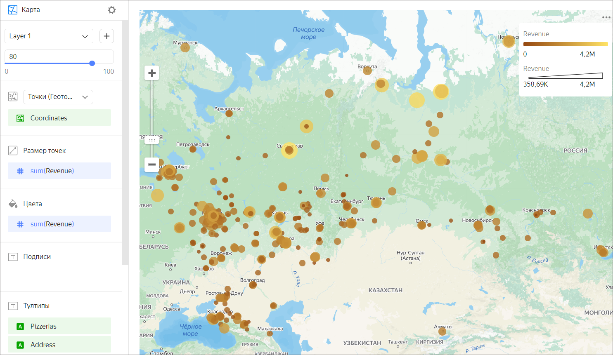

# Точечная карта

Каждая точка откладывается по своим географическим координатам.

Размер точки может выражать значение показателя: чем больше площадь точки, тем выше значение показателя. Такую карту также можно назвать пузырьковой.

Точки могут быть раскрашены в разные цвета в зависимости от принадлежности к какой-либо категории. Также цвет точки может выражать значение показателя: чем выше значение показателя, тем интенсивнее будет закрашена точка.

Карта используется для отслеживания распределения точек на местности. Например, на точечную карту можно нанести расположение магазинов и выделить группу с высокой прибылью.

## Секции в визарде {#wizard-sections}

Секция  в визарде| Описание
----- | ----
Точки (Геоточки) | Измерение с типом [Геоточка](../concepts/data-types.md#geopoint).
Размер точек | Показатель. Задает размер точки в зависимости от значения показателя.
Цвета | Измерение или показатель. Влияет на интенсивность закрашивания точек.
Подписи | Показатель. Отображается в виде подписи на точке. При использовании подписи блокируется управление размером точки.
Тултипы | Измерение или показатель. Подсказка, которая отобразится при наведении на точку.
Фильтры слоя | Измерение или показатель. Используется в качестве фильтра текущего слоя.
Фильтры | Измерение или показатель. Используется в качестве фильтра всего чарта.

## Создание точечной карты {#create-diagram}

1. На [главной странице]({{ link-datalens-main }}) сервиса {{ datalens-full-name }} нажмите **Создать чарт**.
1. В разделе **Датасет** выберите датасет для визуализации. Если у вас нет датасета, [создайте его](../operations/dataset/create.md).
1. Выберите тип чарта **Карта**.
1. Выберите тип слоя **Точки (Геоточки)**.
1. Перетащите измерение с типом [Геоточка](../concepts/data-types.md#geopoint) из датасета в секцию с выбором типа слоя.
1. Задайте размер отображаемых точек для точечной карты. Перенесите показатель в секцию **Размер точек** или нажмите значок  в строке с названием секции.
1. Закрасьте точки на карте. Перенесите показатель или измерение в секцию **Цвета**.
1. Добавьте тултипы из значений измерения и показателя, которые отображаются при наведении на точку.

Дополнительно вы можете:

* добавить, переименовать, удалить слой;
* поменять слои местами в рамках их типа;
* применить фильтр ко всему чарту или к одному слою.

## Рекомендации {#recomendations}

* Используйте цветовые палитры, соответствующие целям и задачам визуализации.
* Если точки на карты расположены с высокой плотностью, сделайте их менее прозрачными. Так вы сможете увидеть пересечения данных.
