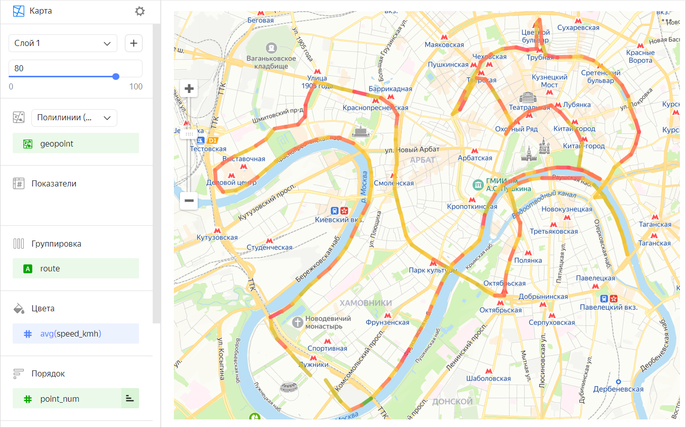
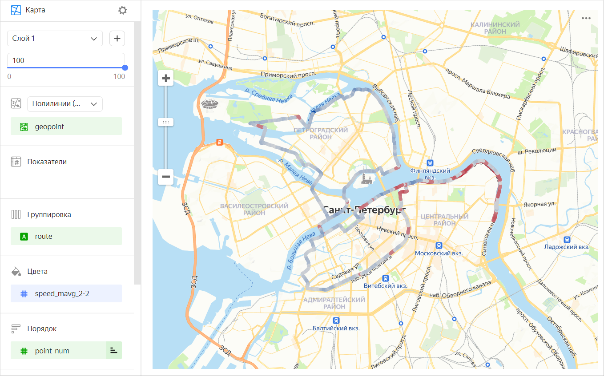
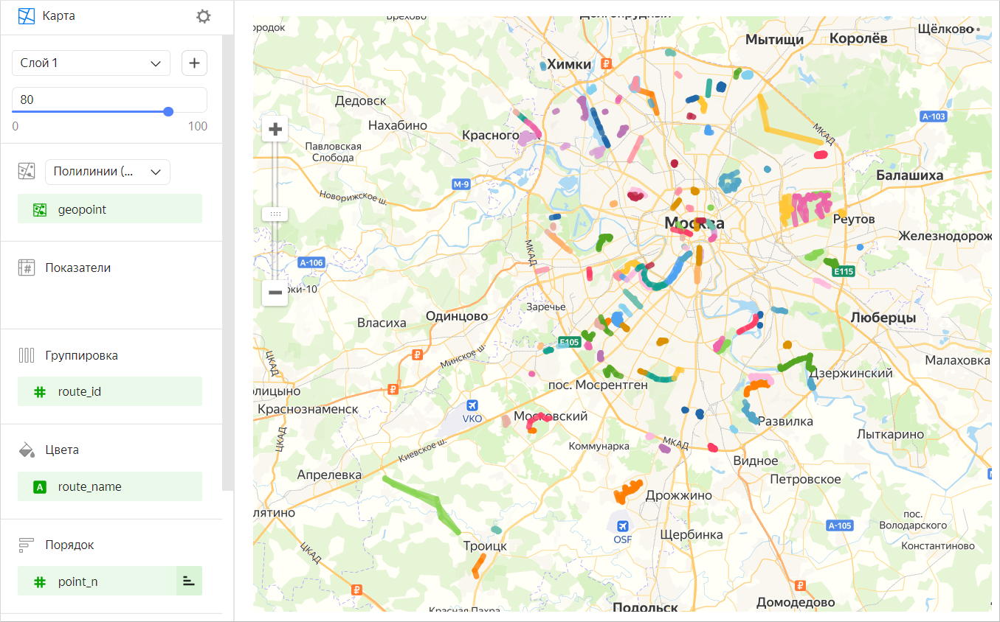

# Полилинейная карта 

Полилинейная карта — это тип геослоя на чарте **Карта**, позволяющий рисовать полилинии на карте. Полилиния состоит из точек, соединенных в определенном порядке. Полилинейная карта используется, например, для отображения траектории движения объектов.

Для построения полилинейной карты необходимы данные:

* Координаты точек линий — с типом данных [Геоточка](../concepts/data-types.md#geopoint). Каждая точка каждой полилинии должна храниться в датасете отдельной строкой.
* Поле или набор полей для группировки точек в линии (идентификатор каждой линии).
* Поле для сортировки порядка точек в каждой линии (например, отметка времени или номер точки).

Отрезки полилинии можно красить одним из способов:

* градиентом по показателю (например, средняя скорость в точке);

  

* дискретными цветами по измерению (например, по названию поездки).

  

## Секции в визарде {#wizard-sections}

Секция  в визарде| Описание
----- | ----
Полилинии	(Геоточки) | Измерение с типом [Геоточка](../concepts/data-types.md#geopoint).
Показатели	| Показатель. Значение, которое отобразится при наведении на точку.
Группировка	| Измерение. Определяет группу точек, образующих полилинию.
Цвета	| Измерение или показатель. Влияет на интенсивность закрашивания отрезков линии. Отрезок закрашивается от исходящей точки.
Порядок	| Измерение. Задает порядок соединения точек внутри группы.
Фильтры слоя	| Измерение или показатель. Используется в качестве фильтра текущего слоя.
Фильтры	| Измерение или показатель. Используется в качестве фильтра всего чарта.

## Создание полилинейной карты {#create-diagram}

Чтобы создать полилинейную карту:



1. Перейдите на [главную страницу]({{ link-datalens-main }}) {{ datalens-short-name }}.
1. На панели слева выберите  **Чарты**.
1. Нажмите кнопку **Создать чарт** → **Чарт**.
1. Слева вверху нажмите  **Выберите датасет** и укажите датасет для визуализации.
1. Выберите тип чарта **Карта**.
1. Выберите тип слоя **Полилинии (Геоточки)**.
1. Перетащите измерение с типом [Геоточка](../concepts/data-types.md#geopoint) из датасета в секцию с выбором типа слоя.
1. Задайте группу точек, которая определяет полилинии. Перенесите измерение в секцию **Группировка**.
1. Задайте порядок соединения точек внутри группы. Перенесите измерение в секцию **Порядок**.
1. Закрасьте линию на карте. Перенесите показатель или измерение в секцию **Цвета**.

Дополнительно вы можете:

* добавить, переименовать, удалить слой;
* применить фильтр ко всему чарту или к одному слою.

## Рекомендации {#recomendations}

* Сокращайте количество точек маршрута на уровне источника, если их слишком много. На уровне чарта используйте для этого фильтр. Это позволит ускорить загрузку и отрисовку карты.
* Используйте функцию скользящего среднего [MAVG](../function-ref/MAVG.md), чтобы сгладить выбросы показателей отдельных точек/участков. Например, при построении линии средней скорости с помощью функции `MAVG([speed],2,2)` усредняются значения показателя скорости в точках: текущей, двух предыдущих и двух следующих. В результате градиент цвета меняется более плавно.
