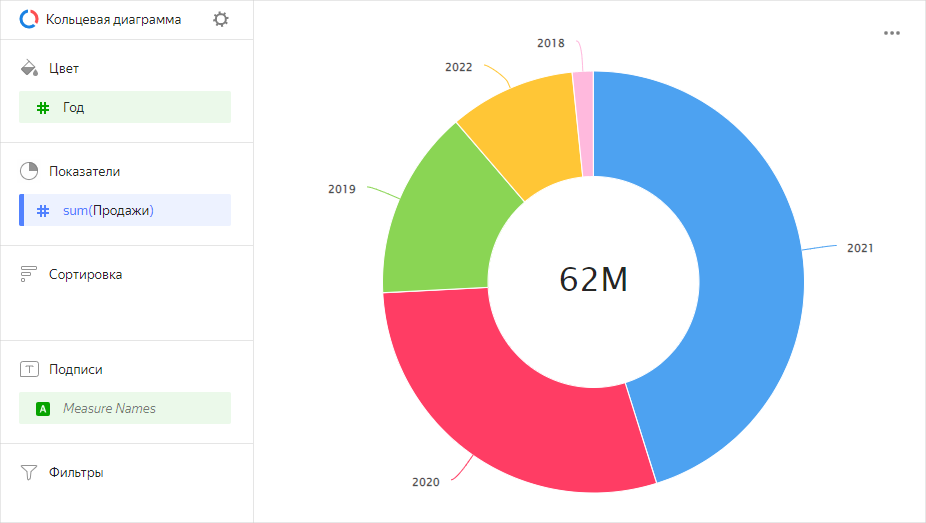

# Кольцевая диаграмма 

Диаграмма отображает отношение между категориями при помощи сегментов кольца. Сумма всех сегментов составляет 100%. Размер каждого сегмента соответствует доле категории в общей сумме. Число в центре кольца зависит от выбранного показателя и отражает общий итог. Кольцевые диаграммы подходят для отображения небольшого количества сегментов.



Год |	Продажа|	
-----|---------| 
2022 |	6М |	
2021 |	28М |	
2020 |	18М |	
2019 |	9М | 
2018 |	1М |



## Секции в визарде {#wizard-sections}

Секция  в визарде| Описание
----- | ----
Цвет | Измерение. Может быть указано только одно поле.
Показатели | Влияет на размер сегментов кольца. Итоговое значение показателя отображается в центре кольца. Может быть указано только одно поле.
Сортировка | Показатель или измерение из секции **Цвет**. Влияет на сортировку сегментов.
Подписи | Показатель. Отображает значения показателя на диаграмме. Чтобы добавить на диаграмму выноски с названиями категорий, перетащите в эту секцию измерение `Measure Names`.
Фильтры | Измерение или показатель. Используется в качестве фильтра.

## Создание кольцевой диаграммы {#create-diagram}

Чтобы создать кольцевую диаграмму:

1. На [главной странице]({{ link-datalens-main }}) сервиса {{ datalens-full-name }} нажмите **Создать чарт**.
1. В разделе **Датасет** выберите датасет для визуализации.
1. Выберите тип чарта **Кольцевая диаграмма**.
1. Перетащите измерение или показатель из датасета в секцию **Цвет**.
1. Перетащите показатель из датасета в секцию **Показатели**. Значения отобразятся в виде сегментов кольцевой диаграммы.

Чтобы отключить отображение числа в центре:

1. В верхней левой части экрана нажмите значок .
1. В окне **Настройки чарта** выключите опцию **Итоги**.
1. Нажмите **Применить**.

## Рекомендации {#recommendations}

* При наличии более 4-6 сегментов на одной диаграмме, стоит объединить самые маленькие из них в общую группу **Другие**. Если сегментов больше, диаграмма выглядит перегруженно, а понимать данные становится сложно. 
* На диаграмме нельзя отобразить отрицательные и нулевые значения.
* Не используйте кольцевые диаграммы для отображения изменения пропорций во времени и для точного сравнения данных по категориям.