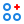
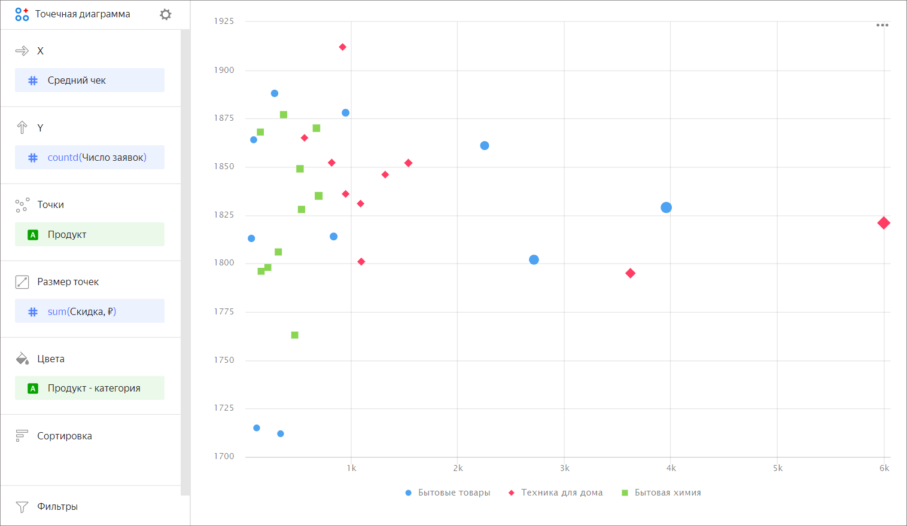
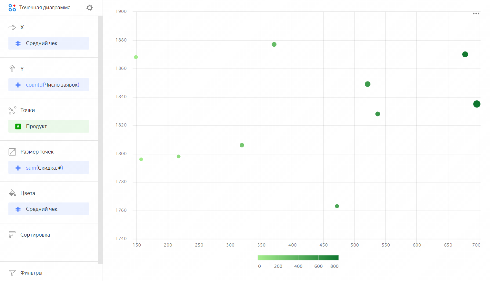

# Точечная диаграмма 

Точечная диаграмма показывает отношение между двумя величинами (измерениями или показателями). Их значения показываются в виде точек. На точечной диаграмме всегда есть две оси: набор значений одной величины представлен вдоль горизонтальной оси, а другой — вдоль вертикальной. На пересечении координат X и Y отображается точка данных, которая связывает эти два значения. Такие точки данных могут быть распределены по горизонтальной оси равномерно или неравномерно, в зависимости от конкретных данных.

Диаграмму используют, когда нужно найти зависимость между измерениями и показателями или показать разброс значений. Например, соотношение между средним чеком на товар и числом заявок.

Также зависимости на точечной диаграмме можно показывать с помощью размера точек. Размер точки определяется значением показателя: чем больше значение показателя, тем больше размер точки. Например, размер точки может зависеть от скидки на товар. 



Продукт | Категория | Средний чек | Число заявок | Скидка	
----|----|----|----|-----|
Раствор для мытья полов|	Бытовая химия|	153.0 | 1 | 0 |
Мультиварка с 40 режимами готовки еды|	Техника для дома |	3442.0 | 1 | 0 |
Гель для стирки цветных вещей|	Бытовая химия |	525.0 | 1 | 0 |
Порошок для чистки ковриков|	Бытовая химия | 463.0 | 1 | 0 |
Средство для мытья посуды с ароматом лимона|	Бытовая химия| 362.0 | 1 | 0 |

Датасет построен на основе таблиц подключения [Sample ClickHouse](../quickstart.md).



Вы можете использовать градиент на диаграмме, добавив показатель в секцию **Цвета**. Например, чем выше средний чек продукта, тем темнее оттенок точки.

## Секции в визарде {#wizard-sections}

Секция  в визарде| Описание
----- | ----
X | Измерение или показатель. Задает значение по оси X.
Y | Измерение или показатель. Задает значение по оси Y.
Точки | Измерение. Определяет количество точек на диаграмме.
Размер точек | Показатель. Задает размер точки в зависимости от значения показателя.
Цвета | Измерение или показатель. Влияет на цвет точек.
Сортировка | Измерение. Может использоваться только измерение с оси Х. Влияет на сортировку оси X. Направление сортировки отмечено значком рядом с полем: по возрастанию  или по убыванию . Чтобы изменить направление сортировки, нажмите значок.
Фильтры | Измерение или показатель. Используется в качестве фильтра.

## Создание точечной диаграммы {#create-diagram}

Чтобы создать точечную диаграмму:



1. Перейдите на [главную страницу]({{ link-datalens-main }}) {{ datalens-short-name }}.
1. На панели слева выберите  **Чарты**.
1. Нажмите кнопку **Создать чарт** → **Чарт**.
1. Слева вверху нажмите  **Выберите датасет** и укажите датасет для визуализации. Если у вас нет датасета, [создайте его](../dataset/create-dataset.md#create).
1. Выберите тип чарта **Точечная диаграмма**.
1. Перетащите измерение из датасета в секцию **X**.
1. Перетащите один или несколько показателей из датасета в секцию **Y**. Значения отобразятся в виде точек на пересечении осей X и Y.

Дополнительно вы можете:

* Изменить цвет точек:

  1. Перетащите измерение или показатель в секцию **Цвета**.
  1. Нажмите значок  и установите новые цвета.

* Изменить размер точек:

  1. Перетащите показатель в секцию **Размер точек**.
  1. Нажмите значок  и установите минимальный и максимальный размеры точек для заданного показателя.

* Указать дополнительное измерение. Для этого перетащите измерение в секцию **Точки**.

### Настройка отображения пустых (`null`) значений {#null-settings}



## Рекомендации {#recomendations}

* 
* Масштаб на осях зачастую разный, при этом может не начинаться от 0. Обращайте внимание на подписи значений.
* Точечная диаграмма не подходит для визуализации данных во времени.
* При визуализации нескольких показателей внимательно подбирайте цвета. Они должны быть различимыми и контрастными.

