# Таблица 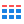

Таблица — это стандартный вид представления данных с наибольшей детализацией. Она содержит данные в виде двумерного массива, состоящего из столбцов и строк. В заголовках столбцов таблицы отображаются названия измерений или показателей, а в ячейках — их значения. Каждая строка — это набор ячеек, содержащих значение каждого столбца. Таблица также может содержать строку с итогами.

Таблица является отличным средством для детальной [аналитики](../../glossary/data-analytics) (глубокого погружения в цифры), а также для поиска проблем. В то же время для считывания информации с таблицы требуется больше времени, чем для графиков и диаграмм. Поэтому лучше всего размещать ее в самом конце дашборда.

Таблицы хорошо подходят для количественного сравнения, где можно посмотреть разные значения нескольких категорий или измерений. Например, в этой таблице показаны три разных показателя по трем категориям.

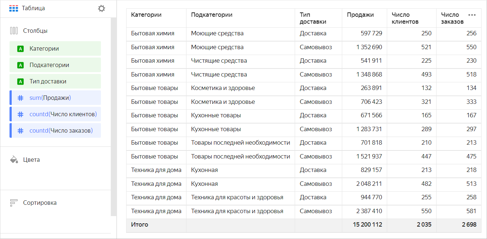



Категории |	Подкатегории |	Тип доставки |	Продажи |	Число клиентов |	Число заказов
---------|---------|---------|---------|---------|---------				
Бытовая химия |	Моющие средства |	Доставка |	597 729 |	250 |	256
Бытовая химия |	Моющие средства |	Самовывоз |	1 352 690 |	521 |	550
Бытовая химия |	Чистящие средства |	Доставка |	541 911 |	225 |	230
Бытовая химия |	Чистящие средства |	Самовывоз |	1 348 868 |	493 |	518
Бытовые товары |	Косметика и здоровье |	Доставка |	263 891 |	132 |	134
Бытовые товары |	Косметика и здоровье |	Самовывоз |	706 423 |	321 |	333
Бытовые товары |	Кухонные товары |	Доставка |	671 566 |	165 |	167
Бытовые товары |	Кухонные товары |	Самовывоз |	1 283 731 |	289 |	297
Бытовые товары |	Товары последней необходимости |	Доставка |	701 818 |	210 |	213
Бытовые товары |	Товары последней необходимости |	Самовывоз |	1 521 937 |	447 |	475
Техника для дома |	Кухонная |	Доставка |	829 157 |	213 |	218
Техника для дома |	Кухонная |	Самовывоз |	2 048 211 |	482 |	513
Техника для дома |	Техника для красоты и здоровья |	Доставка |	944 770 |	255 |	258
Техника для дома |	Техника для красоты и здоровья |	Самовывоз |	2 387 410 |	550 |	581



Чтобы упростить сравнение разных значений, повысить наглядность информации, при [создании таблицы](#create-diagram) можно использовать дополнительные настройки:

* [Настройка размера таблицы](#table-size-settings)
* [Изменение названия столбцов](#change-columns-names)
* [Добавление подсказки к заголовкам](#hint-column)
* [Настройка сортировки в таблице по нескольким столбцам](#sorting-columns)
* [Настройка ширины столбцов](#set-column-width)
* [Закрепление столбцов](#column-fixation)
* [Добавление строки с итогами](#add-totals)
* [Добавление цвета строк](#add-column-color)
* [Настройка заливки полей](#set-field-color)
* [Добавление линейного индикатора в столбец с показателем](#add-linear-indicator)

## Секции в визарде {#wizard-sections}

Секция  в визарде| Описание
----- | ----
Столбцы | Измерения и показатели, которые будут использованы в качестве столбцов. Имя поля отображается в заголовке столбца. В столбцах можно использовать [функции разметки](../function-ref/markup-functions.md).
Цвета | Показатель. Влияет на заливку всех ячеек в рамках строки. Может содержать не более одного показателя.
Сортировка | Измерения и показатели, которые указаны в секции **Столбцы**. Может использоваться несколько измерений и показателей. Порядок полей в секции влияет на порядок сортировки полей таблицы. Направление сортировки отмечено значком рядом с полем: по возрастанию  или по убыванию . Чтобы изменить направление сортировки, нажмите значок.
Фильтры | Измерение или показатель. Используется в качестве фильтра.

## Создание таблицы {#create-diagram}

Чтобы создать таблицу:



1. Перейдите на [главную страницу]({{ link-datalens-main }}) {{ datalens-short-name }}.
1. На панели слева выберите  **Чарты**.
1. Нажмите кнопку **Создать чарт** → **Чарт**.
1. Слева вверху нажмите  **Выберите датасет** и укажите датасет для визуализации.
1. Выберите тип чарта **Таблица**.
1. Перетащите измерение или показатель из датасета в секцию **Столбцы**. Поле отобразится в виде столбца.

   

   * При перетаскивании в секцию **Столбцы** измерения с типом **Дерево строк** в области визуализации отобразится [древовидная иерархия](../dataset/data-types.md#how-to-create-tree).
   * Порядок столбцов можно менять, перетаскивая измерения в секции **Столбцы**.

   

## Дополнительные настройки {#additional-settings}

### Настройка размера таблицы {#table-size-settings}

1. В верхней части экрана напротив типа чарта нажмите значок .
1. Выберите размер таблицы:

   * `L` — большой (по умолчанию);
   * `M` — средний;
   * `S` — маленький.

1. Нажмите кнопку **Применить**.

В зависимости от выбранного размера в таблице меняется размер шрифта, междустрочный интервал и отступы внутри ячеек.

### Изменение названия столбцов {#change-columns-names}

1. В секции **Столбцы** нажмите значок слева от названия измерения или показателя.
1. В открывшемся окне измените поле **Название** и нажмите кнопку **Применить**.

### Добавление подсказки к заголовкам {#hint-column}

1. В секции **Столбцы** нажмите значок слева от названия измерения или показателя.
1. В открывшемся окне включите опцию **Подсказка**, в поле ниже введите текст и нажмите кнопку **Применить**. По умолчанию при включении опции текст подсказки подставляется из описания поля в [датасете](../dataset/index.md).

Когда опция включена, рядом с заголовком столбца таблицы появляется значок . При наведении курсора на значок отображается всплывающая подсказка.

### Настройка сортировки в таблице по нескольким столбцам {#sorting-columns}

1. В левой части экрана над чартом нажмите значок .
1. Выключите настройку **Пагинация** и нажмите кнопку **Применить**.
1. Удерживая клавишу **Ctrl**, нажимайте на заголовки столбцов, в которых хотите поменять сортировку.

### Настройка ширины столбцов {#set-column-width}

1. В правом верхнем углу секции **Столбцы** нажмите значок  (значок появляется при наведении указателя на секцию).
1. В блоке **Ширина** выберите значения для каждого столбца:

   * `Авто` — автоматическая ширина столбца;
   * `%` — ширина столбца в процентах от общей ширины таблицы;
   * `px` — ширина столбца в пикселях.

   Опции `%` и `px` позволяют делать переносы в ячейках таблицы (по словам). Таким образом, число строк в ячейке может расти.

   

   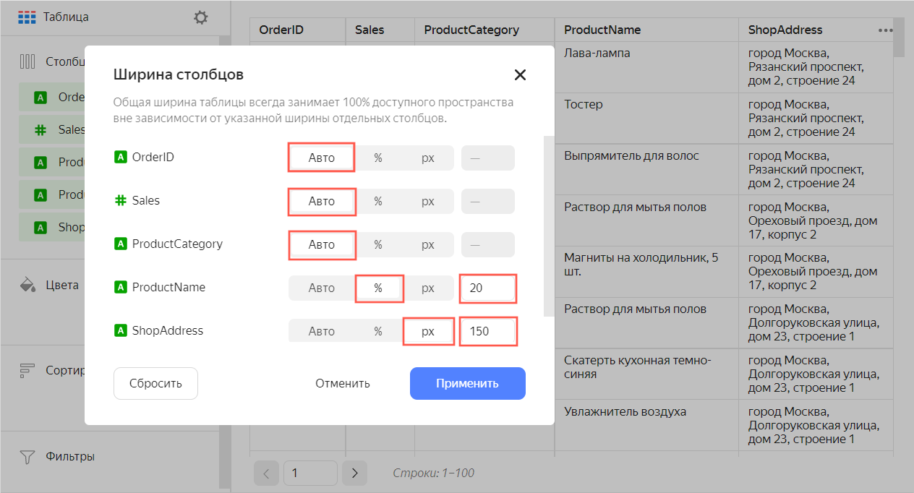

   

   

   Общая ширина таблицы всегда занимает 100% доступного пространства вне зависимости от указанной ширины отдельных столбцов.

   

1. Нажмите **Применить**.

Чтобы установить значение `Авто` для ширины всех столбцов, нажмите кнопку **Сбросить**.

### Закрепление столбцов {#column-fixation}

1. В правом верхнем углу секции **Столбцы** нажмите значок  (значок появляется при наведении указателя на секцию).
1. В открывшемся окне в поле **Закрепление** укажите число столбцов для закрепления. Эти столбцы будут оставаться на месте при горизонтальной прокрутке.
1. Нажмите кнопку **Применить**.

### Добавление строки с итогами {#add-totals}

1. В левой части экрана над чартом нажмите значок .
1. Включите настройку **Итоги** и нажмите кнопку **Применить**.

В таблице отобразится строка **Итого**. Значения в строке рассчитываются по тем же формулам, что и [агрегация](../dataset/data-model.md#aggregation) в показателе.



* Значения в строке **Итого** рассчитываются только для показателей. Для измерений строка будет пустой.
* Если включена опция **Пагинация**, строка **Итого** будет размещена на последней странице.
* Если в таблице только одна запись, строка **Итого** не будет отображаться.



### Добавление цвета строк {#add-column-color}

1. Перенесите показатель в секцию **Цвета**.
1. В правом верхнем углу секции **Цвета** нажмите значок  (значок появляется при наведении указателя на секцию).
1. Настройте цвета:

   * **Тип градиента** — выберите двухцветный или трехцветный.

     * Цвет градиента — выберите цветовую гамму градиента из списка.
     * Направление градиента — измените направление градиента с помощью значка .

   * **Задать пороговые значения** — установите пороговые числовые значения, которые будут соответствовать каждому цвету.

### Настройка заливки полей {#set-field-color}

1. В секции **Столбцы** нажмите значок слева от названия измерения или показателя.
1. В открывшемся окне включите опцию **Заливка столбца**.
1. В списке **По полю** выберите поле, на основе значений которого будет выполнена заливка.
1. Укажите **Тип заливки**:

   

   Для измерения доступен тип заливки **Палитра**, для показателя — **Градиент**.

   

   

   - Для измерения {#measure}

     1. Нажмите на поле выбора цветовой схемы и укажите цвет для каждого значения измерения.
     1. Нажмите кнопку **Применить**.

   - Для показателя {#indicator}

     1. Нажмите на поле выбора градиента и настройте:

        * **Тип градиента** — выберите двухцветный или трехцветный.

          * Цвет градиента — выберите цветовую гамму градиента из списка.
          * Направление градиента — измените направление градиента с помощью значка .

        * **Задать пороговые значения** — установите пороговые числовые значения, которые будут соответствовать каждому цвету.

     1. Нажмите кнопку **Применить**.

   

1. Для типа заливки **Градиент** задайте, как окрашивать пустые (`null`) значения: `Не окрашивать` или `Окрашивать как 0`.
1. Нажмите кнопку **Применить**.

### Добавление линейного индикатора в столбец с показателем {#add-linear-indicator}

1. В секции **Столбцы** нажмите значок слева от названия показателя.
1. В открывшемся окне включите опцию **Линейный индикатор**.
1. Укажите настройки индикатора:

   * **Тип заливки** — тип цветовой заливки для индикатора.
   * **Положительные значения** — цвет индикатора для положительных значений.
   * **Отрицательные значения** — цвет индикатора для отрицательных значений.
   * **Отображать значения** — опция включает отображение значений показателя в ячейке.
   * **Отображать в итогах** — опция включает отображение индикатора в ячейках с итоговыми значениями.
   * **Выравнивание** — выравнивание положения индикатора слева или справа в столбце. Применяется только в случаях, когда все числа в столбце положительные или отрицательные.
   * **Масштаб** — задает масштаб для индикатора. Если задавать масштаб вручную, то нужно указывать значения **мин** и **макс**. При этом значение **мин** должно быть меньше или равно `0` и значение **макс** должно быть больше или равно `0`.

   

   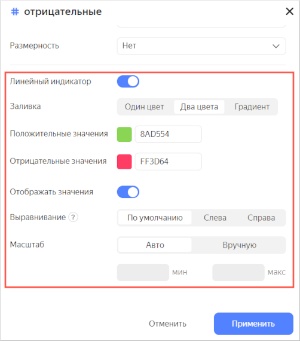

   

1. Нажмите кнопку **Применить**.



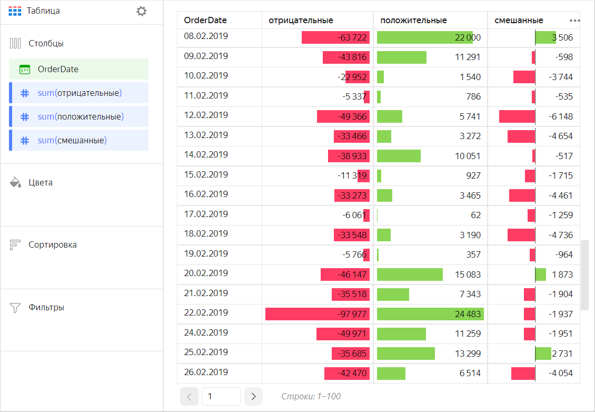



## Рекомендации {#recomendations}

* Ограничивайте размеры таблицы или воспользуйтесь фильтрами и сортировкой. Таблицы с большим количеством строк или столбцов сложно читать.
* Используйте таблицы только по назначению. Не старайтесь заменить ими все визуальные формы представления данных.
* Размещайте измерения слева, а показатели справа. Это облегчает восприятие информации.
* Используйте короткие и хорошо считываемые названия столбцов.
* Включайте отображение итогов внизу таблицы.

  

  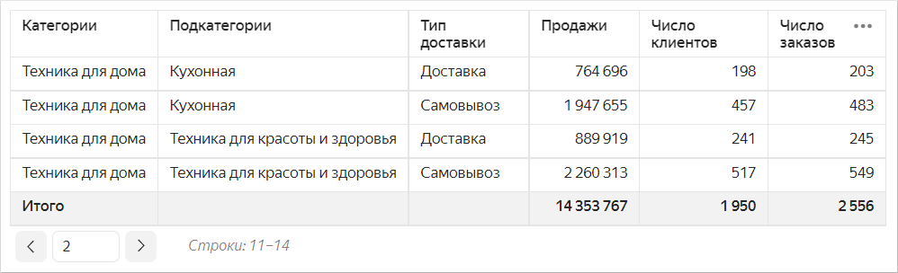

  

* При размещении таблицы на дашборде включайте автовысоту в настройках виджета. Таким образом можно сэкономить место на дашборде. 

  
  
  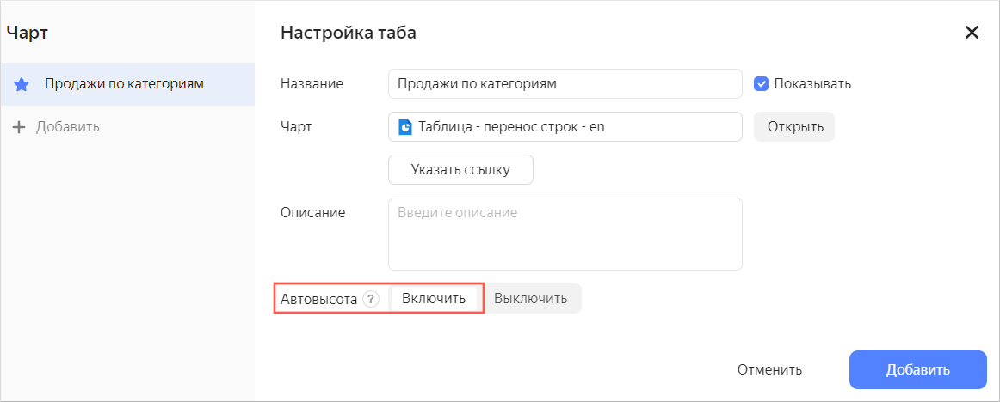

  
  
  При использовании фильтра высота таблицы будет автоматически подстраиваться под число строк.
  
  
  
  Если значение в фильтре не указано, таблица выводит все строки с учетом лимита количества строк на одной странице.
  
  

  Если при использовании фильтра количество выводимых строк сократится, высота таблицы уменьшится автоматически.

  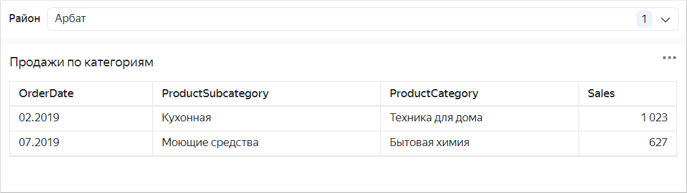

  

* Формируйте итоги как столбец (или промежуточные итоги как столбец). Это можно сделать с помощью вычисляемых полей на основе [оконных функций](../concepts/window-function-tutorial.md) или [LOD-выражений](../concepts/lod-aggregation.md), например:

  * Промежуточная сумма продаж по категориям — показатель `CategorySales` с формулой `SUM(SUM([Sales]) WITHIN [ProductCategory])`.
  * Общая сумма продаж — показатель `TotalSales` с формулой `SUM(SUM([Sales]) TOTAL)`.

    

    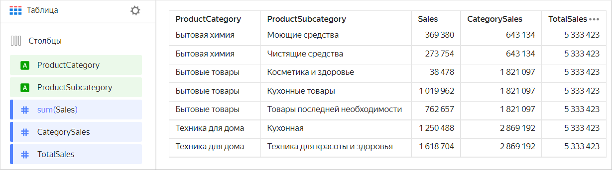

    

  * Максимальное число заказов в месяц с группировкой по категориям — показатель `MaxCountByCategory` с формулой `MAX(COUNTD([OrderID] INCLUDE [ProductCategory]))`.

    

    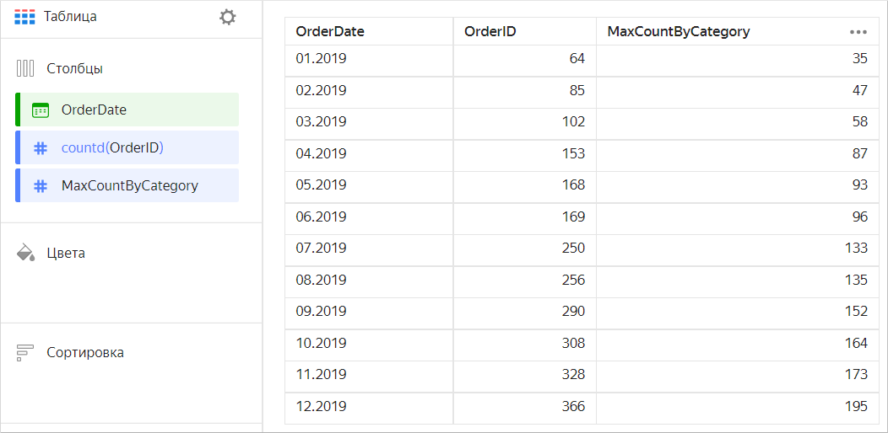

    

* Используйте сортировку. Это упрощает восприятие информации.
* Используйте функцию [URL](../function-ref/URL.md) в ячейках таблицы для перехода по ссылке.

* Если в ячейке таблицы длинный текст, используйте [настройку](#additional-settings) ширины столбцов для переноса строк в ячейках.

  

  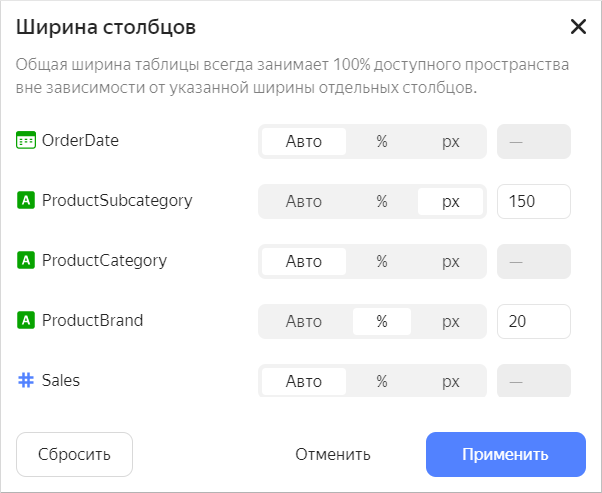

  

* При отображении численных данных указывайте размерность, количество знаков после запятой. Например, если из выпадающего списка **Размерность** выбрать `Миллионы, M` вместо значения `10 345 234.23` будет показано значение `10,3 M`. Если в поле `Знаков после запятой` указать `2`, то вместо значения `123.1234` будет показано значение `123.12`.

#### См. также {#see-also}

* [{#T}](../operations/dashboard/create.md)
* [{#T}](../operations/dashboard/add-chart.md)
* [{#T}](../operations/dashboard/add-selector.md)
