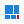
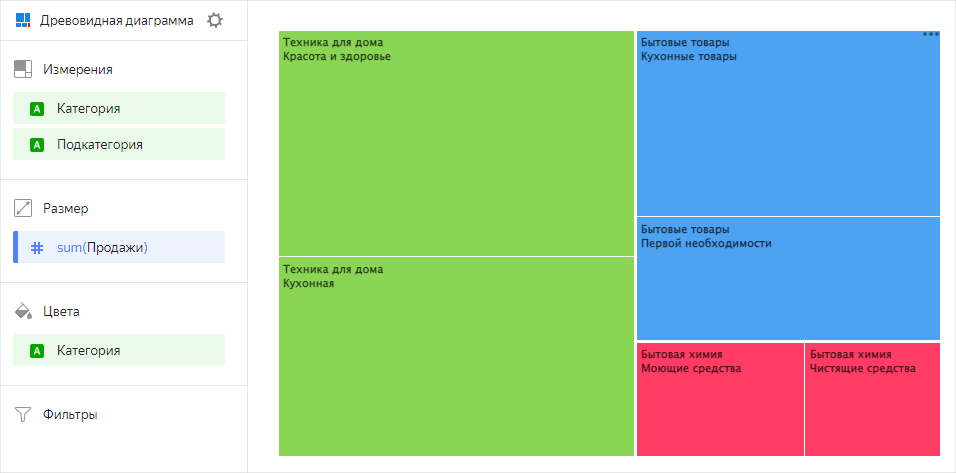

# Древовидная диаграмма  в {{ datalens-full-name }}

Древовидная диаграмма отражает иерархические данные как набор вложенных прямоугольников. 

* Каждый уровень иерархии соответствует измерению и показан цветным прямоугольником, содержащим вложенные прямоугольники. 

* Размер прямоугольника напрямую зависит от значения показателя. Диаграмма экономично расходует место на дашборде даже при большом количестве данных.



Продажи в разрезе категорий и подкатегорий товаров.



- Представление

    

- Исходная таблица

    | Категория        | Подкатегория         | Продажи  |
    |------------------|----------------------|----------|
    | Техника для дома | Кухонная             | 15000000 |
    | Техника для дома | Красота и здоровье   | 17000000 |
    | Бытовые товары   | Кухонные товары      | 12000000 |
    | Бытовые товары   | Первой необходимости | 8000000  |
    | Бытовая химия    | Моющие средства      | 4100000  |
    | Бытовая химия    | Чистящие средства    | 3300000  |





## Секции в визарде {#wizard-sections}

Секция  в визарде| Описание
----- | ----
Измерения | Измерения. Определяют дерево иерархии вложенности прямоугольников. Для полей с типом `Строка` можно настроить использование базового синтаксиса [{#T}](../dashboard/markdown.md): нажмите на значок перед названием поля и включите опцию **Markdown**.
Размер | Показатель. Один показатель, который определяет площадь прямоугольника.
Цвета | Измерение или показатель. Влияет на заливку прямоугольников в диаграмме.
Фильтры | Измерение или показатель. Используется в качестве фильтра.

## Создание древовидной диаграммы {#create-diagram}

Чтобы создать древовидную диаграмму:



1. 
1. 
1. 
1. 
1. Выберите тип чарта **Древовидная диаграмма**.
1. Перетащите одно или несколько измерений из датасета в секцию **Измерения**.
1. Перетащите один показатель из датасета в секцию **Размер**. 
    Значения отобразятся в виде прямоугольников. Площади прямоугольников будут пропорциональны соответствующим значениям выбранного показателя.
1. Перетащите показатель или измерение из секции **Измерения** в секцию **Цвета**.
    Прямоугольники окрасятся в цвета, зависящие от значения добавленного показателя или измерения. В секции **Цвета** могут быть только те измерения, которые есть в секции **Измерения**.
1. Перетащите измерение или показатель из датасета в секцию **Фильтры**.
    Поле может быть пустым, тогда фильтрация не будет применена.

## Рекомендации {#recommendations}

* Используйте диаграмму для отображения пропорций между частью и целым.
* При малом количестве категорий (до 6 штук), воспользуйтесь круговой или кольцевой диаграммой.
* На диаграмме нельзя отобразить отрицательные значения.

