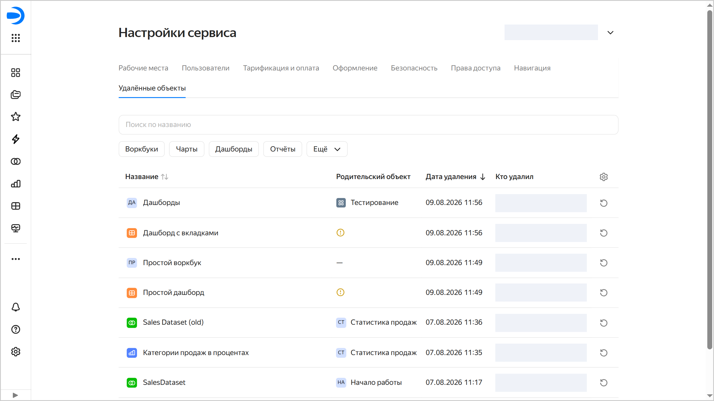

# Работа с коллекцией {{ datalens-full-name }}

В этом разделе вы узнаете, как работать с коллекцией:

* [Создать коллекцию](#create-collection)
* [Редактировать коллекцию](#edit-collections)
* [Переместить коллекцию](#move-collections)
* [Настроить доступ к коллекции](#security)
* [Удалить коллекцию](#delete-collections)
* [Восстановить удаленные объекты и воркбуки](#restore-objects-workbooks)

## Создать коллекцию {#create-collections}
   

Чтобы создать коллекцию:

1. Перейдите на [главную страницу]({{ link-datalens-main }}) {{ datalens-short-name }}.
1. На панели слева выберите  **Коллекции и воркбуки**.

   
   

1. В правом верхнем углу нажмите **Создать** → **Создать коллекцию**.
1. Укажите название коллекции.
1. Нажмите кнопку **Создать**.

<iframe width="560" height="315" src="https://runtime.strm.yandex.ru/player/video/vplv242x7j2gugxkp4fo?autoplay=0&mute=0" allow="autoplay; fullscreen; accelerometer; gyroscope; picture-in-picture; encrypted-media" frameborder="0" scrolling="no"></iframe>

## Редактировать коллекцию {#edit-collections}

Чтобы изменить название и описание коллекции:

1. Вверху страницы коллекции рядом с названием нажмите  **Редактировать**.
1. Введите новое название и описание коллекции и нажмите кнопку **Сохранить**.

## Переместить коллекцию {#move-collections}

Чтобы переместить коллекцию:

1. На странице коллекции вверху нажмите  →  **Переместить**.
1. Выберите коллекцию, в которую хотите переместить текущую коллекцию, и нажмите кнопку **Переместить**. Чтобы переместить ее в новую коллекцию, нажмите кнопку **Создать коллекцию**.

## Настроить доступ к коллекции {#security}



### Назначить права доступа {#wb-coll-grant}

Чтобы назначить права доступа к коллекции:
  
1. На странице коллекции вверху нажмите  **Доступ**.

   В блоке **Наследуемые права** отображаются пользователи, которые унаследовали права доступа к объекту, потому что им были назначены права на один из его родительских объектов. Для каждого пользователя указывается унаследованное право доступа и сам объект, от которого это право унаследовано.

   В блоке **Прямые права** отображаются пользователи, которым назначены права на выбранный объект.

1. Нажмите кнопку  **Добавить пользователя**.
1. В открывшемся окне выберите пользователя или группу, укажите право доступа и нажмите кнопку **Сохранить**. Пользователю или группе будут назначены права на данный объект.

### Отозвать права доступа {#wb-coll-revoke}

Чтобы отозвать права доступа к коллекции:

1. На странице коллекции вверху нажмите  **Доступ**.
1. В блоке **Прямые права** напротив пользователя (группы), у которого вы хотите отозвать права, нажмите значок .

   

   Если пользователя нет в списке, возможно, ему назначены права на родительский объект. Вы можете отозвать права для родительского объекта. Чтобы перейти к объекту наследования прав, найдите пользователя в списке **Наследуемые права** и нажмите на название объекта.

   

1. В открывшемся окне нажмите **Отозвать роль**.

## Удалить коллекцию {#delete-collections}

Чтобы удалить коллекцию:
  
1. На странице коллекции вверху нажмите  →  **Удалить**.
1. Подтвердите удаление коллекции.

## Восстановить удаленные объекты и воркбуки {#restore-objects-workbooks}

Администратор (пользователь с ролью `{{ roles-datalens-admin }}`) может просмотреть список удаленных объектов (подключений, датасетов, чартов, дашбордов, отчетов и HTML-страниц) и воркбуков в [настройках сервиса](../settings/deleted-objects.md) и восстановить их.

Чтобы восстановить объект или воркбук:

1. Перейдите на [главную страницу]({{ link-datalens-main }}) {{ datalens-short-name }}.
1. На панели слева выберите  **Настройки сервиса**.
1. Выберите вкладку **Удалённые объекты**.
1. На вкладке отображается информация обо всех объектах и воркбуках, которые были удалены:

   * **Название** — название объекта или воркбука.
   * **Родительский объект** — название коллекции или воркбука, из которого был удален объект или воркбук. Если родительский объект был удален, в колонке стоит значок . Если удаленный воркбук располагался в корневой коллекции, в колонке стоит прочерк.
   * **Дата удаления** — дата и время удаления объекта или воркбука.
   * **Кто удалил** — имя пользователя, удалившего объект или воркбук.

   Вы можете сортировать список по названию или дате удаления.

   Также вы можете воспользоваться поиском по названию объекта или переключаться по вкладкам с типами объектов: `Воркбуки`, `Чарты`, `Дашборды`, `Отчёты`, `Ещё` → `Датасеты` / `Подключения` / `HTML-страницы`.

   

   Напротив объекта или воркбука, который нужно восстановить, нажмите .
   
1. Подтвердите восстановление объекта или воркбука. Особенности восстановления:

   * В простом случае объект или воркбук восстанавливается в то место, где он располагался до удаления.
   * Если родительская коллекция, в которой располагался объект или воркбук, удалена, отображается диалоговое окно для выбора коллекции, в которую будет восстановлен объект или воркбук или создания новой.
   * Если на месте удаленного объекта или воркбука уже есть объект или воркбук с таким же именем, отображается диалоговое окно для переименования восстанавливаемого объекта или воркбука.
   * Если объект располагался в удаленном воркбуке, сначала восстанавливается воркбук со всем его содержимым на момент удаления, а затем — удаленный объект.

