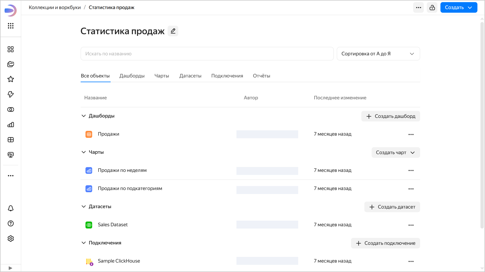
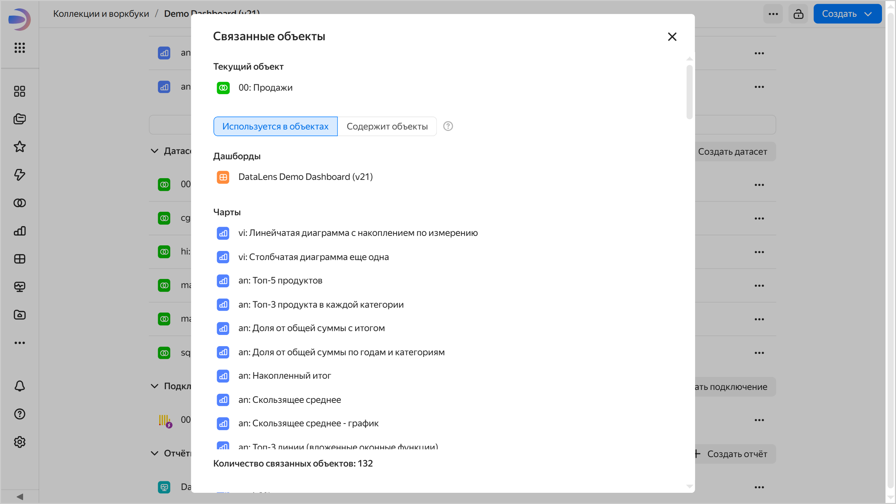

# Воркбуки и коллекции {{ datalens-full-name }}

Воркбуки и коллекции — новый подход к организации объектов в {{ datalens-short-name }}, который является альтернативой старой навигации по папкам. С новым подходом объекты {{ datalens-short-name }} можно размещать в специальных контейнерах:

* **Воркбук** — хранит [подключения](../concepts/connection.md), [датасеты](../dataset/index.md), [чарты](../concepts/chart/index.md), [дашборды](../concepts/dashboard.md) и [отчеты](../reports/index.md).

  

  

  

* **Коллекция** — контейнер для группировки воркбуков и других коллекций.

## Особенности нового подхода {#features}

Воркбуки значительно упрощают работу с объектами​:

* Позволяют согласованно [настраивать права доступа](./security.md) для связанных объектов: подключений, датасетов, чартов и дашбордов.
* Поддерживают настройку прав доступа для [групп пользователей](../../organization/operations/create-group.md).
* Воркбуки можно копировать, сохраняя целостность связей внутри и независимость от оригинала.

  

  Копирование воркбуков с подключением к [файлам](../operations/connection/create-file.md) не поддерживается.

  

* Воркбуки можно собирать в коллекции.

Подходы к организации объектов в воркбуках и в папках старой объектной модели не пересекаются:

* Воркбук нельзя положить в папку.
* Объект из воркбука нельзя добавить на дашборд, размещенный в папке.
* Настройка прав доступа для групп пользователей не поддерживается для папок.
* Объект из воркбука нельзя переместить в папку.

## Как включить воркбуки и коллекции {#enable-workbooks}



Чтобы перенести любой объект из папки в воркбук, выполните [миграцию](./migrations.md). Если вы больше не планируете пользоваться навигацией по папкам, ее можно [отключить](../settings/navigation.md#disable-folder-navigation).

## Узнать больше {#learn-more}

Чтобы получше познакомиться с воркбуками и коллекциями, посмотрите наш [вебинар](https://yandex.cloud/ru/events/815). А если у вас останутся вопросы, задайте их в нашем сообществе в [Telegram](https://t.me/YandexDataLens) или обратитесь в [техническую поддержку]({{ link-console-support }}) {{ yandex-cloud }}.

## Просмотр связанных объектов {#related-objects}

Вы можете посмотреть, где используется объект или какие объекты он использует. Для этого на странице воркбука или в окне редактирования объекта нажмите значок  →  **Связанные объекты**. Например, так можно узнать, на каких источниках построен дашборд или какие чарты построены на основе датасета.





Если при открытии окна связанных объектов отображается ошибка, попробуйте нажать кнопку **Повторить**.