# Веб-аналитика с расчетом воронок и когорт на данных Яндекс Метрики



В качестве источника данных будут использованы данные из Яндекс Метрики.
В этом сценарии вы научитесь строить воронки конверсий, проведете когортный анализ и посчитаете Retention пользовательской базы.

Сценарий также доступен в [записи](https://www.youtube.com/watch?v=fDeqtFRawdo) на YouTube-канале {{ yandex-cloud }}.

Для визуализации и исследования данных [подготовьте облако к работе](#before-you-begin), затем выполните следующие шаги:

1. [Подключите {{ CH }} и {{ ml-platform-short-name }}](#ch-datasphere-connection):
    1. [Подключите {{ CH }}](#ch-connection).
    1. [Подключите {{ ml-platform-short-name }}](#datasphere-connection).
    1. [Клонируйте репозиторий в {{ ml-platform-short-name }}](#clone-repo-to-datasphere).
1. [Получите и загрузите данные в {{ CH }}](#get-download-data-in-ch):
    1. [Яндекс Метрика. Создайте приложение и получите токен доступа](#create-metrica-app-token).
    1. [{{ ml-platform-short-name }}. Выгрузите данные через Logs API Яндекс Метрики](#uploading-data-logs-api).
    1. [{{ ml-platform-short-name }}. Выгрузите данные тестового счетчика через Яндекс Диск](#uploading-data-counter-from-disk).
    1. [{{ CH }}. Получите адрес кластера](#getting-ch-cluster-host).
    1. [{{ ml-platform-short-name }}. Загрузите данные в {{ CH }}](#uploading-data-counter-to-ch).
1. [Подключите {{ datalens-short-name }} и создайте чарты](#datalens-connection-chart-creation):
    1. [Подключитесь к {{ datalens-short-name }}](#datalens-connection).
    1. [Создайте подключение к {{ CH }} в {{ datalens-short-name }}](#creation-datalens-connection-to-ch).
    1. [Создайте датасет на базе подключения](#creating-dataset-based-on-connection).
    1. [Создайте чарт — накопительная диаграмма с областями](#creating-area-chart).
    1. [Создайте чарт — сводная таблица](#creating-pivot-table).
1. [Создайте и настройте дашборд в {{ datalens-short-name }}](#creating-configuring-dashboard):
    1. [Создайте дашборд](#creating-dashboard).
    1. [Настройте дашборд](#configuring-dashboard).
1. [Воронки](#funnels):
    1. [{{ ml-platform-short-name }}. Постройте воронки](#calculating-funnels-datasphere).
    1. [{{ datalens-short-name }}. Воронки по браузерам. Создайте датасет](#calculating-browser-funnels-dataset).
    1. [{{ datalens-short-name }}. Воронки по браузерам. Создайте чарт](#calculating-browser-funnels-chart).
    1. [{{ datalens-short-name }}. Воронки по браузерам. Добавьте чарт на дашборд](#add-browser-funnels-chart-on-dashboard}).
    1. [{{ datalens-short-name }}. Воронки по браузерам. Настройте дашборд](#setting-browser-funnels-chart-on-dashboard).
1. [Когорты](#cohorts):
    1. [{{ ml-platform-short-name }}. Проведите Когортный анализ](#cohort-analysis).
    1. [{{ datalens-short-name }}. Создайте датасет и чарт с визуализацией когорт](#creating-dataset-chart-with-cohort).
    1. [{{ datalens-short-name }}. Настройте чарт с визуализацией когорт](#creating-chart-with-cohort).
    1. [{{ datalens-short-name }}. Создайте чарт с ретеншеном](#creating-chart-with-retention).
    1. [{{ datalens-short-name }}. Добавьте чарты на новую вкладку дашборда](#adding-charts-to-dashboard-tab).
    1. [{{ datalens-short-name }}. Создайте чарты](#creating-chart).
    1. [{{ datalens-short-name }}. Добавьте чарты на дашборд](#adding-chart-to-dashboard).

## Подготовьте облако к работе {#before-you-begin}



## 1. Подключите {{ CH }} и {{ ml-platform-short-name }} {#ch-datasphere-connection}

###  1.1 Подключите {{ CH }} {#ch-connection}

1. В [консоль управления]({{ link-console-main }}) выберите из списка слева **{{ mch-name }}**.
1. В открывшемся окне нажмите **Создать кластер**.
1. Укажите настройки кластера {{ CH }}.
   1. В блоке **Базовые параметры** укажите произвольное имя кластера. 
   1. В блоке **Класс хоста** выберите тип виртуальной машины **burstable** и тип хоста **b2.medium**.
   
      
   
      Не рекомендуется использовать конфигурации ВМ типа **burstable** в продакшн-среде. В этом руководстве они используются в качестве примера. Для продакшн-решений используйте конфигурации **standard** или **memory-optimized**.

      

      
   
   1. В блоке **Размер хранилища** оставьте значение 10 ГБ.
   1. В блоке **База данных** укажите имя БД, например `metrica_data`, имя пользователя и пароль. Запомните имя БД.  
     
           
      
   1. В блоке **Хосты** нажмите значок . Включите опцию **Публичный доступ** и нажмите кнопку **Сохранить**.
   1. В блоке **Дополнительные настройки** включите 4 опции:
        * Доступ из {{ datalens-short-name }}
        * Доступ из консоли управления
        * Доступ из Метрики и AppMetrica
        * Доступ из Serverless
   1. После всех настроек нажмите кнопку **Создать кластер**.     
        
### 1.2 Подключите {{ ml-platform-short-name }} {#datasphere-connection}

1. Перейдите в [консоль управления]({{ link-console-main }}).
1. Выберите из списка слева **{{ ml-platform-name }}**.
1. В открывшемся окне нажмите кнопку **Создать проект**.
1. Укажите произвольное название проекта и нажмите кнопку **Создать**. 
1. Откройте проект. Для этого в строке с именем проекта нажмите значок  → **Открыть**.

Перед нами среда разработки {{ jlab }}Lab, в которой мы будем работать дальше.
   
   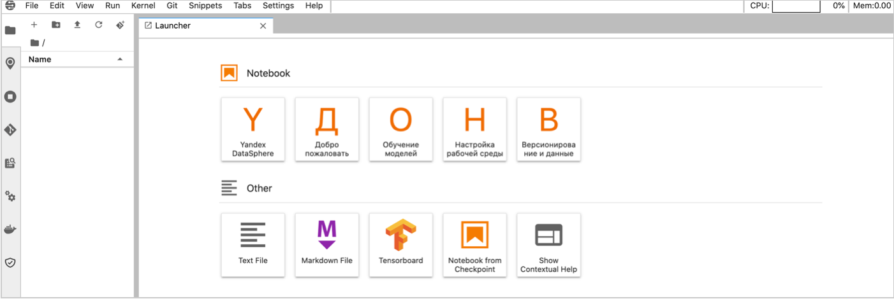 

### 1.3  Клонируйте репозиторий в {{ ml-platform-short-name }} {#clone-repo-to-datasphere}

1. В левом верхнем углу нажмите  **Git Clone**.
1. В открывшемся окне укажите **URI** репозитория `https://github.com/zhdanchik/yandex_metrika_cloud_case.git` и нажмите кнопку **CLONE**.

## 2. Получите и загрузите данные в {{ CH }} {#get-download-data-in-ch}

Если у вас нет счетчика Метрики или в нем недостаточно данных, или вы гарантированно хотите пройти все шаги инструкции и получить результат, перейдите к разделу [2.3](#uploading-data-counter-from-disk) (пропустите [2.1](#create-metrica-app-token) и [2.2](#uploading-data-logs-api)).

Если у вас есть счетчик Метрики и доступ к нему, перейдите к разделам [2.1](#create-metrica-app-token), [2.2](#uploading-data-logs-api) (пропустите [2.3](#uploading-data-counter-from-disk)). Эти шаги рекомендуем опытному пользователю, так как логика расчета воронок и когорт зависит от самих данных, может потребоваться самостоятельная доработка скриптов. 

### 2.1 Яндекс Метрика. Создайте приложение и получите токен доступа {#create-metrica-app-token}

1. Для работы с API получите свой [OAuth-токен](https://tech.yandex.ru/oauth/doc/dg/tasks/get-oauth-token-docpage/). 
1. Создайте приложение:
     1. Перейдите на страницу [https://oauth.yandex.ru/client/new](https://oauth.yandex.ru/client/new).
     1. Укажите произвольное название приложения. 
     1. Перейдите к блоку **Платформы** → **Веб-сервисы**. В поле **Callback URI #1** вставьте `https://oauth.yandex.ru/verification_code`.
     1. Перейдите к блоку **Доступы** → **Яндекс Метрика (metrika)**. Активируйте опцию **Получение статистики, чтение параметров своих и доверенных счётчиков (metrika:read)**.
     1. Нажмите кнопку **Создать приложение**.
     1. В открывшемся окне появится описание нашего приложения. Скопируйте ID вашего приложения.

1. Перейдите по ссылке `https://oauth.yandex.ru/authorize?response_type=token&client_id=<ID приложения>`. В параметр `client_id` добавьте скопированный ID вашего приложения.
1. Нажмите кнопку **Войти как …**
1. Скопируйте полученный токен доступа.

###  2.2 {{ ml-platform-short-name }}. Выгрузите данные через Logs API Яндекс Метрики {#uploading-data-logs-api}

1. В проекте  {{ ml-platform-short-name }} в корне рабочей директории создайте текстовый файл. 

    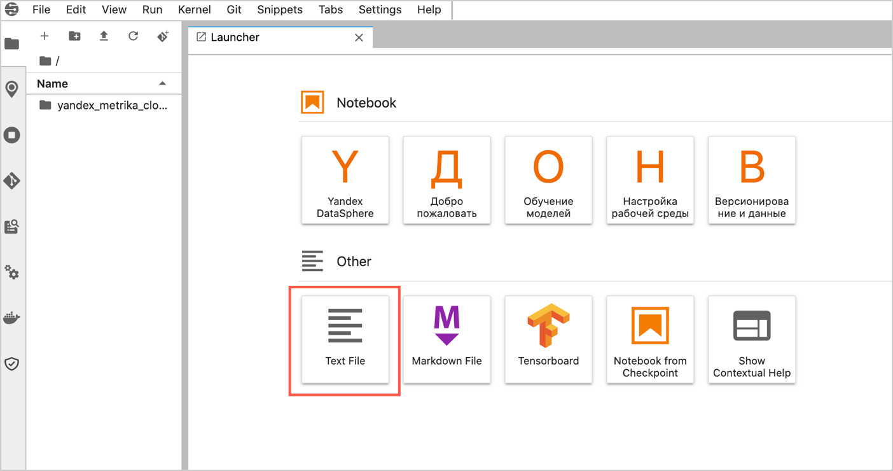

1. Назовите файл `.yatoken.txt`, в содержимое файла вставьте полученный токен доступа. Сохраните изменения и закройте файл.
1. Откройте папку **yandex_metrika_cloud_case** → ноутбук **1a. get_data_via_logs_api.ipynb**.

Если не получилось выгрузить данные из Logs API, то данные для демонстрационного счетчика можно [скачать через Яндекс Диск](#uploading-data-counter-from-disk). 

###  2.3 {{ ml-platform-short-name }}. Выгрузите данные тестового счетчика через Яндекс Диск {#uploading-data-counter-from-disk}



Пропустите этот раздел, если вы работаете с данными своего счетчика.



1. Откройте папку **yandex_metrika_cloud_case** → ноутбук **1b. get_data_via_yadisk.ipynb**.
1. Выполните все шаги (ячейки с кодом) в ноутбуке  **1b. get_data_via_yadisk.ipynb**.

### 2.4 {{ CH }}. Получите адрес кластера {#getting-ch-cluster-host}

1. Перейдите в уже созданный кластер {{ CH }}. Дождитесь, когда у кластера появится статус **Alive**. После этого откройте кластер, кликнув на сам кластер.

     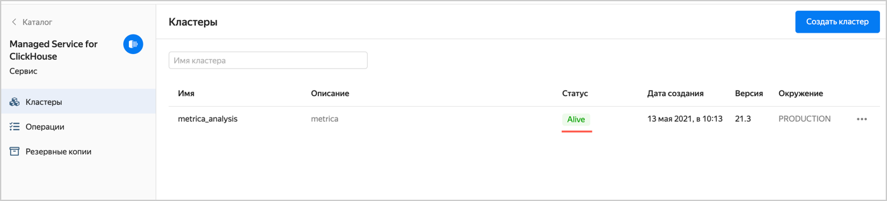

1. Выберите из списка слева **Хосты**.
1. На вкладке **Обзор** перейдите к столбцу **Имя хоста**. Чтобы скопировать имя хоста, наведите указатель мыши справа от названия хоста и нажмите значок копирования. 

### 2.5 {{ ml-platform-short-name }}. Загрузите данные в {{ CH }} {#uploading-data-counter-to-ch}

1. Откройте папку **yandex_metrika_cloud_case** → ноутбук **2. upload_data_to_{{ CH }}.ipynb**.
    1. Вставьте скопированное имя хоста в переменную `CH_HOST_NAME`.
    1. Используйте имя заведенного пользователя в переменной `CH_USER`.
    1. Используйте имя заведенной БД в переменной `CH_DB_NAME`.
    
        
    
1. В корневой директории создайте новый текстовый файл с названием **.chpass.txt**.
    
    

1. Запишите в файл **.chpass.txt** пароль заведенного пользователя. Сохраните и закройте файл.
1. Выполните все шаги (ячейки с кодом) в ноутбуке.

## 3. Подключите {{ datalens-short-name }} и создайте чарты {#datalens-connection-chart-creation}

### 3.1 Подключитесь к {{ datalens-short-name }} {#datalens-connection}

1. На странице созданного кластера {{ CH }} слева в меню выберите **{{ datalens-short-name }}**.
1. В открывшемся окне нажмите кнопку **Активировать**.
1. В открывшемся окне выберите каталог **default** и нажмите **Активировать DataLens**.

### 3.2 Создайте подключение к {{ CH }} в {{ datalens-short-name }} {#creation-datalens-connection-to-ch}

1. Нажмите кнопку **Создать подключение**.
1. Выберите подключение **{{ CH }}**.
1. Заполните настройки подключения.
   1. Добавьте произвольное название.
   1. Выберите хост {{ CH }} из выпадающего списка **Имя хоста**. 
   1. Выберите имя пользователя.
   1. Введите пароль и нажмите **Проверить подключение**.
  
      
    
   1. После проверки подключения в правом верхнем углу нажмите кнопку **Создать**.

### 3.3 Создайте датасет на базе подключения {#creating-dataset-based-on-connection}

1. В правом верхнем углу нажмите **Создать датасет**.
1. Выберите таблицу `metrica_data.hits` в качестве источника. Для этого перетащите таблицу из списка слева в область редактирования.
1. Откройте вкладку **Поля**.
1. В правом верхнем углу нажмите кнопку **Добавить поле**.
1. Для подсчета числа хитов создайте вычисляемое поле **Хиты**, которое будет равно 1. Нажмите кнопку **Создать**. 

   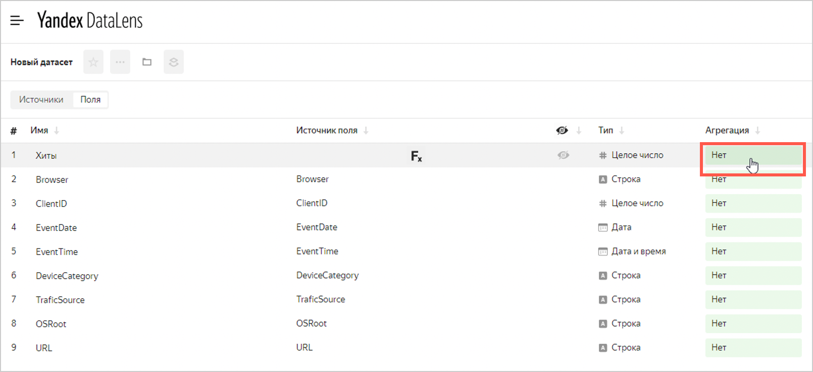

1. Для поля **Хиты** выберите значение **Сумма** в агрегации.  
1. Переименуйте поле **Browser** в **Браузер**.
1. В правом верхнем углу нажмите кнопку **Сохранить**.
1. Назовите датасет `ch_metrica_data_hits` и нажмите кнопку **Создать**.

### 3.4 Создайте чарт — накопительная диаграмма с областями {#creating-area-chart}

Перейдите к созданию чартов.

1. В правом верхнем углу нажмите кнопку **Создать чарт**.
1. В открывшемся окне перетащите следующие поля в область чарта:
    * Перетащите поле **EventDate** в область **X**.
    * Перетащите поле **Браузер** в область **Цвета**.
    * Перетащите поле **Хиты** в область **Y**.
1. Измените тип чарта на **Накопительная диаграмма с областями**. 

    
    
1. Нажмите кнопку **Сохранить**.

   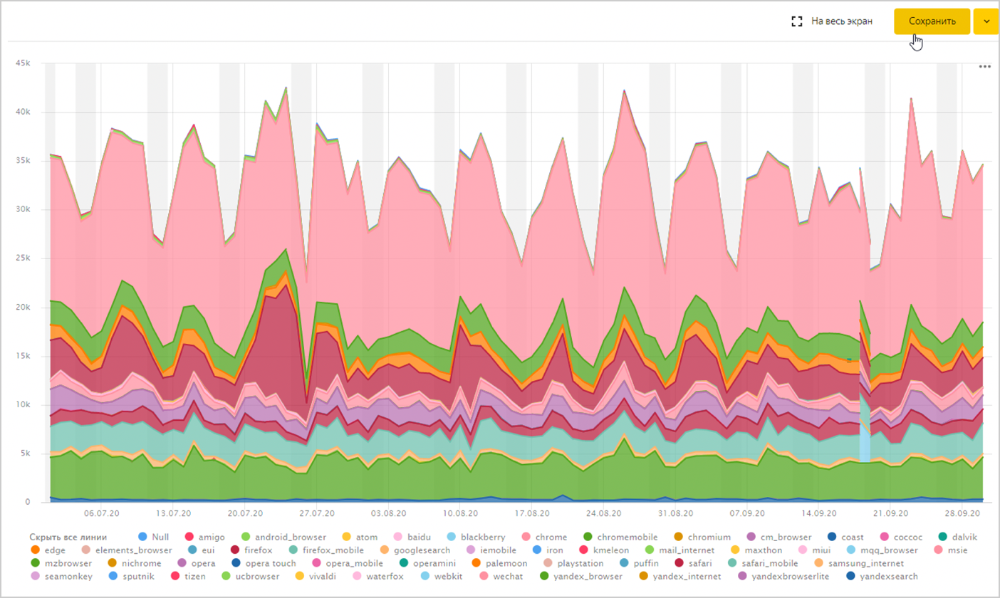
   
1. В появившемся окне укажите имя чарта `ch_metrica_data_hits_area` и нажмите кнопку **Сохранить**.

### 3.5 Создайте чарт — сводная таблица {#creating-pivot-table}

Создайте на основе готового чарта еще один чарт – сводную таблицу.

1. В правом верхнем углу нажмите значок   → **Сохранить как**.
1. Укажите новое имя для копии чарта `ch_metrica_data_hits_table` и нажмите кнопку **Сохранить**.
1. Выберите новый тип чарта **Сводная таблица**.
1. Добавьте или скорректируйте следующие поля в области чарта:
    * Перетащите поле **Браузер** в область **Строки**.
    * Перетащите поле **Хиты** в область **Сортировка**.
1. Нажмите кнопку **Сохранить**.

## 4. Создайте и настройте дашборд в {{ datalens-short-name }} {#creating-configuring-dashboard}

### 4.1 Создайте дашборд {#creating-dashboard}

1. Откройте главную страницу [{{ datalens-short-name }}](https://datalens.yandex.ru/) и нажмите **Создать дашборд**.
1. Укажите название дашборда `ch_metrica_data` и нажмите кнопку **Создать**.
1. Добавьте первый чарт на дашборд. Для этого в правом верхнем углу нажмите **Добавить** → **Чарт**.
    1. Из выпадающего списка **Чарт** выберите чарт **ch_metrica_data_hits_area**.
    1. В поле **Название** укажите имя чарта **Хиты в разбивке на браузеры** и нажмите кнопку **Добавить**.
1. По аналогии добавьте чарт **ch_metrica_data_hits_table** с именем **Хиты в разбивке на браузеры за период**.

    

1. Переместите чарты и измените их размеры на дашборде.
    1. Перетащите чарт с таблицей справа от чарта с диаграммой.
    1. Измените вертикальные размеры чартов, потянув каждый из них за правый нижний угол.
1. В правом верхнем углу нажмите кнопку **Сохранить**.

### 4.2 Настройте дашборд {#configuring-dashboard}

1. Добавьте фильтрацию, чтобы выбирать определенный браузер. Для этого в правом верхнем углу нажмите **Добавить** → **Селектор**.
1. Селектор можно привязать к полю из какого-либо датасета. Выберите из списка **Датасет** созданный датасет **ch_metrica_data_hits**.

    
    
1. Из списка **Поле** выберите **Браузер**. В поле **Название** укажите имя селектора и включите опцию **Показывать**. 
1. Включите опцию **Множественный выбор**. 
1. В поле **Значение по умолчанию** выберите браузеры:
    * android_browser
    * chrome
    * chromemobile
    * firefox
    * opera
    * safari
    * safari_mobile
    * samsung_internet
    * yandex_browser
    * yandexsearch
    
1. Нажмите кнопку **Добавить**.   
1. Перетащите селектор на верх дашборда и растяните по горизонтали.
1. В правом верхнем углу нажмите кнопку **Сохранить**.   

   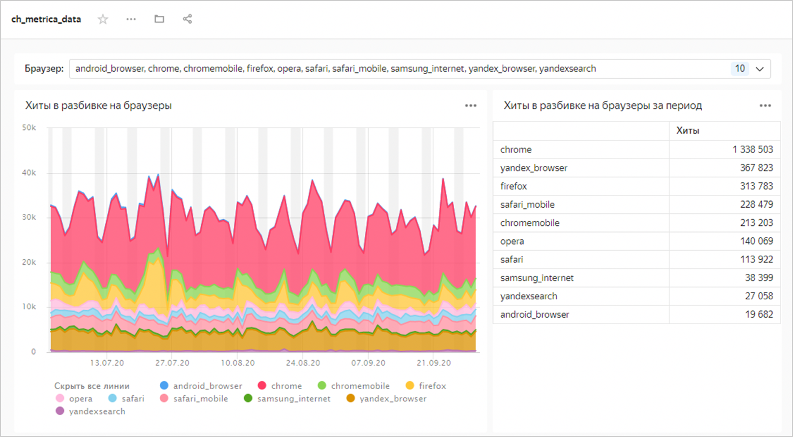 

## 5. Воронки {#funnels}
   
### 5.1 {{ ml-platform-short-name }}. Постройте воронки {#calculating-funnels-datasphere}

1. Откройте ноутбук **3. funnels.ipynb**. Укажите хост, пользователя и название БД.
    
    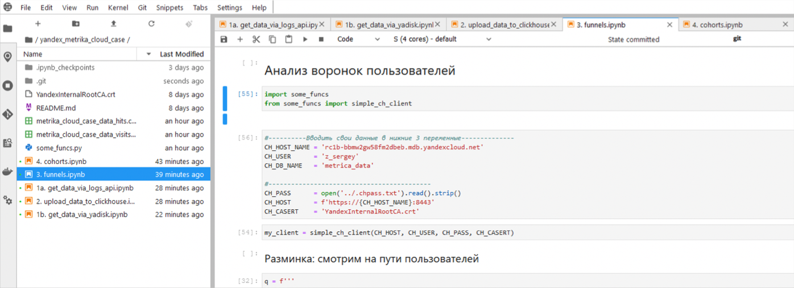 

1. Выполните ячейки, оцените результаты анализа. 
   
   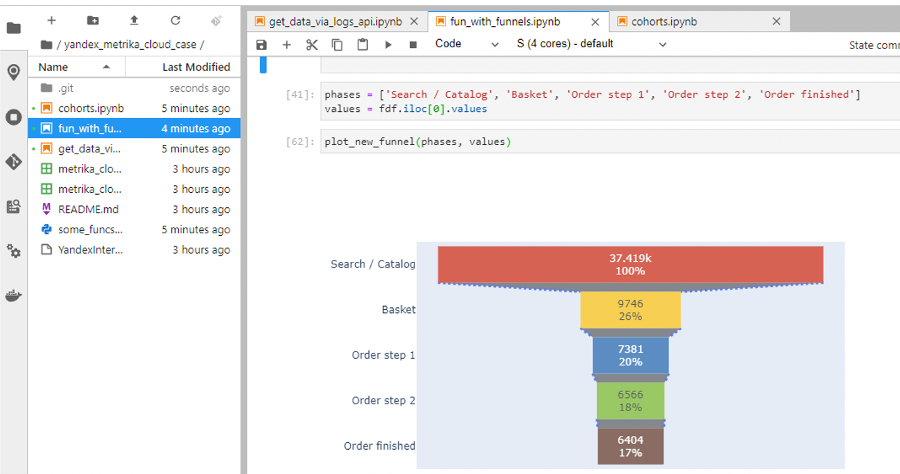 
   
В {{ CH }} будет создана таблица `metrica_data.funnels_by_bro`, в которой будут посчитаны воронки по браузерам.   

### 5.2 {{ datalens-short-name }}. Воронки по браузерам. Создайте датасет {#calculating-browser-funnels-dataset}

Создайте новый датасет на основе новой таблицы и подключения к {{ CH }}.

1. Откройте главную страницу [{{ datalens-short-name }}](https://datalens.yandex.ru/) и нажмите **Создать датасет**.
1. Перейдите в область **Подключения** и нажмите кнопку **Добавить**.
1. Из списка подключений выберите **metrica_analysis**.
1. Перетащите новую таблицу `metrica_data.funnels_by_bro` в область редактирования.
1. Откройте вкладку **Поля**.
    1. Переименуйте поля step X → Шаг X, где X — порядковый номер шага.
    1. Укажите значение агрегации **Сумма** для полей **Шаг X** и нажмите кнопку **Сохранить**.
   
   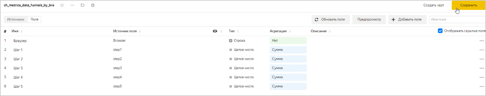 

1. Назовите датасет **ch_metrica_data_funnels_by_bro** и нажмите кнопку **Создать**.

### 5.3 {{ datalens-short-name }}. Воронки по браузерам. Создайте чарт {#calculating-browser-funnels-chart}

Создайте на основе датасета **ch_metrica_data_funnels_by_bro** чарт.

1. Нажмите кнопку **Создать чарт**.
1. Выберите тип чарта **Сводная таблица**.
1. Перетащите следующие поля в область чарта:
    * Поле **Браузер** в область **Строки**.
    * Поле **Шаг X** в область **Показатели**.
    * Поле **Шаг 1** в область **Сортировка**.
1. Нажмите кнопку **Сохранить**.
1. Укажите название чарта **ch_metrica_data_funnels_by_bro_table** и нажмите кнопку **Сохранить**.

###  5.4 {{ datalens-short-name }}. Воронки по браузерам. Добавьте чарт на дашборд {#add-browser-funnels-chart-on-dashboard}

1. Перейдите на созданный дашборд (можно со страницы [дашбордов](https://datalens.yandex.ru/dashboards)).
1. Добавьте новый чарт. В правом верхнем углу нажмите кнопку **Редактировать**.
1. Добавьте чарт `ch_metrica_data_funnels_by_bro_table`. Укажите название **Воронки по браузерам** и нажмите кнопку **Добавить**.
1. Расположите новый чарт справа от уже имеющихся двух. Растяните чарт так, чтобы он совпадал с остальными по вертикали и доходил справа до края страницы. 
1. Нажмите кнопку **Сохранить**.

    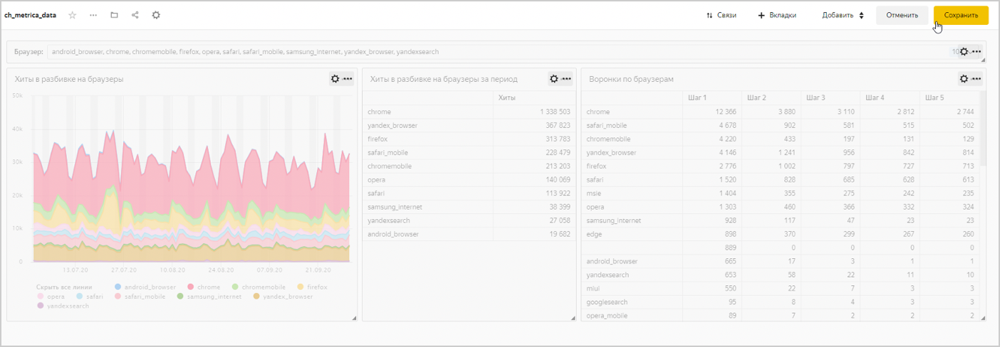 

### 5.5 {{ datalens-short-name }}. Воронки по браузерам. Настройте дашборд {#setting-browser-funnels-chart-on-dashboard}

Чтобы селектор влиял на новый чарт из другого датасета, настройте связи. 

1. Нажмите **Редактировать** → **Связи**.
1. В открывшемся окне выберите из списка селектор **Браузер:**.
1. На странице с другими элементами дашборда прокрутите вниз до чарта **Воронки по браузерам** и нажмите на список со связью.
   1. Выберите тип связи **Исх. связь**.

    

1. Из каждого списка выберите поля для связи **Браузер**. Нажмите кнопку **Добавить**.  
1. В правом верхнем углу дашборда нажмите кнопку **Сохранить**.  
1. В левом верхнем углу нажмите  → **Переименовать**.
1. Укажите название **Supermarket.ru — анализ воронок и когорт**. Нажмите кнопку **Готово**.
 
   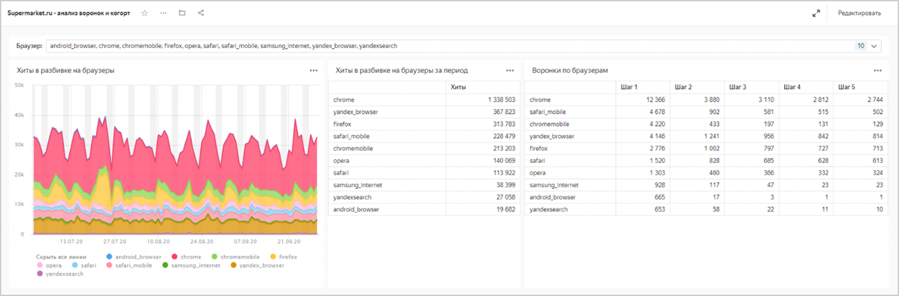 

## 6. Когорты {#cohorts}

### 6.1 {{ ml-platform-short-name }}. Когортный анализ {#cohort-analysis}

1. Откройте ноутбук **4. cohorts.ipynb**. Укажите хост, пользователя и название БД.

   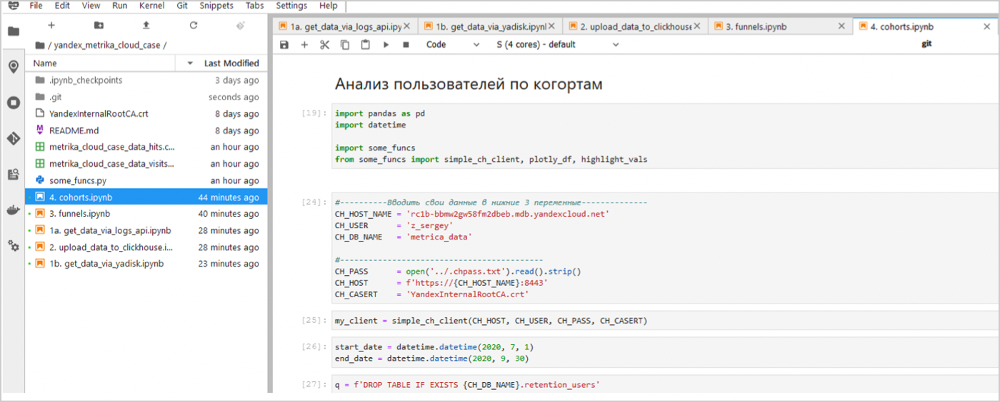  

1. Выполните ячейки, оцените результаты анализа. 

   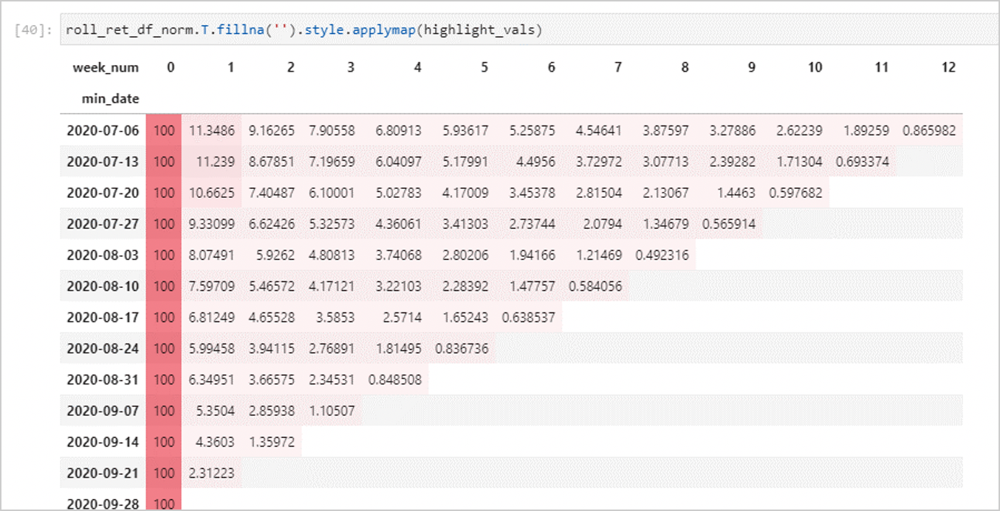 
   
В {{ CH }} создастся таблица `metrica_data.retention_users` с данными, необходимыми для построения визуализации в {{ datalens-short-name }}.   

### 6.2 {{ datalens-short-name }}. Создайте датасет и чарт с визуализацией когорт {#creating-dataset-chart-with-cohort}

Создайте датасет на основе новой таблицы и подключения к {{ CH }}. 

1. Откройте главную страницу [{{ datalens-short-name }}](https://datalens.yandex.ru/) и нажмите **Создать датасет**.
1. В области **Подключения** нажмите кнопку **Добавить**.
1. Выберите из списка подключение `metrica_analysis`.
1. Перетащите новую таблицу `metrica_data.retention_users` в рабочую зону, чтобы подключиться к ней.
1. Откройте вкладку **Поля** и создайте новое вычисляемое поле **week_num**, которое равно `([date]-[min_date])/7`.
   Поле будет означать число недель с момента первого посещения пользователя.
1. Нажмите кнопку **Создать**.
1. Для полей **visits**, **purchases** и **revenue** установите агрегацию **Сумма**.
1. Переименуйте поля в **Визиты**, **Покупки** и **Доход** соответственно. 
1. Сохраните датасет.
    1. Назовите датасет **ch_metrica_data_users_visits**.
    1. Нажмите кнопку **Создать**.
1. На основе датасета создайте новый чарт: 
    * Измените тип чарта на сводную таблицу.
    * Перетащите поле **week_num** в область **Столбцы**.
    * Перетащите поле **min_date** в область **Строки**.
    * Перетащите поле **Визиты** в область **Показатели**.    
   
   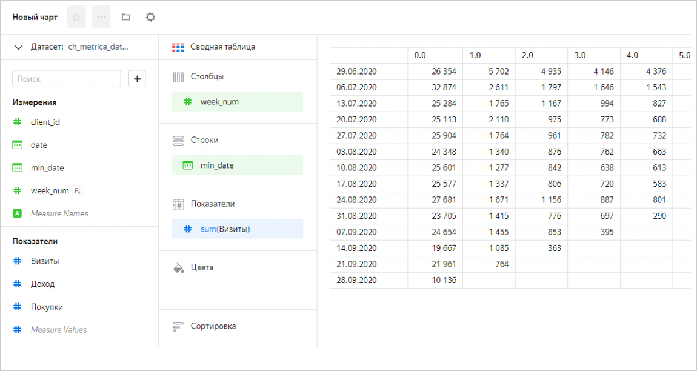 

### 6.3 {{ datalens-short-name }}. Настройте чарт с визуализацией когорт {#creating-chart-with-cohort}

Отфильтруем неполные недели 29.06.2020 и 28.09.2020. 

1. Перетащите поле **min_date** в область **Фильтры**.
1. В поле **min_date** нажмите значок календаря.
    1. В открывшемся окне выберите начало и конец диапазона дат для фильтрации:
        * Дата начала – 06.07.2020.
        * Дата завершения – 27.09.2020.
    1. Нажмите кнопку **Применить фильтр**.
1. Отформатируйте числа в значениях поля **week_num** – уберите знаки после запятой. Для этого в области **Столбцы** в поле **week_num** нажмите значок решетки. В открывшемся окне выполните настройку:
    1. Установите показатель **Знаков после запятой** в значение **0**. 
    1. Установите показатель **Отображать группы разрядов** в значение **Слитно**.
    1. Нажмите кнопку **Применить**.
1. Чтобы сделать таблицу цветной, добавьте поле **Визиты** в область **Цвета** и нажмите значок шестеренки. В открывшемся окне выполните настройку цвета:
    1. Выберите **Тип градиента** — Трехцветный.
    1. Выберите **Цвет** — Оранжевый-Фиолетовый-Голубой.
    1. Включите настройку **Задать пороговые значения** и укажите значения 100, 1000 и 5000.
    1. Нажмите кнопку **Применить**.
1. Нажмите кнопку **Сохранить**.
1. Назовите чарт **ch_metrica_data_users_visits_cohorts_abs** и нажмите **Сохранить**.

### 6.4 {{ datalens-short-name }}. Создайте чарт с ретеншеном {#creating-chart-with-retention}

Создайте чарт с ретеншеном на основе чарта **ch_metrica_data_users_visits_cohorts_abs**. Чарт можно открыть с дашборда или найти в [списке чартов](https://datalens.yandex.ru/widgets).

1. Нажмите кнопку **Сохранить как**.
1. Укажите имя чарта **ch_metrica_data_users_visits_cohorts_rel** и нажмите кнопку **Сохранить**.
1. Создайте новое вычисяемое поле для расчета ретеншена относительно первой недели:
    1. В левой части экрана нажмите значок , который находится над списком полей датасета, и выберите **Добавить поле**.
    1. Назовите поле **Визиты от первой недели**.
    1. Введите формулу `SUM([Визиты])/RMAX(SUM([Визиты]) among [week_num])`.
    1. Нажмите кнопку **Создать**.
1. Перетащите поле **Визиты от первой недели** в секцию **Показатели**.
1. Перетащите поле **Визиты от первой недели** в секцию **Цвета** вместо поля **Визиты**.
1. Настройте формат поля **Визиты от первой недели**. Для этого в секции **Показатели** в поле **Визиты от первой недели** нажмите значок решетки. В открывшемся окне выполните настройку:
    1. Установите показатель **Формат** в значение **Процент**. 
    1. Нажмите кнопку **Применить**.
1. Отредактируйте пороговые значения для цветов показателя. В секции **Цвета** нажмите значок шестеренки. В открывшемся окне укажите пороговые значения 0,01, 0,025 и 0,1 и нажмите кнопку **Применить**.
1. Нажмите кнопку **Сохранить**.

### 6.5 {{ datalens-short-name }}. Добавьте чарты на новую вкладку дашборда {#adding-charts-to-dashboard-tab}
   
Возвращаемся на дашборд. 

1. Нажмите кнопку **Редактировать** → **Вкладки**.
1. Переименуйте существующую вкладку как **Обзор + Воронки**.
1. Добавьте новую вкладку и назовите ее **Когорты**. Нажимите **Сохранить**.
1. Перейдите на новую вкладку Когорты. 
    1. Добавьте на дашборд чарт **ch_metrica_data_users_visits_cohorts_abs**.
    1. В поле **Название** укажите **Визиты по когортам (абсолюты)**.
    1. Чтобы добавить новую вкладку, нажмите слева кнопку **Добавить**.
       1. В новой вкладке добавьте чарт **ch_metrica_data_users_visits_cohorts_rel**.
       1. Укажите название **Визиты по когортам (относительные)**.
   1. Нажмите кнопку **Добавить**.
   
Вы получите чарт с двумя вкладками, между которыми можно переключаться.

     

### 6.6 {{ datalens-short-name }}. Создайте чарты {#creating-chart}

Создайте новый чарт на основе чарта **ch_metrica_data_users_visits_cohorts_abs**. Чарт можно открыть с дашборда или найти в [списке чартов](https://datalens.yandex.ru/widgets).

1. Нажмите кнопку **Сохранить как**.
1. Укажите имя чарта **ch_metrica_data_users_revenue_cohorts_abs** и нажмите кнопку **Сохранить**.
1. Перетащите поле **Доход** в области **Показатели** и **Цвета** поверх поля **Визиты**.
1. В области поля **Доход** нажмите значок решетки. Измените форматирование поля. 
    1. Выберите **1 знак после запятой**.
    1. Выберите размерность **Миллионы**.
    1. Замените пороги градации цветов для нового поля на 500000, 1500000 и 10000000.
1. Сохраните чарт.

    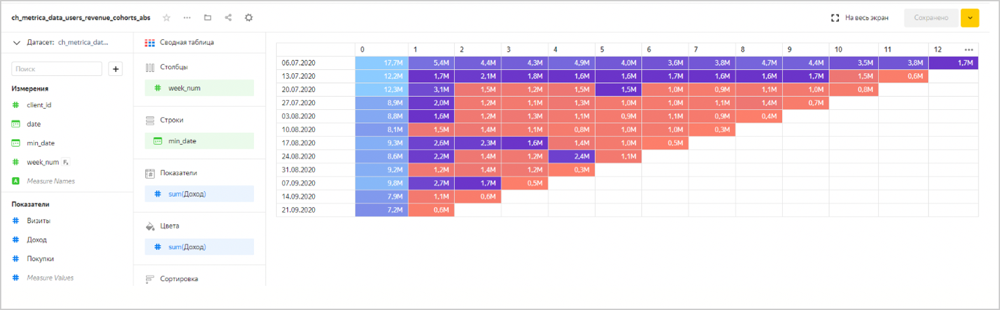 

Создайте еще один чарт на основе чарта **ch_metrica_data_users_visits_cohorts_rel**.

1. Нажмите кнопку **Сохранить как**.
1. Укажите имя чарта **ch_metrica_data_users_revenue_cohorts_rel** и нажмите кнопку **Сохранить**.
1. Измените поле **Визиты от первой недели**.
    1. Переименуйте поле как **Доход от первой недели**.
    1. Измените формулу на `SUM([Доход])/RMAX(SUM([Доход]) among [week_num])`.
    1. Измените пороги градации цветов для нового поля на 0.01, 0.2 и 0.3.
1. Сохраните чарт.

    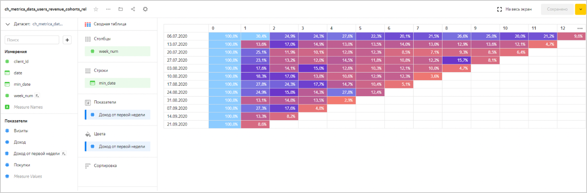

### 6.7 {{ datalens-short-name }}. Добавьте чарты на дашборд {#adding-chart-to-dashboard}

Добавьте на дашборд чарты с визуализацией когорт.

1. Нажмите кнопку **Редактировать**.
1. Нажмите кнопку **Добавить**.
1. Выберите **Чарт**.
1. Из списка чартов выберите чарт **ch_metrica_data_users_revenue_cohorts_abs**.
1. Укажите имя **Доход по когортам (абсолюты)**.
1. С помощью кнопки **+ Добавить** создайте новую вкладку.
    1. В новой вкладке в списке чартов выберите чарт **ch_metrica_data_users_revenue_cohorts_rel**.
    1. Укажите имя **Доход по когортам (относительный)**.
    1. Нажмите кнопку **Сохранить**.
1. Расположите чарты на одном уровне.

    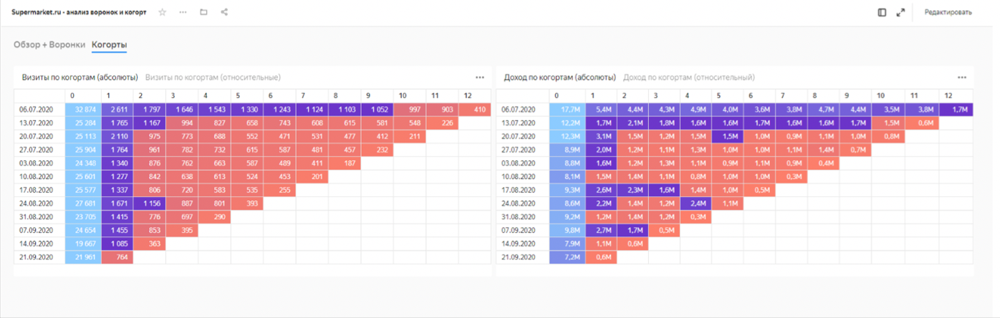