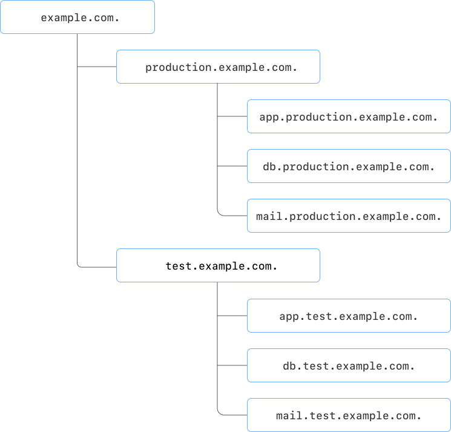

# Зоны DNS

Зона DNS — это логическое пространство, которое объединяет доменные имена ваших ресурсов и содержит нужные [ресурсные записи](resource-record.md). Зоны бывают [публичные](#public-zones) и [внутренние](#private-zones). Вне зависимости от типа, они образуют иерархию: у зоны может быть одна или несколько подзон.

Вы можете управлять иерархией облачных ресурсов и маршрутизировать DNS-запросы. Например, создать подзоны для основной и тестовой сред, а внутри них подзоны для приложений, кластеров БД, кеширующих серверов и т. д.

Для управления доступом к зонам, подзонам и ресурсным записям используется ресурсная модель {{ yandex-cloud }}.
Если публичная зона зарегистрирована в {{ yandex-cloud }}:

* для создания подзоны требуются права на управление родительской зоной;
* для управления подзоной и записями в ней права на родительскую зону не требуются.

Это предотвращает создание подзон для зарегистрированных в {{ yandex-cloud }} зон, к которым у пользователей нет доступа.
Можно создавать зоны и подзоны в разных каталогах. Для этого назначьте пользователю или [сервисному аккаунту](../../iam/concepts/users/service-accounts.md) роль `editor` на каталог, в котором находится родительская зона. Подробнее см. в разделе [{#T}](../security/index.md).

Например, родительская зона `example.com.` находится в каталоге `my-folder`. Тогда, при наличии прав на управление этой зоной, подзоны `test.example.com.` и `production.example.com.` могут быть созданы в каталогах `my-test-folder` и `my-production-folder` соответственно.

## Публичные зоны {#public-zones}

Доменные имена в публичных зонах доступны из интернета. Если у вас есть зарегистрированный домен, вы можете делегировать его. Для этого укажите адреса серверов имен {{ yandex-cloud }} в `NS`-записях вашего регистратора:

* `ns1.{{ dns-ns-host-sld }}.`
* `ns2.{{ dns-ns-host-sld }}.`

Публичные зоны верхнего уровня (TLD-зоны) создавать нельзя.

Из соображений безопасности, вложенные публичные зоны могут создавать только пользователи и сервисные аккаунты, у которых есть роль `dns.editor`, `dns.admin`, `editor`  или `admin` в каталоге с родительской публичной зоной. Учитывайте это при организации структуры ваших доменных имен. Для организации более сложных сценариев обратитесь в [техническую поддержку](../../support/overview.md).

Сервис не требует подтверждения владения доменом. Вы можете использовать доменную зону, даже если она не зарегистрирована на вас. Если вы делегировали свой домен в {{ dns-name }}, но не создали соответствующей публичной DNS-зоны в {{ dns-name }} — такую зону может занять кто-то другой. Поэтому рекомендуем сначала создать публичную DNS-зону в {{ dns-name }}, а уже затем выполнять делегирование. 



Если вашу публичную DNS-зону заняли, обратитесь в [техническую поддержку](../../support/overview.md), чтобы подтвердить свои права на зону.



Запросы к публичным DNS-зонам и запросы внешних DNS-имен с ваших [виртуальных машин](../../glossary/vm.md) являются публичными DNS-запросами. Сервис {{ dns-name }} используется для публичных DNS-запросов, даже в том случае, если в вашем облаке нет никаких DNS-зон, кроме сервисных.

Рекомендуем [использовать кеширующие резолверы](../tutorials/local-dns-cache.md), например: `systemd-resolved`, `dnsmasq`, `unbound`. С их помощью можно снизить количество публичных DNS-запросов и, таким образом, уменьшить [расходы](../pricing.md#public-dns-requests).

## Внутренние зоны {#private-zones}

Доменные имена из внутренних зон доступны для использования только в сетях [{{ vpc-name }}](../../vpc/) (VPC), указанных при создании зоны. Во внутренних зонах вы можете использовать все пространство имен в подсетях выбранной сети, в том числе `internal.` и `.`.



Созданная внутренняя зона перекрывает публичные зоны. Если вы создадите внутреннюю зону `example.com`, то в этой сети {{ vpc-short-name }} станут недоступны все поддомены `example.com.`, доступные из интернета.



### Сервисные зоны {#service-zones}

В сетях {{ vpc-short-name }} могут автоматически создаваться сервисные зоны. Список таких зон определяется диапазоном адресов используемых подсетей, например:



* `.`
* `internal.`
* `10.in-addr.arpa.`
* `168.192.in-addr.arpa.`
* `16.172.in-addr.arpa.`
* `17.172.in-addr.arpa.`
* `18.172.in-addr.arpa.`
* `19.172.in-addr.arpa.`
* `20.172.in-addr.arpa.`
* `21.172.in-addr.arpa.`
* `22.172.in-addr.arpa.`
* `23.172.in-addr.arpa.`
* `24.172.in-addr.arpa.`
* `25.172.in-addr.arpa.`
* `26.172.in-addr.arpa.`
* `27.172.in-addr.arpa.`
* `28.172.in-addr.arpa.`
* `29.172.in-addr.arpa.`
* `30.172.in-addr.arpa.`
* `31.172.in-addr.arpa.`



В этих зонах содержатся записи с внутренними FQDN виртуальных машин и именами баз данных MDB, пользовательскими именами ВМ и обратными записями. Автоматически созданные записи нельзя редактировать, но вы можете управлять записями, добавленными вручную.

Для повышения отказоустойчивости часть трафика может передаваться в сторонние рекурсивные резолверы. Если вам необходимо избежать этого — обратитесь в [техническую поддержку](../../support/overview.md).
