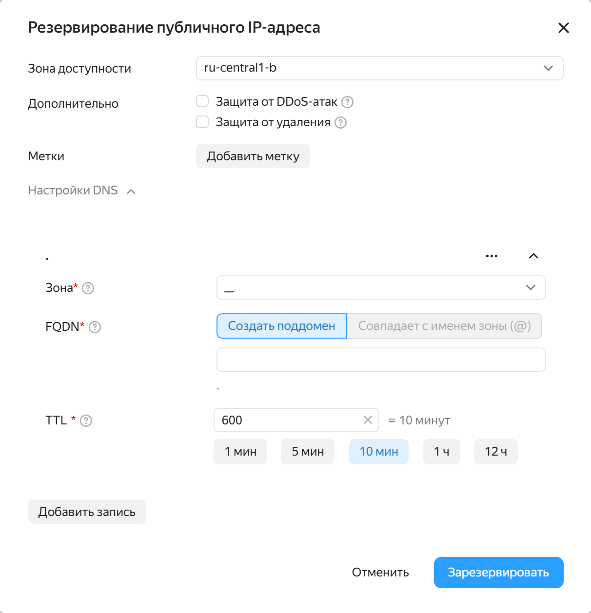
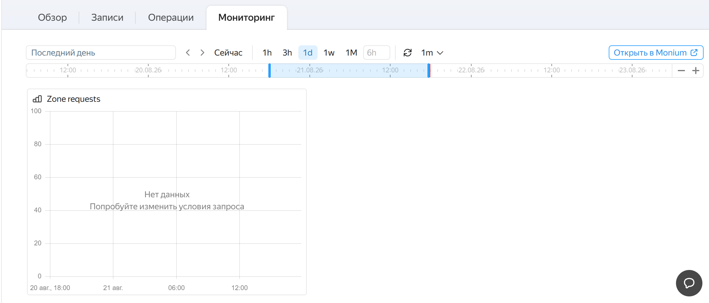

# История изменений в {{ dns-full-name }}

<!-- Changelog begin -->


```
date: 2024-09
index: 3
```

### {{ dns-name }} и {{ vpc-name }} теперь работают вместе



Указывайте DNS-записи прямо в спецификациях публичных адресов, настраивайте резолвинг без лишних шагов и держите сетевую конфигурацию в одном месте.




```
date: 2024-06
index: 2
```

### Серверы НСДИ в вашей сети

Расширяйте зону ответственности DNS-инфраструктуры и используйте привычные инструменты управления именами внутри {{ yandex-cloud }}.




```
date: 2024-03
index: 1
```

### Ресурсные записи SVCB/HTTPS

Ускоряйте подключение клиентов к сервисам и используйте современные стандарты для более гибкой маршрутизации трафика.

### Метрики мониторинга



Следите за состоянием DNS-инфраструктуры в реальном времени и быстрее находите причины сбоев.



<!-- Changelog end -->

## III квартал 2024 {#q3-2024}

Реализована интеграция с {{ vpc-name }} для указания DNS-записей в спецификациях публичных адресов.

## II квартал 2024 {#q2-2024}

К сервису подключены серверы НСДИ.

## I квартал 2024 {#q1-2024}

* Добавлены ресурсные записи типа [SVCB/HTTPS](./concepts/resource-record.md#svcb-and-https-svcb-https).
* Добавлены [метрики мониторинга](./metrics.md).
