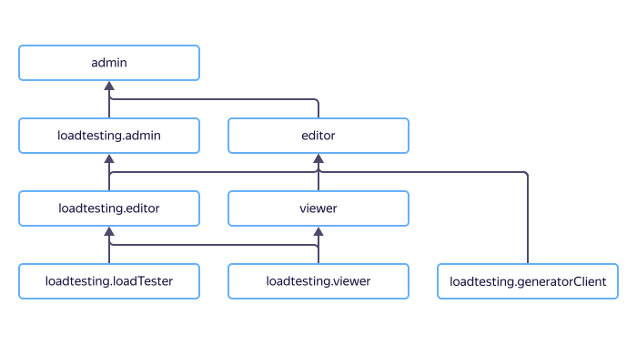

# Управление доступом в {{ dns-name }}

В этом разделе вы узнаете:
* [на какие ресурсы можно назначить роль](#resources);
* [какие роли действуют в сервисе](#roles-list);
* [какие роли необходимы](#required-roles) для того или иного действия.



Назначать роли на ресурс могут пользователи, у которых на этот ресурс есть роль `dns.admin` или одна из следующих ролей:



## На какие ресурсы можно назначить роль {#resources}



На [зону DNS](../concepts/dns-zone.md) роль можно назначить через {{ yandex-cloud }} [CLI](../../cli/cli-ref/dns/cli-ref/zone/add-access-binding.md), [API](../api-ref/authentication.md) или [{{ TF }}]({{ tf-provider-resources-link }}/dns_zone_iam_binding).

## Какие роли действуют в сервисе {#roles-list}



### Сервисные роли {#service-roles}

#### dns.auditor {#dns-auditor}



#### dns.viewer {#dns-viewer}



#### dns.editor {#dns-editor}



#### dns.admin {#dns-admin}



### Примитивные роли {#primitive-roles}





## Какие роли мне необходимы {#required-roles}

В таблице ниже перечислено, какие роли нужны для выполнения указанного действия. Вы всегда можете назначить роль, которая дает более широкие разрешения, нежели указанная. Например, назначить `editor` вместо `viewer` или `dns.admin` вместо `dns.editor`.

| Действие                                                                                                                                            |                              Методы                               | Необходимые роли                                                                                                                                                                            |
|:----------------------------------------------------------------------------------------------------------------------------------------------------|:-----------------------------------------------------------------:|:--------------------------------------------------------------------------------------------------------------------------------------------------------------------------------------------|
| **Просмотр метаинформации**                                                                                                                         |                                                                   |                                                                                                                                                                                             |
| Просмотр информации о DNS-зонах                                                                                                                     |                           `get`, `list`                           | `dns.auditor` на этот ресурс                                                                                                                                                                |
| **Просмотр информации**                                                                                                                             |                                                                   |                                                                                                                                                                                             |
| Просмотр информации о DNS-зонах и ресурсных записях в них                                                                                           |                  `get`, `list`, `listRecordSets`                  | `viewer` или `dns.viewer` на этот ресурс                                                                                                                                                    |
| **Управление DNS-зонами**                                                                                                                           |                                                                   |                                                                                                                                                                                             |
| Создание зоны                                                                                                                                       |                             `create`                              | `editor` или `dns.editor` на каталог, а также `vpc.user` на этот каталог или сеть {{ vpc-short-name }}, если зона внутренняя                                                                |
| Изменение, удаление зон                                                                                                                             |                        `update`, `delete`                         | `editor` или `dns.editor` на каталог, а также `vpc.user` на этот каталог или сеть {{ vpc-short-name }}, если зона внутренняя                                                                |
| Создание подзон                                                                                                                                     |                             `create`                              | `editor` или `dns.editor` на каталог, где находится зона, частями которой будут создаваемые подзоны, а также `vpc.user` на этот каталог или сеть {{ vpc-short-name }}, если зона внутренняя |
| **Управление ресурсными записями**                                                                                                                  |                                                                   |                                                                                                                                                                            |
| Создание ресурсных записей в DNS-зоне                                                                                                               |                             `create`                              | `editor` или `dns.editor` на каталог или зону                                                                                                                              |
| Изменение, удаление ресурсных записей                                                                                                               |                        `update`, `delete`                         | `editor` или `dns.editor`                                                                                                                                                  |
| **Управление доступом к DNS-зонам**                                                                                                                 |                                                                   |                                                                                                                                                                            |
| [Назначение роли](../../iam/operations/roles/grant.md), [отзыв роли](../../iam/operations/roles/revoke.md) и просмотр назначенных ролей на DNS-зоны | `setAccessBindings`, `updateAccessBindings`, `listAccessBindings` | `admin` или `dns.admin` на каталог или зону                                                                                                                                |

Чтобы ограничить доступ пользователям, назначайте им роли на отдельные зоны или подзоны. 

#### Что дальше {#next}

* [Как назначить роль](../../iam/operations/roles/grant.md).
* [Как отозвать роль](../../iam/operations/roles/revoke.md).
* [Подробнее об управлении доступом в {{ yandex-cloud }}](../../iam/concepts/access-control/index.md).
* [Подробнее о наследовании ролей](../../resource-manager/concepts/resources-hierarchy.md#access-rights-inheritance).
