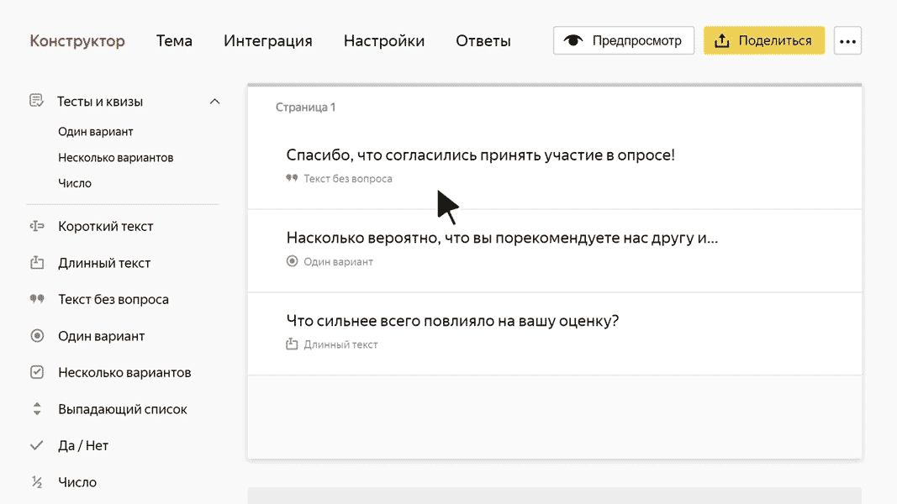

# Добавить вопросы

Форма состоит из блоков вопросов — полей или списков, в которых пользователи могут ответить на вопрос или ввести какие-либо данные. Для блоков можно задать ограничения или варианты ответов, а также настроить условия показа блоков в зависимости от того, как пользователь ответил на другие вопросы.

## Добавить блок вопроса {#section_zlk_g4z_sbb}

1. Выберите форму. Откроется вкладка **Конструктор**.

1. Чтобы добавить на форму блок вопроса, выберите его из списка слева и перетащите в рабочую область. Чтобы понять, как работают разные блоки вопросов, прочтите раздел [{#T}](#sec_questions_ref).

1. В открывшемся окне **Редактирование вопроса** [задайте параметры блока](#params). Чтобы настроить ранее добавленный блок, нажмите на него.

1. Чтобы изменить порядок вопросов, наведите указатель на блок и перетащите его за значок  на нужное место.
    
    

1. Если нужно показывать или скрывать блок в зависимости от ответов пользователя на другие вопросы, [настройте условия показа блока](#conditions).

1. Чтобы удалить блок вопроса, нажмите значок .

1. Чтобы разбить форму на несколько страниц, в нижней части рабочей области нажмите кнопку **Добавить страницу**. Пользователи смогут переключаться между страницами формы с помощью кнопок **Далее** и **Назад**.
    
    

    Пользователи не смогут переключиться на следующую страницу формы, пока не заполнят обязательные поля на предыдущей.

    
    
1. Чтобы просмотреть, как будет выглядеть готовая форма, нажмите кнопку **Предпросмотр**.

## Настроить параметры вопроса {#params}

Чтобы настроить параметры блока вопроса, нажмите на него. Откроется окно **Редактирование вопроса**:

- В левой части окна вы можете настроить параметры вопроса.

- В правой части окна показано, как будет выглядеть вопрос на форме.

В зависимости от типа вопроса, для редактирования доступны разные параметры:

- **Вопрос** — основной текст блока. Обычно служит заголовком поля или формулирует вопрос, на который нужно ответить пользователю.

- **Ответы** — параметры для блоков, в которых пользователю нужно выбрать ответы из нескольких вариантов. Вы можете задать список допустимых ответов или ограничить выбор вариантов (например, при выборе даты или города).

- **Настройки** — параметры, с помощью которых вы можете задать ограничения или дополнительные свойства блока. Например, сделать заполнение поля обязательным или настроить сортировку вариантов ответа. 

- **Валидация** — работает для некоторых типов полей, например, число или ИНН. Валидация нужна для проверки формата ответа: если формат неверный, пользователь увидит сообщение об этом. Подробную информацию можно прочитать в блоке [Валидация ответа](option-validation).

Подробное описание параметров см. в разделе [{#T}](blocks-ref/blocks-reference.md).

## Настроить предзаполнение текстовых и числовых полей формы {#default}

Значения по умолчанию можно добавить только для текстовых и числовых полей. Для предзаполнения полей другого типа [настройте предзаполнение формы](pre-fill.md).

Вопросы, для которых доступно предзаполнение:

 * [{#T}](blocks-ref/short-text.md).
 * [{#T}](blocks-ref/long-text.md).
 * [{#T}](blocks-ref/number.md).
 * [{#T}](blocks-ref/integer.md).
 * [{#T}](blocks-ref/email.md).
 * [{#T}](blocks-ref/link.md).
 * [{#T}](blocks-ref/phone.md).
 * [{#T}](blocks-ref/inn.md).

Чтобы при открытии формы в ее поля автоматически подставлялись заданные значения, добавьте значения по умолчанию:

1. Нажмите на вопрос. Откроется окно **Редактирование вопроса**.

1. Нажмите  **Добавить значение по умолчанию**. 

1. Введите значение, которым будет предзаполнено поле. 

1. Нажмите кнопку **Сохранить**.

## Настроить условия показа вопроса {#conditions}

Вы можете показывать или скрывать блок в зависимости от ответов на предыдущие вопросы:

1. Наведите указатель на блок и нажмите появившийся значок .

1. Выберите опцию **при условии**.

1. Задайте условие показа вопроса:

    - Выберите вопрос, от которого будет зависеть появление блока. 
      Для выбора доступны только те вопросы, которые следуют перед настраиваемым блоком.
      Условие показа первого вопроса настроить нельзя.

    - Выберите операцию сравнения: **равно** или **не равно**. 

    - Выберите или введите ответ, совпадение с которым требуется проверять.

1. Чтобы добавить несколько условий, нажмите ссылку **Добавить условие** и задайте логический оператор. 

    Если между двумя условиями задан логический оператор **И**, требуется одновременное выполнение условий. Если задан оператор **ИЛИ**, требуется выполнение хотя бы одного условия.
    
    Если вы добавите несколько условий с различными операторами, проверка условий будет выполняться по порядку сверху вниз. Оператор **И** не имеет приоритета над оператором **ИЛИ**.
    
    

    Чтобы получить предсказуемый результат проверки группы условий, рекомендуем использовать однотипные операторы: все условия с оператором **И** или все условия с оператором **ИЛИ**. 

    

## Как добавить поле для произвольного ответа {#field-free-answ}

Чтобы на форме с фиксированным набором ответов пользователь мог дать произвольный ответ, используйте условие отображения вопроса:
 
1. Добавьте на форму вопросы:
    
    - **Несколько вариантов** или **Один вариант** с несколькими вариантами ответов. Кроме фиксированных ответов, задайте произвольный ответ, например, «Другое».
    
    - **Короткий текст**. В это поле пользователь будет вводить произвольный текст.

1. В конструкторе наведите указатель на вопрос «Короткий текст» и нажмите значок .

1. Выберите опцию **при условии**.

1. Задайте условие показа вопроса:

    - Выберите вопрос с фиксированными вариантами ответа, от которого будет зависеть появление блока.

    - Выберите операцию сравнения **равно**. 

    - Выберите «Другое».

Таким образом, поле для ввода произвольного текста будет отображаться, если в вопросе с несколькими вариантами выбран пункт «Другое».

## Какие вопросы использовать {#sec_questions_ref}

Если вы не уверены, какой блок вопроса подходит для вашей формы, воспользуйтесь таблицей:

Какой ответ вы хотите получить | Какой блок выбрать
----- | -----
Произвольное слово или короткая фраза. Например, имя. | [{#T}](blocks-ref/short-text.md)
Произвольный длинный текст. Например, отзыв. | [{#T}](blocks-ref/long-text.md)
Число. Например, сумма денег. | [{#T}](blocks-ref/number.md)  [{#T}](blocks-ref/integer.md)
Дата или диапазон дат. Например, дата проведения мероприятия. | [{#T}](blocks-ref/date.md)
Адрес электронной почты | [{#T}](blocks-ref/email.md)
Номер телефона | [{#T}](blocks-ref/phone.md)
Ссылка. Например, профиль в соцсети. | [{#T}](blocks-ref/link.md)
Файл, загруженный пользователем. Например, фото. | [{#T}](blocks-ref/file.md)
Денежный перевод. Например, взнос за участие в мероприятии. | [{#T}](blocks-ref/payment.md)
Выбор одного варианта из предложенных. Например, выбор цвета товара. | [{#T}](blocks-ref/dropdown.md)  [{#T}](blocks-ref/radiobutton.md)
Выбор нескольких вариантов из предложенных. Например, для заказа нескольких услуг. | [{#T}](blocks-ref/multiple.md)
Название города или страны. Например, место проживания. | [{#T}](blocks-ref/cities.md)
Несколько оценок по заданной шкале. Например, оценка мероприятия по нескольким критериям. | [{#T}](blocks-ref/rating.md)
Согласие с каким-либо утверждением или действием. Например, согласие получать почтовую рассылку. | [{#T}](blocks-ref/yes-no.md)
Вопрос для [теста](tests.md), в котором можно получить баллы за правильный ответ. | Вопросы из категории **Тесты и квизы**:<ul><li>[{#T}](blocks-ref/test-single.md)<li>[{#T}](blocks-ref/test-multiple.md)<li>[{#T}](blocks-ref/test-number.md)<ul/>
Информация, которая не требует ответа пользователя. Например, заголовок для группы вопросов. | [{#T}](blocks-ref/no-question.md)
ИНН организации | [{#T}](blocks-ref/inn.md)
Группа повторяющихся вопросов. Например, если нужно указать данные нескольких участников для регистрации на мероприятии. | [{#T}](blocks-ref/series.md)
Имя сотрудника организации {{ org-full-name }} | [{#T}](blocks-ref/people.md)
Название отдела или команды в организации {{ org-full-name }} | [{#T}](blocks-ref/departments.md) [{#T}](blocks-ref/teams.md)
Имя сотрудника или подразделения Яндекса | [Данные Стаффа](blocks-ref/staff.md)
Сервис [ABC](https://abc.yandex-team.ru/) | [Каталог сервисов](blocks-ref/abc.md)
Блок с вариантами ответов, которые подгружаются из [динамической таблицы {{ wiki-name }}](../wiki/create-grid.md) | [{#T}](blocks-ref/wiki.md)
Блок с вариантами ответов, которые подгружаются из таблицы [YT](https://yt.yandex-team.ru/) | [Список из YT](blocks-ref/yt.md)