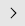

# Получить ответы

Вы можете посмотреть ответы в интерфейсе {{ forms-full-name }}, скачать ответы в виде файла или сохранить их на Яндекс&#160;Диск.

Чтобы получать ответы на ваш почтовый ящик, [настройте интеграцию с почтой](send-mail.md).

## Скачать или просмотреть все ответы {#download}

  1. Выберите форму и перейдите на вкладку **Ответы**.

  1. На вкладке **Сводка** настройте содержимое и формат списка ответов, который вы хотите просмотреть или сохранить:
       * В блоке **Скачать ответы на вопросы** укажите вопросы, ответы на которые хотите получить. Чтобы получить ответы на все вопросы, выберите опцию **Все**.
       
       * Если вы хотите скачать или сохранить на Диск файл с ответами, выберите формат файла.
       
       * Чтобы получить ответы за определенный период, нажмите **Выбрать даты** и задайте начало и конец периода.
       
       * Чтобы включить в список ответов данные пользователей, прошедших опрос, и дополнительные параметры ответов, нажмите ссылку **Показать дополнительные параметры**.

  1. Выберите способ получения ответов:

       
       
       Нажмите кнопку **Смотреть**. Откроется список, который содержит не более 100 последних ответов на вопросы формы.
       
       

       
       
       Нажмите кнопку **Скачать**. Файл с ответами в выбранном формате будет загружен на ваш компьютер.
       

       

       

	   

	   

	   Если вы вошли в [{{ forms-full-name }} для бизнеса](forms-for-org.md) через [федерацию удостоверений](login.md), сохранение ответов на Яндекс&#160;Диск будет недоступно.

	   

	   

       Нажмите кнопку **Сохранить на Я.Диск**. Чтобы сохранить на Диск вложения из ответов формы, выберите **Сохранить на Диск с прикреплёнными файлами.**.
                        
       * Если вы выбрали формат файла XLSX, таблица с ответами откроется в онлайн-редакторе Яндекс&#160;Диска.
       * Если вы выбрали формат CSV или JSON, откроется папка на Диске с сохраненным файлом.
       * Если в браузере заблокировано открытие новых вкладок, рядом с кнопкой **Сохранить на Я.Диск** появится ссылка на сохраненный файл.
       * Прикрепленные файлы будут доступны в папке `Yandex.Forms/<Идентификатор формы>/Files` на Яндекс&#160;Диске и по [ссылке из списка ответов](#files).
       
       Сохраненные на Диск ответы будут доступны вам с любого устройства, вы сможете поделиться ответами с другими пользователями. Подробнее о работе с Яндекс&#160;Диском читайте в [Справке]({{ support-disk-main }}).
       
       
       
       

       

       Чтобы сохранять на Диск файлы из внешнего или внутреннего [конструктора форм](go-to-forms.md), [привяжите к Стаффу ваш личный логин на Яндексе](https://wiki.yandex-team.ru/staff/vodstvo/external-login/#kakpodtverditvneshnijjlogin) и [подключите двухфакторную аутентификацию]({{ support-passport-auth }}) в настройках аккаунта.

       Если вы не привязали к Стаффу ваш личный логин и не подключили двухфакторную аутентификацию, файл будет скачан на ваш компьютер.
        
       

       
        
## Просмотреть ответы по отдельности {#answer-in-detail}





Если ответы на форму [перенесены в архив](#archive), просмотр отдельных ответов недоступен.





1. Выберите форму и перейдите на вкладку **Ответы**.

1. Выберите вкладку **По ответам**.

1. Чтобы просмотреть ответы за определенный период, нажмите **Выбрать даты** и задайте начало и конец периода.

1. Чтобы переключаться между ответами, используйте кнопки  и .
    Ответы на [тесты и квизы](tests.md) будут выделены цветом:
    * Если пользователь ответил на вопрос правильно, то ответ подсвечен зеленым цветом.
    * Если пользователь ответил на вопрос неправильно, то ответ подсвечен красным цветом.

1. Чтобы отправить ссылку другому пользователю, выберите один из ответов и нажмите кнопку **Поделиться**.
   
   

   
   
    В формах для бизнеса ответы доступны по ссылке только сотрудникам организации. Ответы на личные формы доступны по ссылке всем пользователям без авторизации.
	
   

   

## Получить прикрепленные к форме файлы {#files}

Файлы, прикрепленные пользователями к форме, доступны по ссылкам, которые можно найти в списке ответов:

1. [Откройте список последних ответов, скачайте файл с ответами или сохраните ответы на Яндекс&#160;Диск](#download).

1. Найдите в списке ответ со ссылкой на файл и перейдите по ссылке.



При переходе по ссылке откроется страница файла на Яндекс&#160;Диске. При этом предварительный просмотр изображений и документов недоступен.
        
Файлы хранятся на Диске неограниченно долго. Вы можете поделиться ими с другими пользователями.
- Чтобы скачать файл или поделиться им, нажмите кнопку . 
- Чтобы посмотреть список всех прикрепленных к форме файлов, перейдите в папку с помощью кнопки .





При переходе по ссылке файл откроется для просмотра в браузере или будет загружен на ваш компьютер.



Если вы отправите ссылку другому пользователю, для просмотра файла ему нужно будет [войти в аккаунт на Яндексе]({{ link-passport }}).





Доступ к файлам на сервере {{ forms-full-name }} ограничен. Чтобы другие пользователи могли увидеть прикрепленные файлы, [выдайте доступ](access.md#files) сотрудникам, группе или отделу.









Прикрепленные файлы хранятся на сервере {{ forms-full-name }} 3 месяца1 год, после истечения этого срока файлы будут удалены. Рекомендуем [загрузить файлы на Яндекс&#160;Диск](#download) или скачать на ваш компьютер.



## Посмотреть статистику ответов {#view}

Чтобы посмотреть краткую статистику ответов:

1. Выберите форму и перейдите на вкладку **Ответы**.

1. Прокрутите страницу вниз до списка вопросов. 

Для каждого вопроса будет указано количество ответов. Для вопросов с несколькими вариантами ответа будет указано распределение голосов.



## Архивация ответов {#archive}

Ответы на вопросы формы автоматически переносятся в архив, если вы не просматривали и не скачивали ответы на форму более трех месяцев. В [{{ forms-full-name }} для бизнеса](forms-for-org.md) ответы на формы не архивируются.

После архивации:

* Можно [просмотреть список последних ответов, скачать ответы в файле или сохранить их на Яндекс&#160;Диск](#download). Однако для получения ответов из архива потребуется несколько минут.

* [Просмотр ответов по отдельности](#answer-in-detail) недоступен.





## Получить данные из YT {#yt}

Ответы на вопросы формы можно автоматически загружать в [YT](https://yt.yandex-team.ru/docs/) в кластер Hahn. Для каждой формы создается таблица, данные в которой обновляются каждые 15 минут.

Чтобы включить автоматическую загрузку ответов в YT:

1. Выберите форму и перейдите на вкладку **Настройки** → **Дополнительно**.

1. Включите опцию **Экспортировать ответы в YT.Hahn**. Будут загружены все ответы, полученные с момента создания формы.

Чтобы найти таблицу YT с данными вашей формы:

1. Выберите форму и перейдите на вкладку **Ответы**.

1. Под заголовком **Забрать ответы из YT** нажмите ссылку на таблицу.

1. Если у вас нет доступа к таблице, появится сообщение об ошибке <q>Access denied...</q>.
   
   В этом случае запросите доступ:
   1. Нажмите кнопку **Request permissions**.
   1. Включите опцию **Permissions** → **read**.
   1. В поле **Subjects** введите ваш логин.
   1. Нажмите кнопку **Confirm**. Будет отправлен запрос на роль в IDM.

   

   Доступ к каждой таблице нужно запрашивать отдельно.

   



## Удалить ответы {#clear-answers}

В {{ forms-full-name }} не предусмотрено удаление ответов. Если вы хотите сбросить все полученные ответы и использовать эту же форму заново, вы можете создать ее копию:

1. На верхней панели {{ forms-full-name }} выберите вкладку **Мои формы**.

1. Выберите форму и наведите на нее указатель.

1. Нажмите значок  и выберите **Копировать**. Все [вопросы](add-questions.md) и [настройки](appearance.md) будут перенесены в новую форму, но ответов в ней не будет.

1. Вверху страницы появится уведомление о том, что форма скопирована. Нажмите **Перейти к форме**. 

1. [Поделитесь](publish.md) с пользователями новой ссылкой на форму.