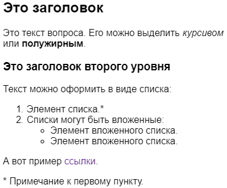

# Настроить внешний вид формы

## Настроить тему оформления {#section_sgz_my3_j3b}

Чтобы придать форме индивидуальность и сделать ее более привлекательной, настройте внешний вид текста и кнопок или добавьте фоновое изображение:

1. Выберите форму и перейдите на вкладку **Тема**.

1. Выберите одну из готовых тем или создайте свою с помощью кнопки **Создать тему**:

    1. Задайте фон для рабочей области формы: выберите цвет заливки, изображение из галереи или загрузите свой фон. Для фона можно настроить прозрачность, скругление углов и отступ вокруг текста. Чтобы фон был виден за полями для ввода ответов, настройте прозрачность полей.

    1. Выберите шрифт и цвет текста. Старайтесь выбрать цвет, который выделяется на выбранном фоне.

    1. Настройте цвет, форму и положение кнопок.

    1. Выберите подложку — фон вокруг рабочей области формы. Для этого включите опцию **Добавить подложку** и выберите цвет заливки, изображение из галереи или загрузите свой фон. Подложка будет видна, если [открыть форму по ссылке](publish.md#section_link).

    1.  Нажмите кнопку **{{ ui-key.yacloud.common.save }}**. Чтобы изменить вашу тему, наведите на нее указатель и нажмите значок .

1. Нажмите кнопку **{{ ui-key.yacloud.common.save }}** внизу страницы.

Если форма уже опубликована, ее оформление изменится.


## Названия кнопок и сообщения {#sec_submit}

Вы можете задать названия кнопок на форме и текст сообщения, которое пользователь увидит после отправки ответа:

1. Выберите форму и перейдите на вкладку **Настройки** → **Тексты и логика отправки**.

1. В блоках **Кнопка отправки формы**, **Кнопка перехода на следующую страницу**, **Кнопка перехода на предыдущую страницу** измените названия кнопок.

1. В блоке **Событие после отправки** измените заголовок и текст сообщения.

1. Нажмите кнопку **{{ ui-key.yacloud.common.save }}**.


## Форматирование текста {#section_pzm_m1j_j3b}

Чтобы добавить в текст элементы форматирования (заголовки, списки, ссылки, курсив и т.д.), используйте [разметку Markdown]({{ link-wikipedia-markdown }}). С помощью Markdown можно отформатировать:

- тексты вопросов и комментарии к ним;

- сообщение об отправке формы.



В разметке Markdown для оформления текста используются символы `*`, `-`, `>` и некоторые другие. Если эти символы стоят в начале строки, они изменяют внешний вид текста, но не выводятся на экран. Чтобы отобразить эти символы, добавьте перед ними обратный слеш: `\*`.




## Пример разметки {#markdown-example}

**Разметка:**

```
## Это заголовок

Это текст вопроса. Его можно выделить *курсивом* или **полужирным**.

### Это заголовок второго уровня

Текст можно оформить в виде списка:
1. Элемент списка.*
1. Списки могут быть вложенные:
    * Элемент вложенного списка.
    * Элемент вложенного списка.

А вот пример [ссылки](https://yandex.ru).

\* Примечание к первому пункту.
```

**Результат:**



## Показывать предыдущий ответ пользователя {#refilling}

Вы можете настроить форму так, чтобы пользователь увидел свои предыдущие ответы на странице с вопросами и мог обновить их.

Включите эту настройку, если отслеживаете изменения ответов пользователей в одной форме: и старые, и новые варианты сохранятся. Все ответы можно получить на [странице ответов](./answers.md).



Предыдущие ответы будут отображаться только у пользователя, который заполняет форму с одного [аккаунта на Яндексе]({{ link-passport }}). 



Чтобы включить отображение ответов пользователя на странице формы:

1. Выберите форму и перейдите на вкладку **Настройки** → **Дополнительно**.

1. В блоке **Дополнительно** включите опцию **Подставлять в форму предыдущие ответы пользователя**.

1. Нажмите кнопку **{{ ui-key.yacloud.common.save }}**.
