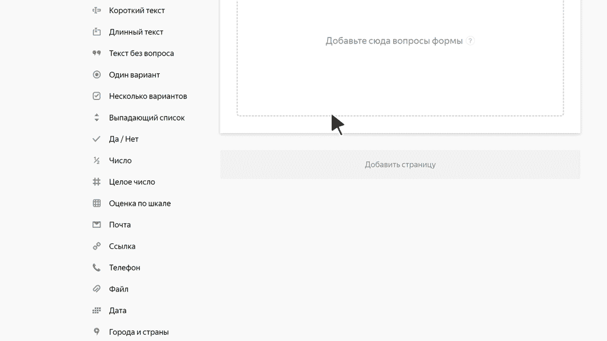

# Города и страны

В этом блоке пользователь может выбрать города или страны. Например, указать город, в котором он живет.

В поле работает подсказка по справочнику городов и стран.

## Настройки блока {#sec_settings}

### Вопрос {#question}

Введите заголовок поля или формулировку вопроса.



### Ответы {#answer}

Вы можете ограничить ответы списком стран или городов. 

- Чтобы пользователь в поле мог выбрать только те страны, которые вы указали:

  1. Выберите **Страны**.

  1. Включите опцию **Ограничить список стран**.

  1. В поле **Выбрать страны** задайте одну или несколько стран.   

- Чтобы пользователь в поле мог выбрать города только тех стран, которые вы указали (например, с помощью формы вы принимаете заказы на отправку товаров по почте, но можете отправлять их только в пределах России): 

  1. Выберите **Города**.

  1. Включите опцию **Ограничить список стран для выбора городов**.

  1. В поле **Выбрать страны** задайте одну или несколько стран.



### Несколько вариантов {#multi}

Включите эту опцию, чтобы разрешить пользователю выбрать несколько городов или стран. Например, указать несколько стран, в которых он побывал.

