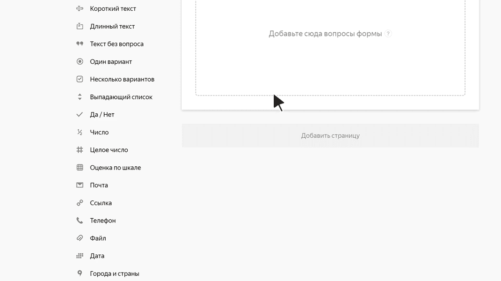

# Дата

В этом блоке пользователь может указать дату или диапазон дат. Например, дату рождения или период отпуска.

## Настройки блока {#sec_settings}

### Вопрос {#question}

Введите заголовок поля или формулировку вопроса.



### Диапазон дат {#range}

Включите эту опцию, если нужно получить в ответ диапазон дат. Например, начало и конец отпуска.
Если опция отключена, пользователь может указать одну дату.

### Ограничить ответ периодом {#limit}

Включите эту опцию, чтобы задать диапазон, в котором пользователь может выбрать дату. Например, если вы предлагаете зарегистрироваться на мероприятие, которое проводится в течение одной недели.



