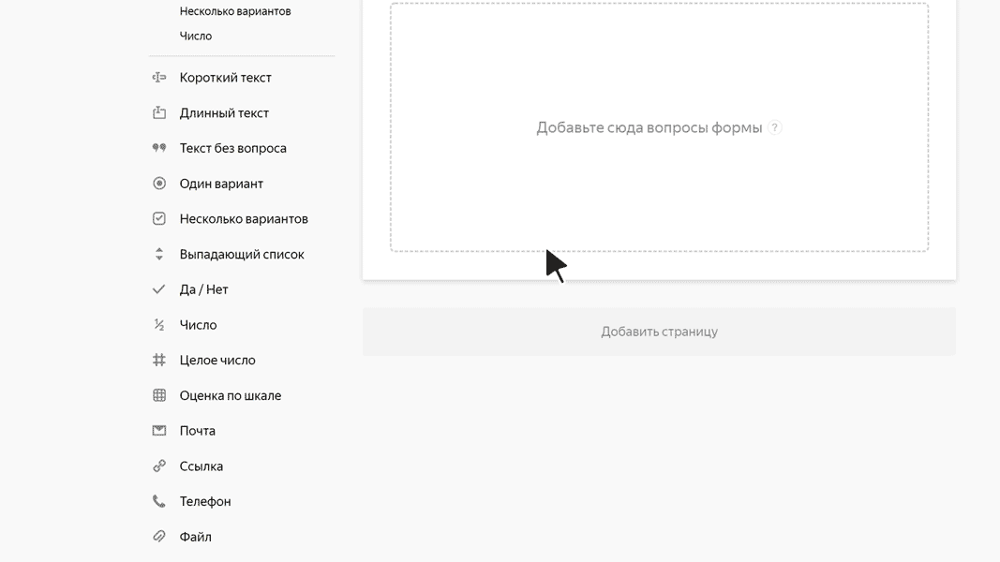

# Файл

С помощью этого блока пользователь может прикрепить к форме файл. Например, фото или отчет об ошибке.

При включенном [сохранении файлов из ответов в хранилище](../storage-for-attached-files.md) к ответу можно прикрепить любое количество файлов размером до 20 МБ каждый. Если хранилище не подключено и ваши файлы сохраняются в сервисе {{ forms-name }}, то можно загрузить не более 20 файлов общим размером до 20 МБ.



Сервис хранит прикрепленные к форме файлы 3 месяца. После истечения этого срока файлы будут удалены и вы не сможете их скачать.



## Настройки блока {#sec_settings}

### Вопрос {#question}

Введите заголовок блока.





### Разрешить прикреплять несколько файлов {#alow-multi}

По умолчанию опция включена, пользователь может прикрепить к форме до 20 файлов. Чтобы разрешить прикреплять только один файл, отключите опцию.