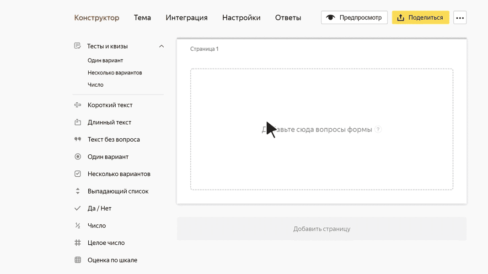

# Целое число

В этом блоке пользователь может ввести целое число. Например, рост в сантиметрах.

## Настройки блока {#sec_settings}

### Вопрос {#question}

Введите заголовок поля или формулировку вопроса.







### Ограничить числа в ответе {#limit}

Задайте минимальное и максимальное значения поля.





