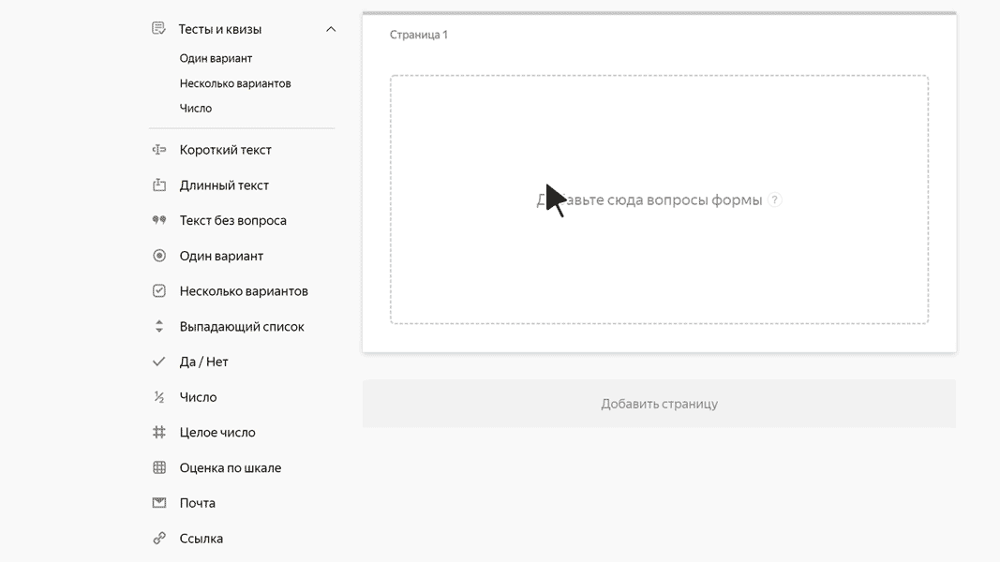

# Ссылка

В этом блоке пользователь может указать адрес сайта или страницы. Например, ссылку на профиль в социальной сети.

## Настройки блока {#sec_settings}

### Вопрос {#question}

Введите заголовок поля.







