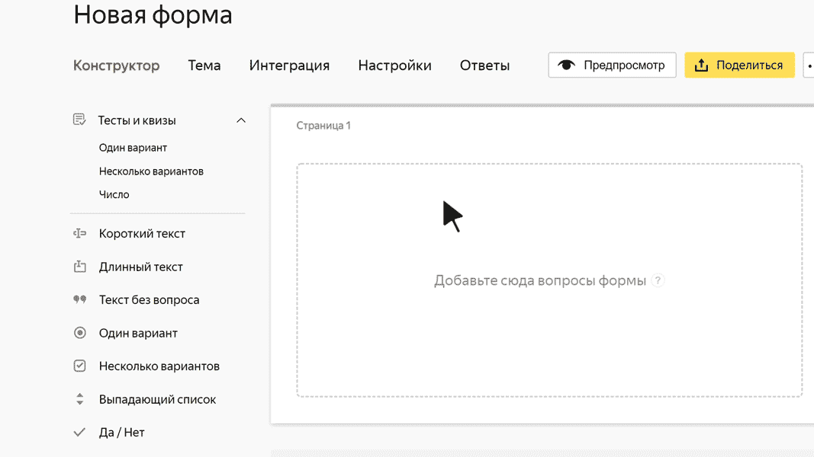

# Длинный текст

В этом блоке пользователь может ввести произвольный длинный текст. Например, отзыв или описание проблемы.

## Настройки блока {#sec_settings}

### Вопрос {#question}

Введите формулировку вопроса. Например, просьбу подробно описать проблему.







### Ограничить количество символов в ответе {#limit}

Задайте минимальную и максимальную длину ответа.

